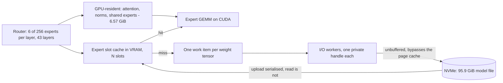

<p align="center">
  
</p>

<h1 align="center">Crow</h1>

<p align="center">
  A frontier coding LLM, made runnable by streaming its experts off the SSD.
</p>

---

## What this is

**The model is not trained. It is made runnable.**

A frontier-scale mixture-of-experts coding model whose expert weights are read from disk on demand
instead of held in memory. The host no longer needs to fit the model — a 96 GiB file runs in
1.3 GiB of process memory.

Target model: **`deepseek-ai/DeepSeek-V4-Flash`**, MIT licensed.

On top of it, an agent platform — in the spirit of **`NousResearch/hermes-agent`**, which serves as
an example for scope and not as a specification. That part has not been built; what exists today is
the model side and an interactive CLI on top of it.

This is a research repository. It carries the patch against `llama.cpp`, the measuring tools and
the record of what was measured — not a product.

## Status

Development machine: RTX 5090, 32,607 MiB VRAM · 63.4 GB RAM · 24 threads · NVMe.

### At the operating point

Measured 2026-08-07 with `unsloth/UD-IQ3_XXS` (95.9 GiB on disk), 200k context on one slot, three
graded runs with four rotating tasks each:

| | |
|---|---:|
| decode | **12.08 tok/s** (median of 18, 9.84–13.41) |
| prefill | 14.43 tok/s (median of 18) |
| peak VRAM | 31,838 of 32,607 MiB |
| coding gate | 4/4 · 3/4 · 4/4 |

The single failure is `two-sum`, one of the tasks that already produces a different program in
every reference run — it carries no signal. The full command line, a reason per flag, and the three
queries that tell a measurement server from an operating point live in the vault, not here.

**Where the throughput comes from.** An expert used to be one work item, read tensor by tensor in a
loop. It is one item per weight tensor now, so several I/O workers pull from the handle pool at
once: queue depth 1.60 → 4.31, decode 9.89 → 12.76 tok/s on the same bytes in the same request
size. The idea came from the model itself, running on this machine, when asked how to raise
throughput without reading a single additional byte.

That split alone cost reproducibility — several workers began calling `ggml_backend_tensor_set`
concurrently, which the single-worker loop never did. A mutex held **only** around the upload
restores it: all six gate tasks that are deterministic in the reference come back byte-identical to
it, while the disk read stays outside the lock, where the gain lives.

### Against CPU offload

Measured 2026-08-06 with `unsloth/UD-Q2_K_XL` (90.2 GiB), `-c 4096`, before the split above:

| | **Crow, SSD streaming** | llama.cpp CPU offload |
|---|---:|---:|
| decode | **11.03 tok/s** | 8.18 tok/s |
| prefill | **9.47 tok/s** | 4.43 tok/s |
| peak VRAM | 29.06 GiB | 9.17 GiB |
| **peak host RAM** | **1.28 GiB** | 51.79 GiB |
| coding gate | 9–10 of 10 | 10 of 10 |

The right-hand column is the reference point, not a rival configuration: it is what the same binary
reaches with the experts left on the CPU. Both were measured back to back from one executable, one
quantisation and one prompt, with the placement as the only difference.

The gate resolves differences of two tasks or more, so the column difference of one is inside its
own movement and is not read as a quality difference.

**The two tables are not rows of one comparison.** Different quantisation, different context,
different prompts. Each holds within itself.

Every figure here has its raw run on disk and its reasoning on the issue that asked for it.

**Spent so far: 0 €.** No rented compute, no API calls — everything measured on the machine above.

## Architecture



The host holds no model weights. Misses are read straight off the drive with unbuffered I/O, which
is why process memory stays flat regardless of model size. A slot becomes resident only once its
last tensor has landed.

## Build

The streaming path is a patch against `llama.cpp`. It is applied to a pinned upstream tag, never to
a moving branch.

```bash
git -C <llama.cpp-clone> worktree add --detach <tree> b10269
```

```bash
powershell -File tools/verify-patch-b10269.ps1 -WT <tree> -BuildDir build -UpTo build -NoNegative
```

That applies `patches/moe-stream-on-b10269.patch`, configures with CUDA, builds, and checks the
result — the flags reaching the binary, the symbols surviving the link, the patched paths matching
the expected count. Dropping `-UpTo build -NoNegative` runs the full verification including a
control build on the unpatched base; that leaves the tree pristine, so build again before measuring.

The patch is recoverable in both directions: `tools/verify-patch-roundtrip.sh` rebuilds the tree
from the patch in a scratch worktree and hashes every path against the live one. Its negative
control is cutting one block out — that has to come back with a smaller count and the missing path
named, or the check proves nothing.

## Run

### The server

```bash
llama-server -m <model>/DeepSeek-V4-Flash-UD-IQ3_XXS-00001-of-00004.gguf \
  -c 200000 -ngl 99 -np 1 \
  --moe-stream --moe-stream-cache 64s --moe-stream-io-threads 8 --moe-stream-direct
```

| Flag | |
|---|---|
| `-c 200000 -np 1` | one slot with the whole context — a coding session holds files and history |
| `--moe-stream` | route expert tensors through the slot cache instead of placing them |
| `--moe-stream-cache 64s` | cache size, here in slots — 64 of 256 experts per layer, ~24 GiB |
| `--moe-stream-io-threads 8` | I/O workers, each with its own file handle |
| `--moe-stream-direct` | unbuffered reads, bypassing the OS page cache |

`--moe-stream-io-threads` is the number of workers, not the queue depth the drive actually sees.
That one is measured, and it is 4.31.

### The CLI

```bash
python cli/crow.py
```

Standard library only, on purpose: it has to run before anything is installed. Commands are
`/help`, `/reset`, `/context` and `/exit`; `--base-url`, `-m` and `--system` override the defaults.

Two properties come from measurements rather than taste. The context is **append-only** — nothing
is ever inserted in front of or edited inside an existing message, because the prompt cache only
survives while the prefix stays byte-identical, and re-prefilling 12k tokens costs minutes. And the
output **streams**, because a non-streaming call leaves the user in front of a blank terminal for
the entire decode.

The prompt carries a context bar whose limit is read from the server's `/props`, not from the
command line — at `-np 4` the server splits the context per slot, so the CLI's own number would be
wrong. While the model reasons, the raven shows the state and flips to `writing code` at the first
content token: 88.2 % of everything this model generates is `reasoning_content`, and a client that
reads only `content` shows a blank screen for most of the wait and reports a `ttft` that silently
contains the whole reasoning phase.

`--temperature` defaults to 0.6, not 0. Pure greedy decoding has no way out of a repetition
attractor, and this model loops inside the reasoning block and never reaches the answer.
`--temperature 0` stays available so measurement runs get byte-identical output.

## Repository layout

| | |
|---|---|
| `cli/` | the interactive client, standard library only, with its own suite |
| `patches/` | the streaming patch against its pinned upstream tag |
| `tools/` | measuring and verification tools, each with its own selftest |
| `manifests/` | size and SHA-256 of every raw protocol, per day |
| `runs/` | raw protocols — **not** in git, recorded by the manifests |

Every tool answers `-Selftest` (PowerShell) or `selftest` (Python) and refuses to report a verdict
without passing it.

## How this project works

These rules are the actual product of the repository; the numbers follow from them.

- **Every number carries its denominator.** Anything unmeasured is marked as unmeasured, together
  with the one measurement that would settle it.
- **A cited number needs its suite in the same commit, and that suite needs a case that must fail.**
  A checker that cannot go red measures nothing.
- **A zero without a positive control is not a finding.** Every search includes a term that has to
  hit; otherwise "not present" cannot be told apart from "not looked for".
- **A vendor's own model-card number is a statement about that vendor's harness**, not about the
  model. It is labelled as such wherever it appears.
- **A criterion a correct implementation cannot meet manufactures faults instead of finding them.**
  Comparing answer hashes across two compute backends was such a criterion and was withdrawn.
- **Two numbers taken under different conditions are not a comparison**, however similar they look.
  Where both are worth keeping, they are printed apart with what differed.
- **Raw protocols stay out of git**, but their fingerprints do not. What a run produced is recorded
  even though the bytes are not versioned.
- **Closed work is not deleted.** Issues closed with a corrected goal say so on the ticket.

Knowledge lives on the issues and in a separate vault, not in this file. This README describes what
the repository is and how to run it — nothing else.

## Licence

MIT, see `LICENSE`. Four components carry terms this project cannot grant, and
`THIRD-PARTY-NOTICES.md` says which: the diffs under `patches/` are against `ggml-org/llama.cpp`
and carry its MIT notice verbatim, the bundled typeface is under the SIL Open Font License 1.1,
the model is fetched rather than shipped, and the CUDA backend is built against NVIDIA's toolkit.

## Credits

`Crow.jpg` is a generated render; the prompt that produced it sits beside it in
`CrowJPG-Prompt.txt`.
