<div align="center">

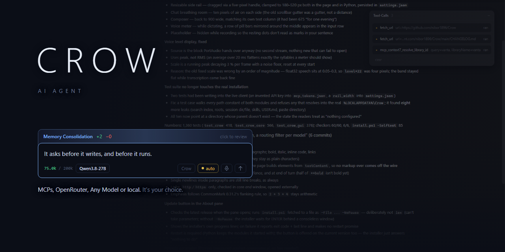

<h1>CROW</h1>

<h3>Qwen3.8-27B at 200k context on one GPU.</h3>

<p><b>An agent, not a chat box:</b> 12 tools plus MCP servers, persistent memory, its own skills.<br>Runs on this machine, or on a provider you choose.</p>

<p>
<a href="LICENSE"></a>
<a href="cli/crow.py"></a>
<a href="#requirements"></a>
<a href="cli/crow.py"></a>
<a href="https://huggingface.co/unsloth/Qwen3.8-27B-GGUF"></a>
<a href="https://github.com/ggml-org/llama.cpp"></a>
<a href="#memory"></a>
</p>

<table>
<tr>
<td align="center"><b>27B</b><br><sub>dense</sub></td>
<td align="center"><b>200k</b><br><sub>context, one slot</sub></td>
<td align="center"><b>16.35 GiB</b><br><sub>model on disk</sub></td>
<td align="center"><b>25.5 GiB</b><br><sub>VRAM in use</sub></td>
<td align="center"><b>123.05</b><br><sub>tok/s decode, 11-round turn</sub></td>
<td align="center"><b>133.18</b><br><sub>tok/s decode, warm turn</sub></td>
<td align="center"><b>2,262.96</b><br><sub>tok/s prefill</sub></td>
</tr>
</table>

</div>

---

## Contents

| | |
|---|---|
| [Operating point](#operating-point) | what this build runs at |
| [Requirements](#requirements) | card, disk, Windows |
| [Install](#install) | one line |
| [Start](#start) | server, then a client |
| [Documentation](#documentation) | everything else |
| [Screenshots](#screenshots) | the window |

## Operating point

| | |
|---|---|
| Model | `Qwen3.8-27B-UD-Q4_K_XL.gguf`, 17,559,178,144 B |
| Architecture | dense, no `expert_count`; hybrid attention + SSM, `full_attention_interval 4` |
| Quant | `UD-Q4_K_XL`, Unsloth, imatrix 1,251 chunks |
| Context | `-c 200000`, one slot (`-np 1`) |
| KV | `q8_0` / `q8_0`, 6,647.00 MiB measured against 6,645.8 predicted |
| Speculation | `--spec-type draft-mtp`, head ships in the GGUF |
| GPU | RTX 5090, 32,607 MiB. 26,140 MiB in use |
| Build | llama.cpp server `1c3c967` |
| Source of truth | [`manifests/operating-point.json`](manifests/operating-point.json) |

---

## Requirements

| | |
|---|---|
| **GPU** | NVIDIA. 32 GB for this operating point. 16 GB is the installer's floor, unmeasured |
| **System RAM** | 32 GB |
| **Disk** | ~2 GB for Crow, **16.35 GiB for the model**, one file |
| **OS** | Windows x64 |
| **Python** | 3.8+. Terminal client uses the standard library only |
| **WebView2** | Window only. Ships with Windows 11 and with Edge |
| **pywebview** | Window only, ~2 MB. Installed by `install.ps1` |
| **Node** | Only for MCP servers started with `npx` or `node`. Reported by the preflight, never required. NOT installed by `install.ps1` |

---

## Install

```powershell
irm https://raw.githubusercontent.com/nibor1896/Crow/main/install.ps1 | iex
```

Preflight, download, extract, per-file sha256 against the release manifest, then the start lines
with paths resolved. No elevation. Everything under `%LOCALAPPDATA%\Crow`.

Model, separately:

```powershell
hf download unsloth/Qwen3.8-27B-GGUF --include "*UD-Q4_K_XL*" --local-dir $env:LOCALAPPDATA\Crow\models\qwen38-gguf
```

Check that one file of 17,559,178,144 B arrived. `hf` prints `✓ Downloaded` even when it could not
reach the repository.

---

## Start

### Server

```powershell
$env:LOCALAPPDATA\Crow\bin\llama-server.exe `
  -m $env:LOCALAPPDATA\Crow\models\qwen38-gguf\Qwen3.8-27B-UD-Q4_K_XL.gguf `
  --port 8082 -c 200000 -ctk q8_0 -ctv q8_0 -ngl 99 -np 1 --jinja `
  --slot-save-path $env:LOCALAPPDATA\Crow\session `
  --spec-type draft-mtp
```

### Clients

```powershell
python $env:LOCALAPPDATA\Crow\cli\crow_gui.py
```

```powershell
python $env:LOCALAPPDATA\Crow\cli\crow.py --base-url http://127.0.0.1:8082/v1
```

The window reads the `--port` off the running process. The terminal client needs `--base-url`.

---

## Documentation

Configuration, features and measurements live under [`docs/`](docs/).

| | |
|---|---|
| [Server flags](docs/reference/server-flags.md) | what `llama-server` is started with |
| [Client flags](docs/reference/client-flags.md) | what `crow` and the window take |
| [Reasoning levels](docs/reference/reasoning-levels.md) | `low`, `medium`, `high`, `off` |
| [Tools](docs/reference/tools.md) | the twelve built in |
| [Settings](docs/reference/settings.md) | `settings.json` |
| [mcp.json](docs/reference/mcp-json.md) | every key, both transports |
| [Memory](docs/user-guide/memory.md) | what is written, by whom, and the gate |
| [Skills](docs/user-guide/skills.md) | using and writing one |
| [Session search](docs/user-guide/session-search.md) | the index |
| [MCP servers](docs/user-guide/mcp.md) | stdio, elicitation, commands |
| [MCP over HTTP](docs/user-guide/mcp-http.md) | headers, OAuth |
| [Remote models](docs/user-guide/remote-models.md) | subscriptions, dialects, routing |
| [Window](docs/user-guide/window.md) | the GUI |
| [Measurements](docs/measurements/README.md) | every number with its conditions |
| [Architecture](docs/developer-guide/architecture.md) | the four modules and the core/surface split |
| [Testing](docs/developer-guide/testing.md) | three suites, five checkers, the manifest |
| [Repo](docs/developer-guide/repo.md) | layout |
| [Not built](docs/developer-guide/not-built.md) | decided against, and why |

## Licence

MIT. See [LICENSE](LICENSE).

Model: [Qwen](https://huggingface.co/Qwen/Qwen3.8-27B) (Apache-2.0). Quantisation by
[Unsloth](https://huggingface.co/unsloth). Engine:
[llama.cpp](https://github.com/ggml-org/llama.cpp).

Earlier READMEs: [v0.5.1, Qwen-first](docs/README-v0.5.1-qwen.md) ·
[v0.5.1, the one before it](docs/README-v0.5.1-deepseek.md).

<div align="center">
<a href="https://ko-fi.com/nibor1896"></a>
</div>


---

## Screenshots

Taken on the shipped build. Windows, `Qwen3.8-27B` on the local llama-server unless a shot says
otherwise.

<div align="center">
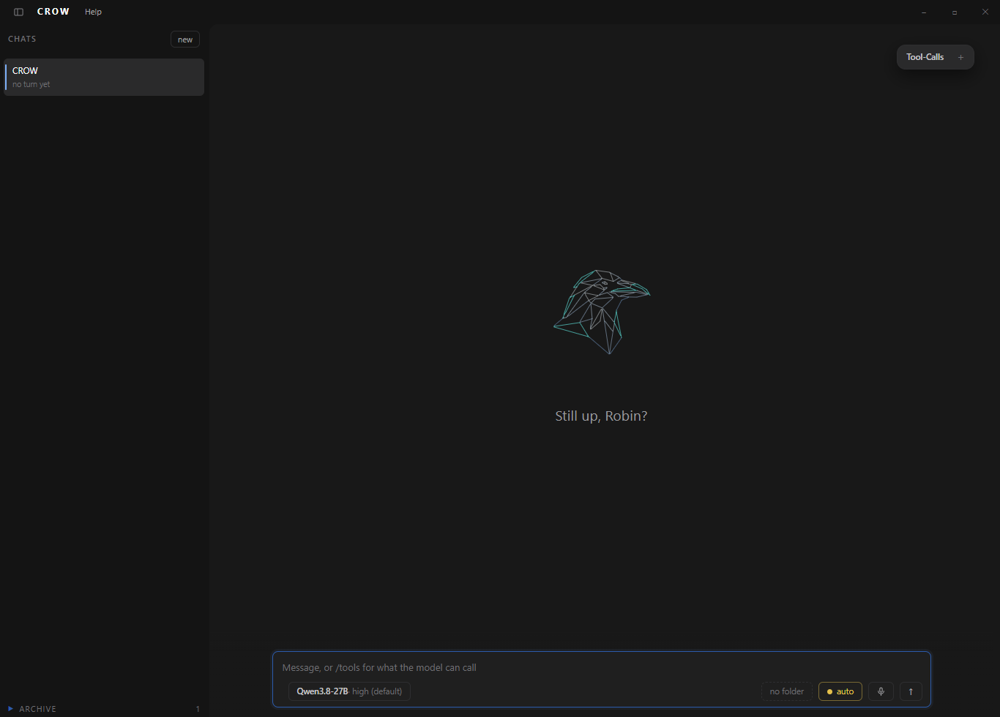
</div>

An empty chat. The rail groups chats by working directory, the composer carries the model, the
release level, the working directory and dictation.

<div align="center">
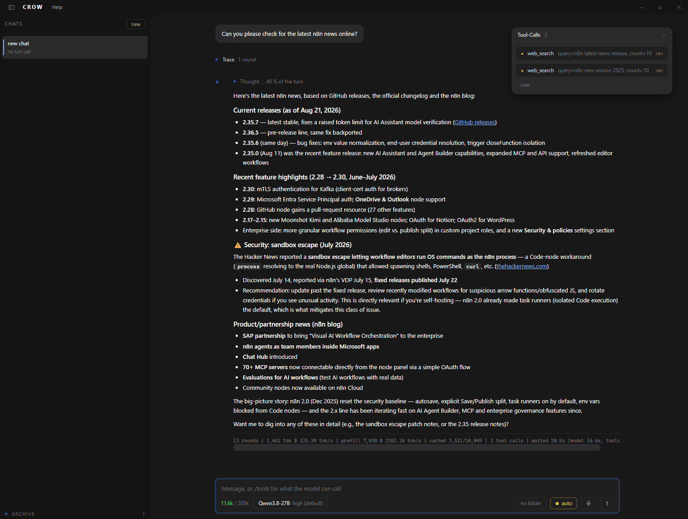
</div>

A turn with its trace open and the code panel on the right. Calls fold one at a time into their
arguments and their result; the source a turn writes stands under them, under its own path.

<div align="center">
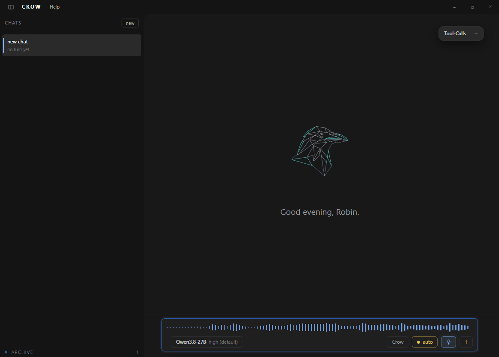
</div>

Dictation. The voice line sits in the input row and costs no height; the level scale calibrates
itself against a running peak.

### Settings

<div align="center">
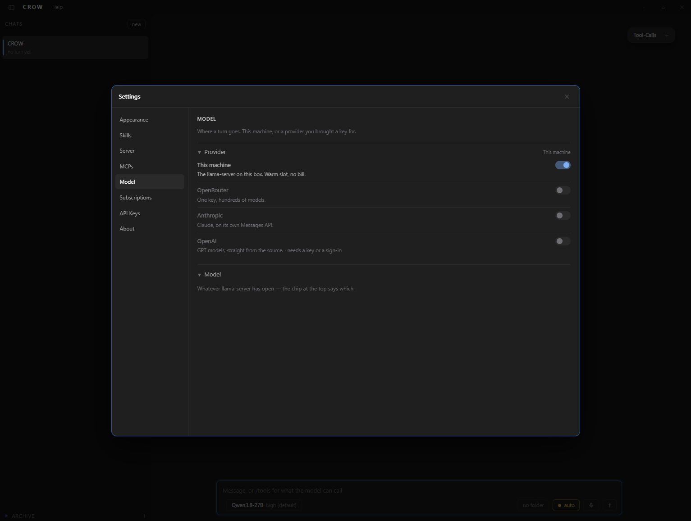
</div>

Where a turn goes. `This machine` is the llama-server on this box: warm slot, no bill.

<div align="center">
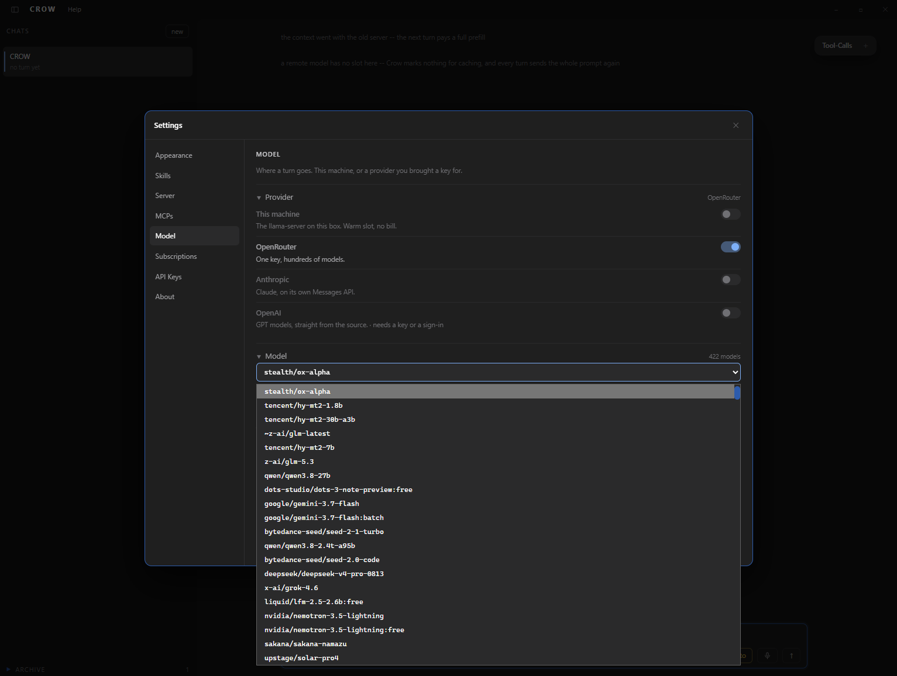
</div>

The same pane on OpenRouter, catalogue open. The count beside it is what the provider last
reported, read from disk rather than fetched per open.

<div align="center">
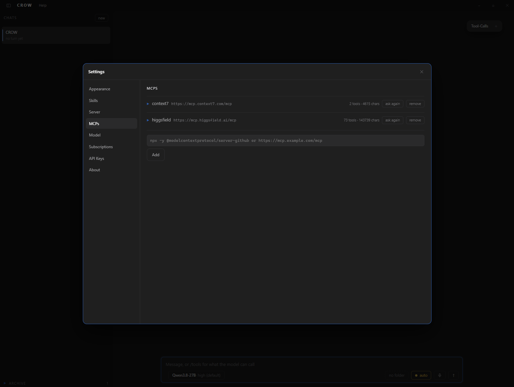
</div>

MCP servers. Per tool a switch and a class -- reading, writing, executing -- pre-filled from the
server's annotations and decided by the user.

<div align="center">
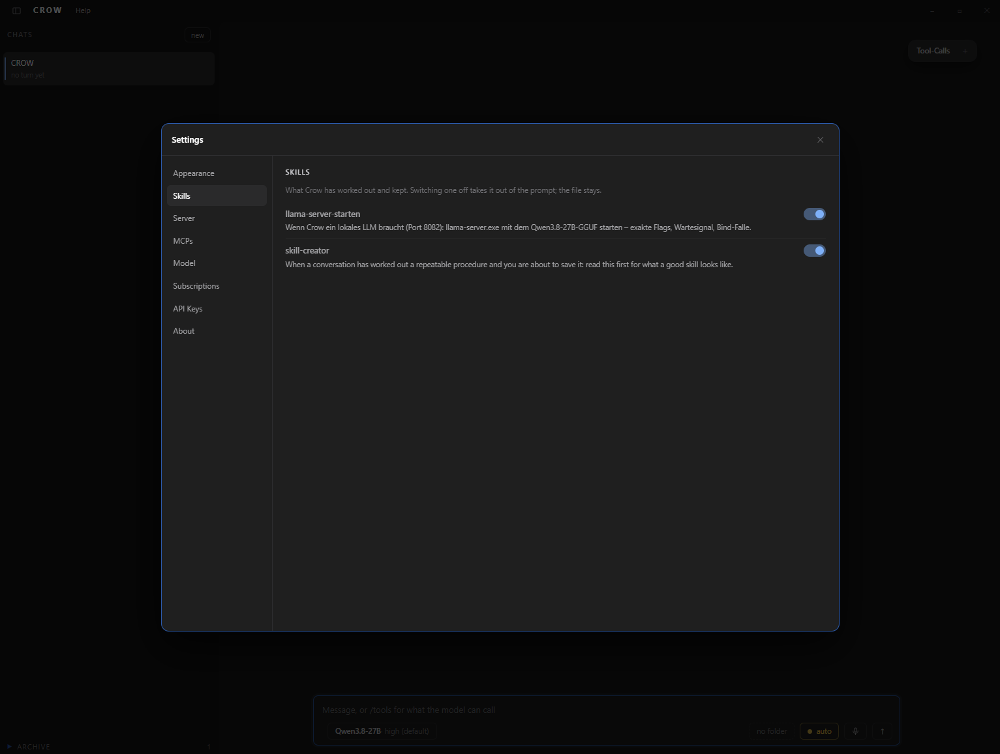
</div>

Skills. One row per skill; off takes it out of the prompt and leaves the file where it is.

<div align="center">
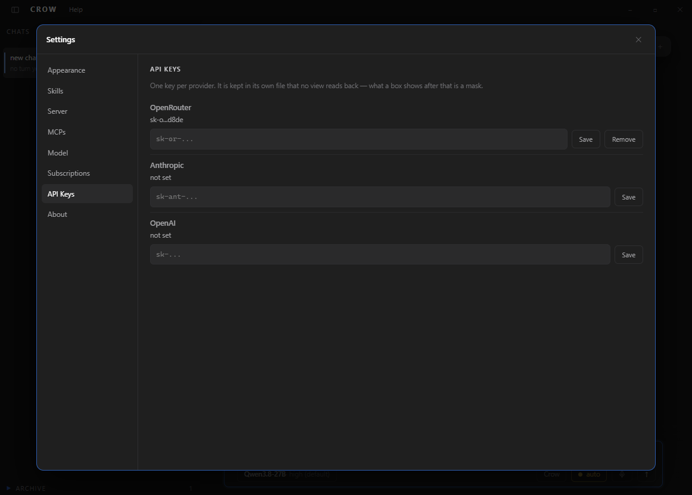
</div>

API keys. One key per provider, kept in its own file that no view reads back -- what a box shows
afterwards is a mask.

### Themes

<div align="center">
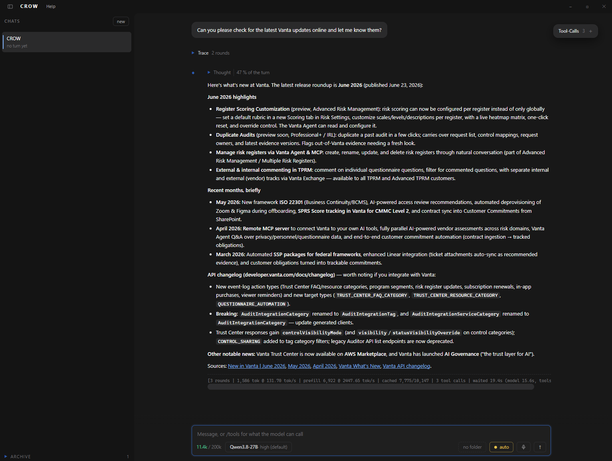
</div>

Dark.

<div align="center">
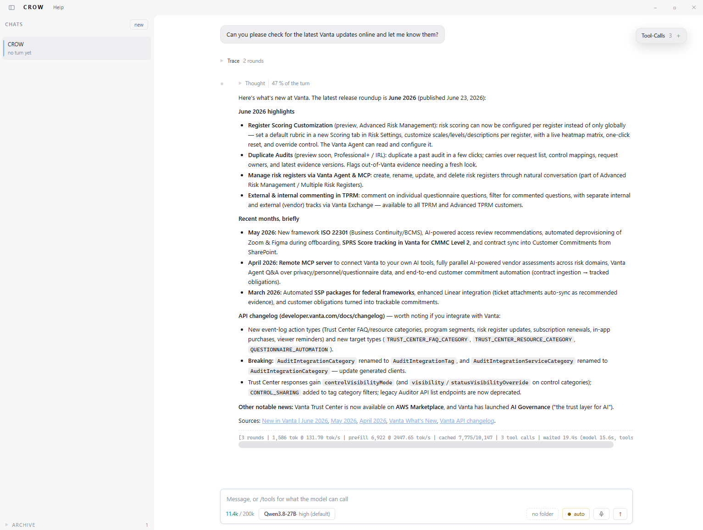
</div>

Light.

<div align="center">
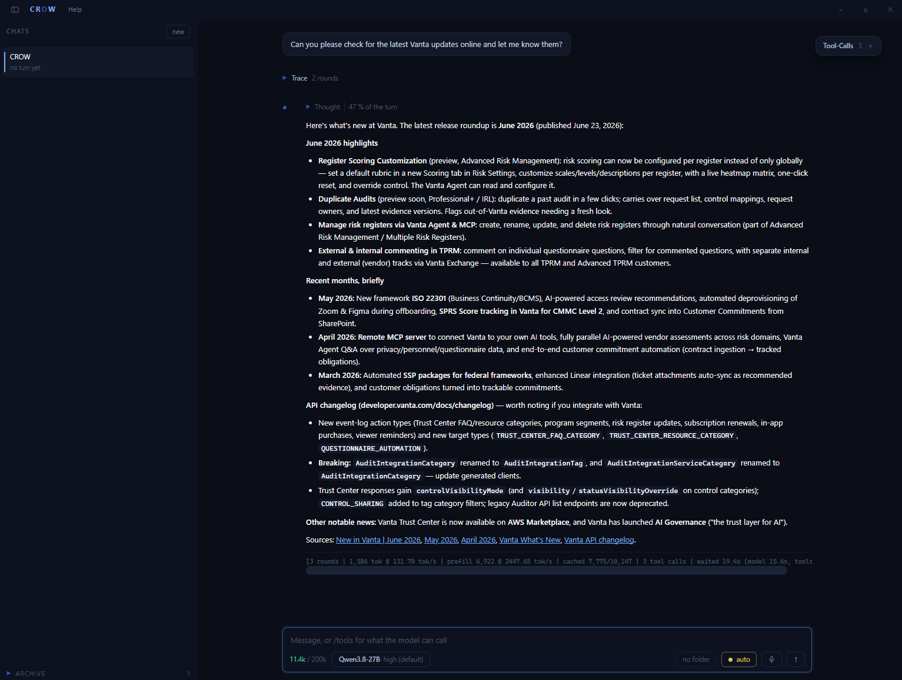
</div>

Crow.
