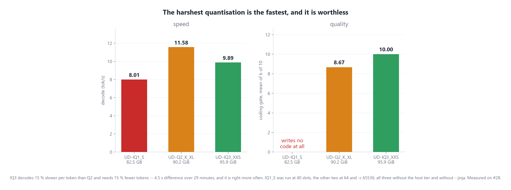
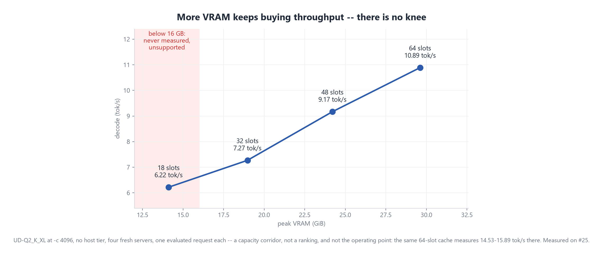
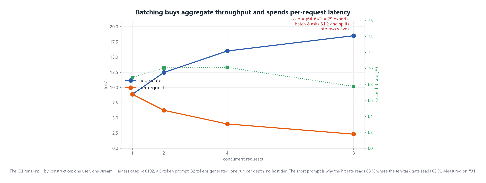

<div align="center">

<h1>Crow</h1>

<h3>A 284-billion-parameter coding model, at a 200k context. One graphics card. 1.28 GB of system RAM.</h3>

<p>Frontier mixture-of-experts inference, with the experts streamed off the SSD.<br>No cluster. No 200 GB host. No cloud.</p>

<p>
<a href="LICENSE"></a>
<a href="cli/crow.py"></a>
<a href="#requirements"></a>
<a href="cli/crow.py"></a>
<a href="https://huggingface.co/deepseek-ai/DeepSeek-V4-Flash"></a>
<a href="https://ko-fi.com/nibor1896"></a>
</p>

<table>
<tr>
<td align="center"><b>284B</b><br><sub>parameters</sub></td>
<td align="center"><b>13B</b><br><sub>active per token</sub></td>
<td align="center"><b>200k</b><br><sub>context, one slot</sub></td>
<td align="center"><b>95.9 GiB</b><br><sub>model on disk</sub></td>
<td align="center"><b>1.28 GiB</b><br><sub>peak host RAM, measured</sub></td>
<td align="center"><b>12.08</b><br><sub>tok/s decode, gate median</sub></td>
<td align="center"><b>0 EUR</b><br><sub>spent so far</sub></td>
</tr>
</table>

</div>

<br>

## What this is, in one paragraph

**Crow runs a frontier-scale coding model on a single consumer graphics card by leaving most of the model on the SSD.**

A mixture-of-experts model is mostly asleep. Every token wakes only **6 of the 256 experts** in each of its 43 layers, so 92.7 % of the file is untouched at any given moment. Crow keeps the parts that *every* token needs in VRAM — attention, norms, shared experts, 6.57 GiB of them — holds the 64 most useful experts per layer beside them in a slot cache, and reads whatever is missing straight off the drive while the GPU is still working. The host machine never holds the model at all: **1.28 GiB of process memory for a 95.9 GiB file.**

The context window is 200,000 tokens, on a single slot, and it costs about 1.41 GiB of the card — compressed attention makes context the cheap part here. A coding session holds files and history, so a 16k or 64k window would be measuring a product nobody uses.

That is the whole idea. Everything below is what it costs to make it actually run.

<div align="center">
<p><i>If this is useful to you: <a href="https://ko-fi.com/nibor1896">ko-fi.com/nibor1896</a></i></p>
</div>

---

```console
PS> python cli\crow.py

  ██████  ███████   ██████  ██    ██
 ██▓▓▓▓██ ██▓▓▓▓██ ██▓▓▓▓██ ██▓   ██
 ██▓    ▓▓███████▓▓██▓   ██▓██▓   ██
 ...
 v0.0.1

crow at http://127.0.0.1:8081/v1 (health: ok, 200k context)
/help for commands, /exit to leave.

[----------] 4.7k/200k | you> take variant 2 and write me the finished function

crow> Here's the finished function, using the server's own reported usage:

def get_context_usage(server_response: dict, max_ctx: int = 200_000) -> int:
    ...

[1262 tok @ 8.56 tok/s | prefill 18 @ 10.61 tok/s | ttft 1.73s | answer 63.15s | thinking 44% | total 149.15s]
```

That `prefill 18` is the second turn of a real session, and it is the whole point of
the line: the first turn had generated 4,256 tokens, and before 2026-08-08 the second
turn re-read every one of them — about six and a half minutes before the first word
appeared. [Why](#the-context-is-append-only-and-carries-its-reasoning).


[Part II](#part-ii-how-it-works) builds every box in that diagram from the measurements that produced it.

---

## Contents

**[Part I: Getting started](#part-i-getting-started)**
&nbsp;&nbsp;[Requirements](#requirements) · [Quick start](#quick-start) · [Full setup](#full-setup) · [Using the CLI](#using-the-cli) · [Common questions](#common-questions)

**[Part II: How it works](#part-ii-how-it-works)**
&nbsp;&nbsp;[The problem](#the-problem-a-model-that-does-not-fit) · [Sparsity](#1-sparsity-most-of-the-model-is-asleep) · [Quantisation](#2-quantisation-and-where-it-breaks) · [The cache](#3-the-slot-cache-and-what-vram-buys) · [Reading the drive](#4-reading-the-drive-without-the-page-cache) · [Cost per token](#what-it-costs-per-token) · [Against CPU offload](#against-cpu-offload) · [Batching](#batching-and-why-the-cli-does-not) · [What is not claimed](#what-is-not-claimed)

**[What's next](#whats-next)** · **[How this project works](#how-this-project-works)** · **[Licence](#licence)**

---

# Part I: Getting started

## Requirements

| | |
|---|---|
| **GPU** | NVIDIA, **16 GB VRAM minimum**, 32 GB for the measured operating point. Below 16 GB was never measured and is unsupported |
| **System RAM** | 16 GB. The model does not live here — 1.28 GiB is the measured process peak |
| **Disk** | ~2 GB for Crow, **~96 GB for the model** |
| **OS** | Windows x64. The streaming path uses `FILE_FLAG_NO_BUFFERING` and a handle pool, both Windows-specific |
| **Python** | 3.8+, for the client only. Standard library, nothing to install |

The installer checks all of this **before** it downloads anything.

## Quick start

```powershell
irm https://raw.githubusercontent.com/nibor1896/Crow/main/install.ps1 | iex
```

Five steps, no elevation, everything under `%LOCALAPPDATA%\Crow`:

```console
  Crow 0.0.1

[1/5] Checking this machine
      GPU  NVIDIA GeForce RTX 5090, 32607 MB
      RAM  63.4 GB
      Disk  364.3 GB free on C:
      Windows  64-bit, PowerShell 5.1.26100.8875
      preflight  passed

[2/5] Downloading the package
      crow-0.0.1-win-x64.zip  [####################.....]  84%  424.1 MB / 506.4 MB  18.2 MB/s

[3/5] Verifying
      size  506.4 MB
      sha256  A31F...

[4/5] Installing to C:\Users\you\AppData\Local\Crow
        26/26  README.md                                  27 KB
      26 files extracted

[5/5] What is left to do
```

The model is **not** part of that download. It is 95.9 GiB, it belongs to somebody else, and an installer that spends hours on it before you have seen anything work is the wrong shape. The last step prints the one command that fetches it:

```powershell
hf download unsloth/DeepSeek-V4-Flash-GGUF --include "UD-IQ3_XXS/*" --local-dir %LOCALAPPDATA%\Crow\models
```

> **A trap worth knowing about.** Measured here on 2026-08-07: when `hf` cannot reach the repository it prints `✓ Downloaded` and returns the local directory — failure that looks exactly like success. Check that four files totalling ~96 GiB actually arrived.

## Full setup

### Step 1 — start the server

```powershell
%LOCALAPPDATA%\Crow\bin\llama-server.exe `
  -m %LOCALAPPDATA%\Crow\models\UD-IQ3_XXS\DeepSeek-V4-Flash-UD-IQ3_XXS-00001-of-00004.gguf `
  -c 200000 -ngl 99 -np 1 --jinja `
  --moe-stream --moe-stream-cache 64s --moe-stream-io-threads 8 --moe-stream-direct
```

Every flag carries a reason, and none of them is taste:

| Flag | Why |
|---|---|
| `-c 200000` | A coding session holds files and history. 16k or 64k measures a product nobody uses. Measured: 200k loads on one slot at 31,838 of 32,607 MiB |
| `-np 1` | One user, one stream. `-np 4` splits the context into 4 × 50k and is the harness case, not the CLI |
| `--jinja` | Use the **model's** chat template instead of llama.cpp's built-in one. Without it the client's replayed reasoning is dropped and the prompt cache breaks on every turn: measured 138.8–242.3 s of re-prefill per turn against 1.6–2.2 s |
| `--moe-stream` | Route expert tensors through the slot cache instead of placing them |
| `--moe-stream-cache 64s` | 64 of 256 experts per layer, ~24 GiB. 121 slots would reach a 95 % hit rate and need 45.5 GiB, which does not fit |
| `--moe-stream-io-threads 8` | I/O workers, **each with its own file handle**. Windows serialises on the file object, so a shared handle stays at queue depth 1 whatever you do |
| `--moe-stream-direct` | Unbuffered reads. Without it `read_raw_at` falls back to the shared handle and the pool delivers 1.01x instead of 2.22x |

`--moe-stream-io-threads` is the number of *workers*, not the queue depth the drive sees. That one is measured, and it is **4.31**.

### Step 2 — check that the right server is running

Two read-only queries, both in seconds:

```powershell
(Invoke-RestMethod -Uri 'http://127.0.0.1:8081/props').default_generation_settings.n_ctx
nvidia-smi --query-gpu=memory.used,memory.total --format=csv,noheader
```

Expect `n_ctx = 200192` (llama.cpp rounds up) and about **31,800 of 32,607 MiB**. If it says 65536 or 16384, a measurement server is running and not the operating point.

### Step 3 — start the client

```powershell
python %LOCALAPPDATA%\Crow\cli\crow.py
```

## Using the CLI

Standard library only, on purpose: it has to run before anything is installed.

| Command | |
|---|---|
| `/help` | the commands |
| `/reset` | drop the conversation and start a new one |
| `/context` | how much of the window is used |
| `/exit` | leave |

| Option | |
|---|---|
| `--base-url` | default `http://127.0.0.1:8081/v1` |
| `-m` | model name sent to the endpoint |
| `--system` | replace the system prompt, `--no-system` removes it |
| `--temperature` | default **0.6**, see below |
| `--no-font`, `--no-background` | leave the terminal profile alone |

Four properties come from measurements rather than taste:

<a id="the-context-is-append-only-and-carries-its-reasoning"></a>
**The context is append-only, and every assistant turn carries its reasoning.** Nothing is ever inserted in front of, or edited inside, an existing message, because the prompt cache only survives while the prefix stays byte-identical.

The second half of that was the harder lesson. Until 2026-08-08 the client dropped `reasoning_content` from the history — it is display-only, so why send it back. But this model's template renders a kept turn as `<think>…</think>`, and an omitted field leaves an *empty* think block: the prefix then diverges exactly where the thoughts began, and everything behind that point is re-read. The cost therefore has nothing to do with how much the model thought. **48 tokens of reasoning cost 2,018 tokens of prefill**, because the whole answer sat behind them.

Measured across three task sets, `prompt_n` of turn 2 over what turn 1 generated:

| turn 2 sends | ratio | prefill |
|---|---|---|
| history **without** `reasoning_content` | 0.909 – 0.986 | 138.8 – 242.3 s |
| history **with** `reasoning_content` | 0.008 – 0.016 | 1.6 – 2.2 s |

It is not cumulative, it repeats: every turn pays the previous turn's output, so the penalty scales with answer length rather than session length. This is also why the client sends a one-entry `tools` array with every request — **for the cache, not for the tool.** The template keeps a past turn's thoughts only while tools are present; with an empty array both variants render byte for byte the same.

**The output streams, and the raven shows the state.** 88.2 % of everything this model generates is `reasoning_content` — measured over 30 stored answers, 69,951 reasoning characters against 9,337 of content. A client that renders only `content` shows a blank screen for most of the wait. Crow shows `thinking`, then flips to `writing code` at the first content token.

**`--temperature` defaults to 0.6, not 0.** Pure greedy decoding has no way out of a repetition attractor, and this model loops inside the reasoning block and never reaches an answer. `--temperature 0` stays available so measurement runs get byte-identical output.

On first start the client installs its bundled typeface and writes `profiles.defaults.font.face` and `background` into Windows Terminal's `settings.json`, with a `.bak` beside it. It never overwrites a value it did not write itself. Both halves can be switched off.

## Common questions

**Does it need the model in RAM?** No. That is the point. Peak host memory is 1.28 GiB, measured, against 51.79 GiB for llama.cpp's CPU offload on the same binary.

**Is the output the same as a resident model?** On the deterministic half of the coding gate, yes — six of six tasks byte-identical to the reference after the load-path rework. The other half of the gate produces three different programs across three runs at *identical* configuration, so that half cannot answer the question. See [what is not claimed](#what-is-not-claimed).

**Why Windows only?** The streaming path rests on `FILE_FLAG_NO_BUFFERING`, positional `OVERLAPPED` reads and a per-worker handle pool, because Windows serialises I/O on the file object. The POSIX side of the primitive exists and compiles; it has never been run.

**Can I use a smaller quantisation?** Measured, and no: `UD-IQ1_S` does not write wrong code, it writes none — no function block emitted at all. The break point is above IQ1_S.

**Why not just buy more VRAM?** More VRAM does keep buying throughput; there is no knee across 18 to 64 cache slots. But the model is 95.9 GiB and no consumer card holds it, so streaming is not a workaround for a small card — it is the only shape that runs at all.

---

# Part II: How it works

## The problem: a model that does not fit

DeepSeek-V4-Flash is 284 billion parameters. Resident at bf16, that is:


568 GB against 32.6 GB of VRAM and 63.4 GB of system RAM. Nothing about placement or scheduling closes a gap of eighteen times.

Two published paths exist and neither works here. Keeping the experts in host RAM needs a machine with 200 GB or more — ktransformers documents exactly that minimum, and this machine misses it by a factor of 3.2. Memory-mapping the file and letting the OS page it in was measured on 2026-08-02 and is a different operating regime, not a slower one: **1.8 % CPU, 0.3 GB of 63.4 GB free, 0.79 GiB/s effective against a drive that does 5.3 GB/s sequential.** The process was not computing. It was waiting on random 4 KiB faults with eviction pressure.

## 1. Sparsity: most of the model is asleep

A dense model reads every weight for every token. A mixture-of-experts model does not:


43 layers, 256 experts each, 6 of them selected per token. The rest of that layer contributes nothing to this token and does not need to be anywhere near the GPU.

That leaves a set which *is* needed by every token — attention, norms, embeddings, the shared expert:


**6.57 GiB, 7.3 % of the 90.18 GiB of tensors.** It is GPU-resident by construction at `-ngl 99`; nothing had to be built for it. The other 92.7 % is the streaming problem.

Routing is concentrated enough for a cache to be worth anything, and that was measured before any of it was built: 80 % of expert selections fall on **25.7 %** of the experts, Gini 0.713. Coding routes *wider* than prose (25.7 % against 21.4 %), and those 4.3 points show up as 5.7 points less hit rate — so the workload this project cares about is the harder one.

## 2. Quantisation, and where it breaks

Fewer bits per weight means fewer bytes to move. The question is where the model stops being worth running, and it is answered by running it:



`UD-IQ1_S` is the fastest rung that fits and it is worthless — it emits no function block at all, repeats the prompt and drifts into reasoning until the budget runs out. The interesting comparison is one rung up.

**IQ3 decodes 15 % slower per token than Q2 and needs 15 % fewer tokens. The two cancel: 4.5 seconds difference over 29 minutes across 30 answers** — and IQ3 is right more often. `merge-intervals` fails on Q2_K_XL in 3 of 3 runs *byte-identically* (an aliasing bug on a shallow copy) and is correct on IQ3_XXS in 3 of 3, also byte-identically. Both sides deterministic, different hashes, different verdicts. The bug was quantisation-bound.

The failure mode this axis exists to prevent is inverted here: there is no speed win to report without its quality cost, there is a **quality win at no measurable cost in time.**

## 3. The slot cache, and what VRAM buys

Each streamed layer gets a fixed number of expert slots in VRAM. A hit means the weights are already there; a miss means fetching them while the compute thread waits.



From 18 to 64 slots: **+15.50 GiB of VRAM for +4.67 tok/s.** The gain per GiB does not fall off across the range — 0.216, 0.363 and 0.319 tok/s per GiB — which is why no intermediate size is recommended as optimal. Size the cache to the safe limit of the card.

A second question the cache answers only partly: **cold misses cannot be cached away.** They are the working set every layer must touch once, they stay constant across every cache size, and at 40 slots they were 61 % of all misses. Growing the cache removes evictions, never first touches.

The cache also has a hard floor that the graph, not the option, imposes:


Multi-pass expert GEMMs need at least `3 x n_expert_used` slots. Upstream's default computed `2 x n_expert_used` clamped to 16, which is smaller than the 18 the graph requires — so the default aborted during graph build on every model with 6 or more active experts. Crow refuses at the option instead, at load time, with the number named.

## 4. Reading the drive without the page cache

This is where most of the engineering went, and the numbers are not subtle.

**Page faults are the wrong instrument.** A fault is synchronous and per-thread: a thread touches a missing page, blocks, one read is issued, it resumes. Measured during prefill: queue depth **0.35**, 707 MB/s through the fault path, on a drive that reaches 10,533 MB/s when asked properly.

**Windows serialises on the file object, not the file pointer.** Measured across both read mechanisms:

| handle | mechanism | depth 8 vs 1 |
|---|---|---:|
| shared | `SetFilePointerEx` | 0.98x |
| shared | `OVERLAPPED` offset | 1.01x |
| per-thread | `SetFilePointerEx` | 2.19x |
| **per-thread** | **`OVERLAPPED` offset** | **2.22x** |

The read mechanism makes no difference. Sharing the handle makes all of it. So `llama_file` holds 18 private handles, and the I/O workers each read through their own.

**One work item per weight tensor, not per expert.** An expert carries 2–3 weight tensors, and reading them in a loop keeps one request in flight at a time:


Same bytes, same request size, 29 % more decode throughput. That change alone broke reproducibility — several workers began calling `ggml_backend_tensor_set` concurrently, which the single-worker loop never did, and `binary-search` started producing two different programs across three runs. A mutex held **only** around the upload restores it; the disk read stays outside the lock, which is where the gain lives.

This work produced a fix that went upstream on its own: `llama_file` on Windows had no positional unbuffered read at all, and `has_direct_io()` returned a hard `true` on a path that had never opened anything unbuffered — so external code logged "O_DIRECT, page cache bypassed" while reading through the page cache. Submitted as [ggml-org/llama.cpp#26541](https://github.com/ggml-org/llama.cpp/issues/26541) and [#26542](https://github.com/ggml-org/llama.cpp/pull/26542).

## What it costs per token


And the honest headline about where a request's time actually goes:


**79.2 % of a request is the decode thread waiting on the drive**, median over six evaluated requests. The GPU idles roughly three quarters of the time at this operating point — `utilization.gpu` at 28 %, the memory controller at 7 %, no throttling in any sample. This is not a compute-bound system and it is not a bandwidth-bound one. It is a latency-bound one, and every lever above acts on that.

Context is nearly free by comparison:


## Against CPU offload

The comparison that matters is not against another project. It is against what the *same executable* does with the experts left on the CPU — one binary, one quantisation, one prompt, placement as the only variable:


Streaming is **1.35x on decode, 2.14x on prefill, and needs 40x less host memory**, at roughly 3.2x the VRAM. The CPU side ran at **256 MiB of available system RAM** — the thrashing regime, now with a number from this operating point.

No quality difference between the placements is demonstrable: they are one gate task apart, and the gate's aggregate detection limit is two.

## Batching, and why the CLI does not



Batching never buys throughput for free. From batch 1 to 8 the experts touched per call grow by a factor of 3.9 for 2.09x the aggregate. The break is at 8 and the source predicts it: `stream_wave_cap = (64-6)/2 = 29`, batch 4 asks 19.80 experts per call and stays in one wave, batch 8 asks 31.16, falls into two, and the hit rate drops for the first time.

**Batch 4 is the knee: 1.80x aggregate at unchanged hit rate.** And per request it is a loss — 8.88 down to 4.00 tok/s. An interactive client has one user, so the CLI runs `-np 1` by construction and none of this applies to it. These figures describe the harness case, which is deferred.

## What is not claimed

Written out because a page like this is easy to read as more than it says.

- **Half the coding gate is not deterministic.** Five of ten tasks produce three different programs across three runs at identical configuration, temperature 0, fixed seed. The split is clean and it tracks chain length: every stable task stays under 302 decoded tokens, every unstable one starts at 517. So `k of 10` must not be averaged, and a difference landing on the unstable half is not attributable to anything.
- **The gate resolves two tasks in the aggregate**, not one. A lever that costs a single task is not distinguishable from the gate's own movement.
- **There is no baseline at the operating point itself.** The CPU-offload comparison was measured at `-c 4096` on Q2_K_XL; nobody has run CPU offload at 200k with IQ3, and this machine has not the host memory to try.
- **Vendor model-card scores are statements about that vendor's harness**, not about the model, and none of them survives 2-bit or 3-bit quantisation. No published quality figure exists for the file this project runs.
- **Nothing here is compared to another project's number.** The nearest published figures for this class of workload differ from this operating point in at least two free variables each, so a "we are faster" line would be measuring the difference between two machines.
- **The upstream CUDA fault this project tracks was never reproduced here**, on this quantisation and this card. That is not a claim that it is fixed.
- **The headline 12.08 tok/s is a gate median, not what a chat turn feels like.** It was measured over the coding gate's short tasks at the operating point — near-empty context, no tools header. Real turns in the client, with 1–5k of conversation behind them, decoded at 8.08–8.56 tok/s on 2026-08-08. Both figures are measured; the reason for the gap is not, and the measurement that would settle it is a decode series against context length.

---

## What's next

Crow chats today. It cannot yet *act*: when it produced a working three.js page on 2026-08-06, the code was printed to the terminal and had to be copied out by hand. Closing that gap is [#55](https://github.com/nibor1896/Crow/issues/55), and these are the pieces, with what each one actually depends on.

**Buildable now — Python, no open questions**

- [ ] **File tools: read, write, patch.** Fuzzy patch matching is worth copying from hermes-agent; everything else is standard library.
- [ ] **Read-before-write, blocking rather than warning.** hermes detects a stale write and performs it anyway — two independent code paths that both resolve to last-write-wins. Ours refuses, and a test that writes without a prior read has to be rejected, not logged.
- [ ] **Local command execution**, with the output limits and the credential blocklist that make it safe to leave running.
- [ ] **A todo tool.** Cheap, and at ~12 tok/s it is what keeps a long run on track.
- [x] **Fix the `ttft` number the CLI reports.** It used to start the clock at the first *content* token, so it silently contained the whole reasoning phase. It now counts the first token of any kind, and `answer` is reported beside it — the gap between the two *is* the thinking time. Figures quoted from before 2026-08-07 measure the old definition.

**Buildable, but gated on one server change**

- [ ] **The tool-calling loop itself.** The model's chat template supports it — `tools` 25 times, `tool_calls` 7 times — and the operating point now runs with `--jinja`, so the template is actually in use. What is still missing is the loop: a returned `tool_call` is reported, not executed. The measurement that follows is its own question, because *a template that can express tool calls is not the same as a model that makes good ones.* [#58](https://github.com/nibor1896/Crow/issues/58)

**Decided by measurement, not by preference**

- [x] **Whether reasoning goes back into the history — it does.** Settled by the prefill number rather than by argument: dropping it re-reads 0.909–0.986 of the previous turn's output every turn, replaying it re-reads 0.008–0.016. Live through the client, turns 2 and 3 prefilled 18 and 19 tokens where they had cost about 4,256 before. [#60](https://github.com/nibor1896/Crow/issues/60)
- [ ] **The context counter.** The bar counts neither of the two things it could mean — it assigns instead of accumulating, and both of its terms are the wrong quantity. In a live session it ran *backwards* while the conversation grew. The field that settles it is already in the response: `usage.total_tokens`, with `prompt_tokens_details.cached_tokens` beside it as a per-turn cache reading. Second half of [#60](https://github.com/nibor1896/Crow/issues/60).
- [ ] **Staying fast and keeping the context as a session grows.** Two acceptance criteria, neither measured beyond ten turns: a turn must not get slower as the session lengthens, and the context that matters must still be there at the end of the window. [#61](https://github.com/nibor1896/Crow/issues/61)
- [ ] **A release, once the loop stands.** The package builds and verifies today (`tools/pack-release.ps1`, 506 MB, self-contained), and the installer has now been run end to end into an empty directory rather than only self-tested. What it needs is something worth installing. Tracked as [#57](https://github.com/nibor1896/Crow/issues/57).
- [ ] **A name and a logo.** `Crow` is the project name, not a product name. Tracked as [#56](https://github.com/nibor1896/Crow/issues/56), with one hard constraint already measured: the bundled typeface has 0 of 256 braille glyphs, so a braille logo and this font cannot both ship.

**Deliberately not next**

Batching across parallel agents is the lever this whole architecture was built for — one expert load serving many tokens instead of one — and it is measured and waiting ([#31](https://github.com/nibor1896/Crow/issues/31)). It needs agents before it can batch them, so it sits behind the loop above.

---

## How this project works

These rules are the actual product of the repository; the numbers follow from them.

- **Every number carries its denominator.** Anything unmeasured is marked as unmeasured, together with the one measurement that would settle it.
- **A cited number needs its suite in the same commit, and that suite needs a case that must fail.** A checker that cannot go red measures nothing.
- **A zero without a positive control is not a finding.** Every search includes a term that has to hit; otherwise "not present" cannot be told apart from "not looked for".
- **A criterion a correct implementation cannot meet manufactures faults instead of finding them.** Comparing answer hashes across two compute backends was such a criterion and was withdrawn.
- **Two numbers taken under different conditions are not a comparison**, however similar they look.
- **Raw protocols stay out of git**, but their fingerprints do not — `manifests/` records what a run produced even though the bytes are not versioned.
- **Closed work is not deleted.** Issues closed with a corrected goal say so on the ticket.

Every tool in `tools/` answers `-Selftest` (PowerShell) or `selftest` (Python) and refuses to report a verdict without passing it. The figures in this file are generated, not drawn: `docs/images/_eq.py` and `docs/images/_plots.py`.

| | |
|---|---|
| `install.ps1` | the one-command installer, with its own suite |
| `cli/` | the client, standard library only, 81 tests |
| `patches/` | the streaming patch against its pinned upstream tag |
| `tools/` | measuring, packing and verification tools, each with a selftest |
| `docs/images/` | the generators behind every figure above |
| `manifests/` | size and SHA-256 of every raw protocol, per day |
| `runs/` | raw protocols — **not** in git, recorded by the manifests |

### Building it yourself

The streaming path is a patch against `llama.cpp`, applied to a pinned tag, never to a moving branch:

```bash
git -C <llama.cpp-clone> worktree add --detach <tree> b10269
powershell -File tools/verify-patch-b10269.ps1 -WT <tree> -BuildDir build -UpTo build -NoNegative
```

That applies `patches/moe-stream-on-b10269.patch`, configures with CUDA, builds, and checks the result — the flags reaching the binary, the symbols surviving the link, the patched paths matching the expected count. Dropping `-UpTo build -NoNegative` runs the full verification including a control build on the unpatched base.

`tools/pack-release.ps1` builds the shipped archive and refuses one that is not self-contained: every import of every binary must resolve inside the package or to a Windows system library, and it iterates, because `cublas64_13.dll` only reveals that it needs `cublasLt64_13.dll` once it is itself in the set.

## Licence

MIT, see [`LICENSE`](LICENSE). Four components carry terms this project cannot grant, and [`NOTICE`](NOTICE) says which: `ggml-org/llama.cpp` (MIT, other copyright holders), `deepseek-ai/DeepSeek-V4-Flash` (MIT, fetched rather than shipped), the NVIDIA CUDA Toolkit the CUDA backend is built against, and Google Sans Code under the SIL Open Font License 1.1.

## Credits

`Crow.jpg` is a generated render; the prompt that produced it sits beside it in `CrowJPG-Prompt.txt`.

Measured on one machine: RTX 5090 (32,607 MiB), 63.4 GB DDR5, 24 threads, one Phison NVMe. **Spent so far: 0 EUR** — no rented compute, no API calls.

<div align="center">
<br>
<a href="https://ko-fi.com/nibor1896"></a>
</div>
