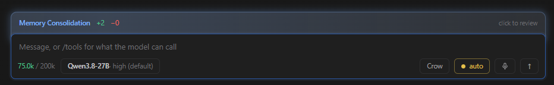

<div align="center">


<h1>CROW</h1>

<h3>Qwen3.8-27B at 200k context on one GPU.</h3>

<p><b>An agent, not a chat box:</b> 12 tools plus MCP servers, persistent memory, its own skills.<br>Runs on this machine, or on a provider you choose.</p>

<p>
<a href="LICENSE"></a>
<a href="cli/crow.py"></a>
<a href="#requirements"></a>
<a href="cli/crow.py"></a>
<a href="https://huggingface.co/unsloth/Qwen3.8-27B-GGUF"></a>
<a href="https://github.com/ggml-org/llama.cpp"></a>
<a href="#memory"></a>
</p>

<table>
<tr>
<td align="center"><b>27B</b><br><sub>dense</sub></td>
<td align="center"><b>200k</b><br><sub>context, one slot</sub></td>
<td align="center"><b>16.35 GiB</b><br><sub>model on disk</sub></td>
<td align="center"><b>25.5 GiB</b><br><sub>VRAM in use</sub></td>
<td align="center"><b>123.05</b><br><sub>tok/s decode, 11-round turn</sub></td>
<td align="center"><b>133.18</b><br><sub>tok/s decode, warm turn</sub></td>
<td align="center"><b>2,262.96</b><br><sub>tok/s prefill</sub></td>
</tr>
</table>

</div>

---

## Contents

- [Operating point](#operating-point)
- [Requirements](#requirements)
- [Install](#install)
- [Start](#start)
- [Config](#config)
- [Memory](#memory)
- [Skills](#skills)
- [Session search](#session-search)
- [MCP servers](#mcp-servers)
- [MCP over HTTP](#mcp-over-http)
- [Remote models](#remote-models)
- [Settings](#settings)
- [Measurements](#measurements)
- [Window](#window)
- [Repo](#repo)
- [Licence](#licence)

---

## Operating point

| | |
|---|---|
| Model | `Qwen3.8-27B-UD-Q4_K_XL.gguf`, 17,559,178,144 B |
| Architecture | dense, no `expert_count`; hybrid attention + SSM, `full_attention_interval 4` |
| Quant | `UD-Q4_K_XL`, Unsloth, imatrix 1,251 chunks |
| Context | `-c 200000`, one slot (`-np 1`) |
| KV | `q8_0` / `q8_0`, 6,647.00 MiB measured against 6,645.8 predicted |
| Speculation | `--spec-type draft-mtp`, head ships in the GGUF |
| GPU | RTX 5090, 32,607 MiB. 26,140 MiB in use |
| Build | llama.cpp server `1c3c967` |
| Source of truth | [`manifests/operating-point.json`](manifests/operating-point.json) |

---

## Requirements

| | |
|---|---|
| **GPU** | NVIDIA. 32 GB for this operating point. 16 GB is the installer's floor, unmeasured |
| **System RAM** | 32 GB |
| **Disk** | ~2 GB for Crow, **16.35 GiB for the model**, one file |
| **OS** | Windows x64 |
| **Python** | 3.8+. Terminal client uses the standard library only |
| **WebView2** | Window only. Ships with Windows 11 and with Edge |
| **pywebview** | Window only, ~2 MB. Installed by `install.ps1` |
| **Node** | Only for MCP servers started with `npx` or `node`. Reported by the preflight, never required. NOT installed by `install.ps1` |

---

## Install

```powershell
irm https://raw.githubusercontent.com/nibor1896/Crow/main/install.ps1 | iex
```

Preflight, download, extract, per-file sha256 against the release manifest, then the start lines
with paths resolved. No elevation. Everything under `%LOCALAPPDATA%\Crow`.

Model, separately:

```powershell
hf download unsloth/Qwen3.8-27B-GGUF --include "*UD-Q4_K_XL*" --local-dir $env:LOCALAPPDATA\Crow\models\qwen38-gguf
```

Check that one file of 17,559,178,144 B arrived. `hf` prints `✓ Downloaded` even when it could not
reach the repository.

---

## Start

### Server

```powershell
$env:LOCALAPPDATA\Crow\bin\llama-server.exe `
  -m $env:LOCALAPPDATA\Crow\models\qwen38-gguf\Qwen3.8-27B-UD-Q4_K_XL.gguf `
  --port 8082 -c 200000 -ctk q8_0 -ctv q8_0 -ngl 99 -np 1 --jinja `
  --slot-save-path $env:LOCALAPPDATA\Crow\session `
  --spec-type draft-mtp
```

### Clients

```powershell
python $env:LOCALAPPDATA\Crow\cli\crow_gui.py
```

```powershell
python $env:LOCALAPPDATA\Crow\cli\crow.py --base-url http://127.0.0.1:8082/v1
```

The window reads the `--port` off the running process. The terminal client needs `--base-url`.

---

## Config

### Server flags

| flag | value | why |
|---|---|---|
| `-c` | `200000` | a coding agent holds files and history. Rollover cuts at 0.9 of the window |
| `-np` | `1` | one user. `-np 4` splits the context four ways |
| `-ctk` / `-ctv` | `q8_0` | f16 left 332.8 MiB of headroom; q8_0 leaves 6,627 |
| `-ngl` | `99` | 16.35 GiB fits on the card whole |
| `--jinja` | on | without it llama.cpp uses its built-in template and the reasoning replay is dropped |
| `--slot-save-path` | `<install>\session` | the server refuses to start against a path that does not exist |
| `--spec-type` | `draft-mtp` | the model's own MTP head. 1.85x decode, measured |
| `--spec-draft-n-max` | `3` (default) | measured, see below |

### Client flags

| flag | default | |
|---|---|---|
| `--base-url` | `http://127.0.0.1:8081/v1` | this model needs `:8082` |
| `--reasoning-effort` | unset | per chat via `/reasoning`. Levels come from the manifest |
| `--rollover-at` | `0.9` | archive and start fresh at this share of the window. `0` disables |
| `--max-tool-rounds` | `24` | `0` answers without running any tool |
| `--mode` | `auto` | `manual` asks before writing and executing, `allowedit` before executing |
| `--no-review` | off | stop the model saving memories and skills after a turn |
| `--no-memory-approval` | off | let the review write to memory without asking. **The gate is on by default** |
| `--rounds` | off | full timing line after every tool round |
| `--show-reasoning` | off | stream the reasoning. `/thoughts` toggles it |
| `--no-session` | off | do not resume the last session, do not save this one |
| temperature / top_p / min_p | `1.0` / `0.95` / `0.01` | written once, in `cli/crow_core.py` |

### Reasoning levels

Per model, out of the manifest. Names that render the same prompt are one row in the window.

| rows offered | collapses |
|---|---|
| `high` (default), `low`, `medium` | `off` renders as `high` |

### Tools

12 built in, plus whatever [MCP servers](#mcp-servers) are configured.

`read_file` `write_file` `edit_file` `list_dir` `find_files` `search_text` `run_command`
`web_search` `fetch_url` `memory` `skill` `session_search`.

| release level | asks before |
|---|---|
| `auto` (default) | nothing |
| `allowedit` | executing |
| `manual` | writing and executing |

Reading never asks, at any level.

---

## Memory

Two files. Plain text, `§` on its own line between entries, editable by hand.

| path | limit | holds |
|---|---|---|
| `<working directory>\.crow\MEMORY.md` | 4,000 chars | this project: layout, conventions, commands, traps |
| `%LOCALAPPDATA%\Crow\USER.md` | 1,500 chars | who you are, how you want to be worked with |

| | |
|---|---|
| Limits come from | `MAX_TOOL_BYTES`. 16,000 B is ~4,000 tokens, so 4 chars buy 1 token |
| 4,000 chars is | a quarter of one tool read. Bigger than that and `read_file` is cheaper |
| Head cost, both stores plus one skill | 633 chars = 158 tokens = **0.09 %** of the usable window |
| Empty stores cost | nothing. No entries, no block, byte 0 unchanged |

### Rules

| | |
|---|---|
| Never trimmed for you | a write over the limit fails and returns the entries and both numbers |
| No `read` action | the content is already in the prompt |
| Exact duplicates | answered with success and one entry |
| Injection and invisible Unicode | refused before the entry is written |
| No working directory bound | `memory` is refused with a reason; `user` still works |

### The head is pinned

The rendered block is written into the chat file on first open and replayed **verbatim** from then
on. `prefix_fingerprint` hashes the system prompt, llama-server reuses a prompt by common token
prefix, and the KV cache lives on disk, so a head re-read at every start would go stale against
every saved cache. Binding a different folder re-pins and says what the prefill costs first.

### Who writes it

| | |
|---|---|
| Trigger | `MEMORY_REVIEW_AT` = **0.20 / 0.50 / 0.75** of the context window |
| Each mark fires | once. The mark is written to the chat file and travels with it |
| A turn crossing several marks | fires once, at the highest |
| Off with | `--no-review` |
| Before it writes | **it asks.** The proposed entries wait on a chip in the composer; nothing reaches the file until you press it |
| Nobody answers | they expire after **300 s** and are dropped. Nothing is ever written by a timer |
| Ask nothing, write always | `--no-memory-approval` |
| When it saves | one line in the chat, per entry, at the moment it lands |

### The gate

The review never writes on its own. What it wants to keep is staged and shown behind the composer,
and it stays there until you answer.

<div align="center">

</div>

| | |
|---|---|
| Collapsed | the title, lines **gained** in green and **lost** in red. A `replace` is one entry and both |
| Click | opens every proposed entry in full, and the two answers |
| `save to memory` | writes through the same `memory` tool the model uses. The cap, the duplicate check and the injection scan all still answer |
| `discard` | nothing is written |
| No answer | the entries expire after 300 s and are dropped. **Nothing is ever written by a timer** |
| New chat | the questions go with it |
| Off | `--no-memory-approval`, and then the review writes unasked as it did before 1.0.0 |

It keeps breathing while it waits, because a question is still true until it is answered. The line
that reports a **finished** write glows once and settles: same colour, different grammar.

---

## Skills

Procedures the model keeps. Memory is what is **true**; a skill is what to **do**.

```
%LOCALAPPDATA%\Crow\skills\<name>\SKILL.md
---
name: start-llama-server
description: When Crow needs a local LLM (port 8082). Exact flags, the wait signal, the bind trap.
enabled: true
---
1. …
```

| | |
|---|---|
| In the prompt | name and description only, never the body |
| Body fetched with | `skill(action=read, name=…)`, one call |
| List limit | 2,000 chars for the **whole list**, 200 per description |
| Over the limit | the list says how many did not fit; it does not grow |
| `enabled` | in the file's own frontmatter. Absent means on |
| Written by | the same review at 0.20 / 0.50 / 0.75. One pass decides both |

### Creating one

Crow ships with `skill-creator` and reads it before it writes. Seeded once, on the first run that
has no skills directory; deleted, it stays deleted.

```
Read your skill "skill-creator" first and follow it.
Then save, as a skill, how to <do the thing>: <steps, flags verbatim, the trap>.
Tell me at the end which name and description you saved.
```

| what `skill-creator` enforces | |
|---|---|
| Save only what worked **here** | not a plan, not general knowledge |
| The description says **when** | it is all the prompt carries; a description of itself is never chosen |
| Name the job, not the topic | `run-a-measurement-series`, not `measurements` |
| Body | numbered steps, flags verbatim, what each step produces, the one trap that was hit |
| Rewrite under the same name | `save` replaces and keeps the on/off switch |
| Saying nothing | the normal outcome |

---

## Session search

```
session_search(query, limit=8)
```

| | |
|---|---|
| Covers | the open chat and everything under `session\archiv\` |
| Index | `%LOCALAPPDATA%\Crow\index.db`, SQLite FTS5 |
| The index is | derived. Delete it and the next search rebuilds it |
| Freshness | file mtime. A changed file loses all its rows and gets new ones |
| Returns | the real messages, clipped at 400 chars each. No summary |
| Query syntax | every word is quoted, so `--slot-save-path` is a search and not an error |
| Without FTS5 | the tool stays declared and answers that nothing was searched |

---

## MCP servers

```
/mcp add npx -y @modelcontextprotocol/server-filesystem C:\dev\Crow
/mcp add node C:\dev\notekeeper\dist\index.js
/mcp add uvx mcp-server-fetch
/mcp add https://mcp.context7.com/mcp
/mcp add https://mcp.example.com/mcp --header Authorization: Bearer <token>
```

The name comes out of the line: `filesystem`, `notekeeper`, `fetch`. A URL is named from its host:
`context7`, and `docs.mcp.cloudflare.com` is `cloudflare_docs`.

| | |
|---|---|
| Config | `%LOCALAPPDATA%\Crow\mcp.json`, one block per server |
| Transport | `command` → stdio, `url` → [Streamable HTTP](#mcp-over-http). One block is one transport, never both |
| Protocol | `2025-06-18`. A `-32022` with `data.supported` is retried once against the highest version offered |
| Schema | asked **once**, when the server is added, then written to disk |
| `TOOLS` at start | read from that file, never from a server |
| Connection | opened when a tool is first called, then kept until `command`, `args`, `env`, `cwd`, `url`, `headers` or `enabled` change |
| Tool names | `mcp_<server>_<tool>` |
| Adding takes | every tool the server offers |
| Classes | empty until you set them. An unclassified tool is `executing` |
| Client capabilities | `elicitation` only. `sampling` gets `-32601` naming what is missing |
| Invisible U+E0000–U+E007F | stripped from names, descriptions, schemas and results. Emoji flags survive |
| `${VAR}` | in `command`, `args`, `cwd`, `env`, `url`, `headers`. Read from the environment when the server is used, never stored. An unset one refuses the server by name |
| Credential redaction | on **errors** only. A server that quotes the request it refused would otherwise put the token in the prompt, the chat and the session file. A successful result is untouched |
| Timeouts | `connect_timeout` 20 s, `timeout` 60 s. Per block, `0` and below fall back to the default |

### stdio

| | |
|---|---|
| Framing | one JSON object per line, both ways. A stdout line that does not parse is kept and reported, not dropped |
| Launcher | resolved through `PATH` + `PATHEXT` before it starts. `npx` is `npx.CMD` on Windows and `CreateProcess` does not look for it |
| Environment | a fixed base set plus the block's `env`, never the whole shell |
| stderr | drained, last 20 lines kept and printed with a failure |
| stdout that is not a message | kept too, and named apart. A command that is not an MCP server (an installer, a wizard, a CLI printing usage) says so only there |
| Close | EOF on stdin, `kill` after 3 s, then reaped |

### Elicitation

A server may ask the person a question in the middle of a tool call. What arrives is a **schema**,
never a rendering. Crow draws the fields, so nothing on screen came off the wire.

| | |
|---|---|
| Accepted | a flat object of `string`, `number`, `integer`, `boolean`. `enum` of strings. At most 12 fields |
| Declined, with a reason | anything else: nested objects, arrays, `$ref`, a schema asking for nothing, and every mode this client does not draw |
| Labels | `title`, `description` and `enum` go through the `U+E0000–U+E007F` filter and reach the page by `textContent` |
| Answer | `accept` with values, `decline`, or `cancel`. Three buttons, because the specification separates a refusal from a dismissal |
| Values | checked against the schema that was shown. Only declared fields travel; a `boolean` arrives as a boolean |
| Timeout | 300 s, then `cancel` |
| Off per server | `"elicitation": false` in the block. The capability is then not declared at all |
| Where | in the chat, on the turn that caused it, the same place a tool approval lands |

### Commands

| | |
|---|---|
| `/mcp` | what is configured, and its cost |
| `/mcp add <command line>` | add a server, take what it offers |
| `/mcp add <url> [--header <name: value>]` | the same, over HTTP. `--header` may repeat |
| `/mcp auth <server>` | authorise an HTTP server in the browser |
| `/mcp fetch <server>` | ask it again, keeping what was ticked |
| `/mcp use <server> <tool> <class>` | `reading`, `writing` or `executing` |
| `/mcp drop <server> <tool>` | take it out of the tool list |

Removing a server: `Help → Settings → MCPs`.

### The file

```json
{"servers": {"filesystem": {
  "command": "npx",
  "args": ["-y", "@modelcontextprotocol/server-filesystem", "C:/dev/Crow"],
  "env": {},
  "enabled": true,
  "timeout": 60,
  "connect_timeout": 20,
  "tools": {"include": ["read_file"], "exclude": []},
  "schema": {"tools": [{"name": "read_file", "description": "...",
                        "inputSchema": {}, "annotations": {}}]},
  "classes": {"read_file": "reading"}
}}}
```

| key | |
|---|---|
| `schema` | what the server answered. Untrusted, per the specification |
| `classes` | what you confirmed. This is the half a release level acts on |
| `include` | positive list, and it wins over `exclude` |
| Globs | both lists take `*`, `?`, `[…]`. An entry without one is an exact name. `docs` excludes the tool `docs`, never `docs_search` |
| `enabled: false` | skipped. No connection attempted |
| `elicitation` | `false` stops this server asking, and stops the capability being declared |
| `timeout` · `connect_timeout` | seconds. Defaults 60 and 20 |
| `url` | Streamable HTTP endpoint, `http` or `https`. Not alongside `command` |
| `headers` | sent on every HTTP request. Never shown in either surface |
| `client_id` · `client_secret` | a pre-registered OAuth client, for servers that reject dynamic registration |
| `client_name` | what dynamic registration calls this client. Default `Crow` |
| `redirect_host` | `127.0.0.1` (default) or `localhost` in the redirect URI. The listener binds loopback either way |

The classification is pre-filled from `annotations`: `readOnlyHint: true` → `reading`,
`destructiveHint: false` → `writing`, anything else → `executing`. The specification's own defaults
are `readOnlyHint: false` and `destructiveHint: true`, so a server that says nothing gets the
strictest of the three.

### Cost

| | tools | chars in every prompt |
|---|---|---|
| built-in | 12 | 7,758 |
| `@modelcontextprotocol/server-filesystem` | 14 | 8,217 |
| `mcp-server-fetch` | 1 | 1,137 |

Measured 2026-08-22. The tool list is rendered into the head of the prompt, so changing it moves
byte 0: the next turn and the first turn of every saved session pay a full prefill.

### Not built

| | |
|---|---|
| `sampling` | not declared. A server that asks for inference anyway gets `-32601` naming the missing capability |
| Elicitation URL mode · nested schemas · arrays | declined with a reason. Crow draws the form itself, so it answers only what it can draw |
| `notifications/tools/list_changed` | ignored. A tool list that changed mid-chat would move byte 0 |
| No catalog | no curated list of servers. You enter the command line or the URL |

---

## MCP over HTTP

Transport `Streamable HTTP`, specification `2025-06-18`. A block with a `url` uses it; a block with
a `command` does not.

| | |
|---|---|
| Endpoint | one URL, `http` or `https`. `POST` only. No `GET` stream is opened |
| Per message | one `POST`, `Content-Type: application/json` |
| `Accept` | `application/json, text/event-stream`. Both, on every request |
| Answer | a JSON object **or** an SSE stream (`event: message` / `data: {…}`). Both are normal; context7 answers `tools/list` as a stream |
| SSE reader | own thread, stops at the first message carrying `result` or `error`. `:` comment lines and notifications ahead of the answer are skipped |
| Notification · client response | `202`, empty body, nothing enqueued |
| Session | `Mcp-Session-Id` off the `initialize` response where the server sets one, then on every request. **No id is a valid state**, not a fault |
| `404` on a session | expiry. The session is dropped, `initialize` runs again, the call is retried **once** |
| Close | `HTTP DELETE` with the session id. `405` and any other refusal are ignored |
| Server → client requests | arrive on the open stream, answered by a separate `POST` |

### Headers

Three layers. Later ones overwrite earlier ones.

| layer | |
|---|---|
| 1 · identity | `User-Agent: Crow/<version> (+<repo>)` |
| 2 · block | everything in `headers`, e.g. `Authorization` |
| 3 · transport | `Content-Type`, `Accept`, `Mcp-Session-Id`, `MCP-Protocol-Version` |

`MCP-Protocol-Version` is sent only after `initialize` has come back, never on it.

`headers` is not in `mcp_view()` and appears in no listing, no sheet and no log.

### Adding one

```
/mcp add https://mcp.context7.com/mcp
/mcp add https://mcp.example.com/mcp --header Authorization: Bearer <token>
/mcp add https://mcp.example.com/mcp -H X-Api-Key: <key> -H X-Org: acme
```

| | |
|---|---|
| Name | from the host: `mcp.context7.com` → `context7`, `docs.mcp.cloudflare.com` → `cloudflare_docs` |
| `--header` · `-H` | `name: value`, may repeat. Everything after the flag up to the next flag is the value, so a value may contain spaces |
| Refused | a URL with arguments after it, `--header` without a `:`, a header carrying a control character, `--header` on a command line |

### The block

```json
{"servers": {"context7": {
  "url": "https://mcp.context7.com/mcp",
  "headers": {"Authorization": "Bearer <token>"},
  "timeout": 60,
  "connect_timeout": 20,
  "tools": {"include": ["query-docs"], "exclude": []},
  "schema": {"tools": [{"name": "query-docs", "description": "...",
                        "inputSchema": {}, "annotations": {}}]},
  "classes": {"query-docs": "reading"}
}}}
```

### Measured

Three servers, 2026-08-22:

| | protocol | answer | session |
|---|---|---|---|
| `mcp.context7.com` | 2025-06-18 | SSE | none |
| `mcp.deepwiki.com` | 2025-06-18 | SSE | none |
| `docs.mcp.cloudflare.com` | 2025-06-18 | SSE | none |

`docs.mcp.cloudflare.com` answers `Python-urllib` with `403`, error 1010, `browser_signature`. It is
the `User-Agent` that decides, not the protocol.

Driven end to end on 2026-08-22: static headers against `mcp.context7.com`, and the full OAuth leg
against `mcp.higgsfield.ai`, whose `/oauth2/authorize` hands off to Clerk. Its token endpoint
answers `"token_type": "bearer"` and its MCP endpoint refuses `bearer <token>` while accepting
`Bearer <token>`. The scheme is sent capitalised for that reason.

### OAuth

A server that answers `401` is authorised in the browser. `/mcp add <url>` does it by itself, and
so does re-fetching a configured server; `/mcp auth <server>` repeats it on its own.

| | |
|---|---|
| Discovery | `WWW-Authenticate: resource_metadata=...` when the `401` carries it, else `/.well-known/oauth-protected-resource<path>`, else `/.well-known/oauth-protected-resource` |
| Authorization server | every entry in `authorization_servers`, in the order the document lists them. Metadata from `/.well-known/oauth-authorization-server` then `/.well-known/openid-configuration`, path-inserted first where the issuer has a path |
| `issuer` | in the metadata document, compared against the URL it was fetched from. A mismatch is refused |
| PKCE | `S256`, required. `code_challenge_methods_supported` without it, or absent, is refused |
| Client | RFC 7591 dynamic registration, `token_endpoint_auth_method: none`. `client_id` + `client_secret` in the block are used instead where the server rejects registration. Google Drive answers `400`, GitHub Copilot advertises no endpoint at all |
| `client_name` | `Crow`, overridable. Figma's endpoint allowlists registration by exact name and `403`s one it does not know |
| Redirect | `http://127.0.0.1:<port>/callback`, listener bound to loopback only. `redirect_host: localhost` changes only the name. Some authorization servers sit behind a WAF that `403`s a literal `127.0.0.1` |
| `state` | sent and compared. This is what binds the answer to the request |
| `iss` | read, not enforced. It guards mix-up, which needs a client talking to several authorization servers in one flow; this one talks to exactly one and takes the token endpoint from metadata fetched before the browser opened. Enforcing it refuses every brokered login. Clerk, Auth0 and Okta all stamp their own domain |
| Several `authorization_servers` | tried in the order the metadata lists them |
| `resource` | RFC 8707. The `resource` the metadata names, checked against the endpoint's host first; the canonical URI of the endpoint where it names none. On the authorization request and the token request |
| Transport | every endpoint must be `https`, or loopback. Anything else is refused before a token moves |
| Tokens | `%LOCALAPPDATA%\Crow\mcp_tokens.json`, never in `mcp.json` and never in a view. `0600` where the platform means it. Dropped with the server |
| Refresh | inside a tool call, silently, `60 s` before expiry and on a `401`. A browser never opens during a turn. The call fails naming `/mcp auth <server>` |

### Not built

| | |
|---|---|
| Browser leg inside a turn | a tool call may refresh, never ask. It runs when a server is added, when somebody is at the keyboard |
| Client ID Metadata Documents | `2025-11-25` recommends them; Crow speaks `2025-06-18` and registers dynamically |
| `GET` stream | not opened. `MAY` in the specification, and Crow acts on no unsolicited notification |
| `Last-Event-ID` | no resumption. Nothing is held open to lose |
| Batching | one message per request. Removed from the protocol in `2025-06-18` |

---

## Remote models

`Settings → API Keys`, paste the key, then `Settings → Model`. The catalogue is fetched when the key
lands and on `ask again`. Nothing is asked of a provider while a window opens.

| file | |
|---|---|
| `%LOCALAPPDATA%\Crow\providers.json` | active provider, model per provider, catalogue |
| `%LOCALAPPDATA%\Crow\provider_keys.json` | keys, `0600`, read by no view |
| `%LOCALAPPDATA%\Crow\provider_tokens.json` | logins, `0600`, read by no view |

| provider | endpoint | credential |
|---|---|---|
| This machine | `--base-url`, default `http://127.0.0.1:8081/v1` | none |
| OpenRouter | `https://openrouter.ai/api/v1` | `sk-or-...` |
| Anthropic | `https://api.anthropic.com/v1` (Messages) | `sk-ant-...` or a sign-in |
| OpenAI | `https://api.openai.com/v1` | `sk-...` or a sign-in |

| | |
|---|---|
| Typed slug | field beside `ask for the list`, sent exactly as entered. Measured 2026-08-23: Anthropic's `/v1/models` answers a borrowed sign-in `401` |
| Variant suffix | `:free`, `:extended`, `:nitro`, `:floor` are part of the slug. `z-ai/glm-5.2` and `z-ai/glm-5.2:free` are two entries with two bills |

### Subscriptions

`Settings → Subscriptions`, one tile per provider. PKCE, `state`, refresh: the flow `/mcp` uses.
A sign-in outranks a pasted key; `sign out` drops the login and leaves the key.

Measured 2026-08-22, neither provider registers a client:

| | discovery | registration |
|---|---|---|
| `claude.ai`, `api.anthropic.com`, `console.anthropic.com` | 404 | none |
| `auth.openai.com` | `openid-configuration`, authorize + token | none |

Each needs a `client_id`. Until one is set the tile says so instead of opening a login that returns
`400`. Crow ships no other product's `client_id`.

```json
{"oauth": {"anthropic": {"client_id": "...", "authorize": "https://...", "token": "https://..."}}}
```

`issuer` replaces `authorize`/`token` where the provider publishes discovery. `auth.openai.com` does.

**Anthropic, documented way in:**

```bash
claude setup-token
```

Paste what it prints. `CLAUDE_CODE_OAUTH_TOKEN` in the environment is read under the same name.

**Borrowed sign-in, second choice.** Measured 2026-08-23: a borrowed Claude Code session token
authenticated at `/v1/messages` and returned `429` naming no limit, with the account's five-hour
window at 7 %.

| provider | store | read |
|---|---|---|
| Anthropic | `~/.claude/.credentials.json` | `claudeAiOauth.accessToken` |

| borrowed token | |
|---|---|
| Read | at the moment a request needs it |
| Never | copied, written, refreshed. The refresh token belongs to the program that owns the file |
| Expired | reported; open that program once and it refreshes itself |
| Grant | requests carry **that program's** grant, so nothing switches on by finding a file |
| Order | Crow's own sign-in, then borrowed, then pasted key |

**Not Codex.** `~/.codex/auth.json` holds a token; `GET https://api.openai.com/v1/models` answers it
`403`: authenticated, resource refused. It belongs to the ChatGPT backend; the platform API wants
an `sk-...` key. Two providers, not one.

### Two dialects

| transport | endpoint | who |
|---|---|---|
| `chat_completions` | `<base>/chat/completions` | the local server, OpenRouter, OpenAI |
| `anthropic_messages` | `<base>/messages` | Anthropic, key **and** sign-in |

The dialect belongs to the provider, not to the credential. Measured 2026-08-23, a Codex token got
`403` from the OpenAI-shaped endpoint.

What `anthropic_messages` translates, each mandatory:

| | |
|---|---|
| System prompt | moves to the top level |
| Tools | `input_schema` instead of `function` |
| Tool call | `tool_use` blocks with an object `input` |
| Tool results | every result answering one turn batched into **one** user message |
| `max_tokens` | required |
| `temperature`, `top_p`, `top_k` | removed on current models, not sent |
| Stream back | `text_delta` → content, `thinking_delta` → reasoning, `input_json_delta` → tool arguments. One loop, not two |

| credential | header |
|---|---|
| key | `x-api-key` |
| sign-in | `Authorization: Bearer` plus `anthropic-beta: oauth-2025-04-20` |

Never both.

### One answer's ceiling

`max_tokens` travels on a remote request and not on a local one. Measured 2026-08-23, without it
OpenRouter answered:

```
HTTP 402 -- you requested up to 65536 tokens, but can only afford 313
```

A provider reserves and prices the model's maximum output when the body names no cap. llama-server
reserves nothing and bills nobody, and a cap there would cut long answers it is happy to finish.

### Which upstream answers

OpenRouter is a broker: one slug is served by many upstream companies. One field is sent to it and
to nobody else.

| field | | |
|---|---|---|
| `session_id` | sticky routing key | all turns of one chat go to the same upstream |

| | |
|---|---|
| Value | sha256 of the chat's path, never the path. That path names a person and a directory layout |
| Length | 64 characters against a documented limit of 256 |
| Unsaved chat | sends none; an empty string would make every unsaved chat one session |
| Both senders | the visible turn and the background review carry the same key, or the review is a second session inside the first |

**`provider.require_parameters` is not sent.** Measured 2026-08-23:

```
HTTP 404 -- No endpoints found that can handle the requested parameters
```

| | |
|---|---|
| Default | an upstream that does not know a parameter ignores it |
| With the flag | ignoring becomes exclusion |
| Crow's body | carries `timings_per_token` and `chat_template_kwargs`, llama.cpp extensions no remote upstream supports |
| Result | every candidate excluded |
| Available again | the day a remote body stops carrying local-only fields |

### No slot, no cache, no operating point

`SLOT_FILE`, `prefix_fingerprint`, `/props` and every "pays a full prefill" line are llama-server's.
Against a provider none of them exists, and the window says so once, where the endpoint is chosen:

| | local | remote |
|---|---|---|
| context window | `/props`, **measured** | the catalogue's `context_length`, **declared** |
| no window reported | bare token count, no bar | bare token count, no bar |
| KV save and restore | `/slots/0` | not attempted; the session file says `kv: false` |
| `/health`, `/props` | asked | not asked |
| reasoning levels | per `manifests/` | none offered |

No price display. Whoever brings a key knows their costs.

---

## Settings

`Help → Settings` in the window.

| pane | |
|---|---|
| **Appearance** | theme: dark, light, crow |
| **Skills** | one row per skill, name and description, a switch. Off takes it out of the prompt; the file stays. Switching re-pins the open chat and says what the prefill costs |
| **Server** | connection state, the base URL as its title, and the tool-call switch |
| **MCPs** | one row per server, folded; per tool a switch and its class. Add with a command line, `ask again`, `remove`. See [MCP servers](#mcp-servers) |
| **Model** | provider and model, two folds. Picking a provider empties the chat. See [Remote models](#remote-models) |
| **Subscriptions** | one tile per provider that can log in. Click opens the browser; `sign out` drops the login |
| **API Keys** | one key per provider. Stored in `provider_keys.json`, shown as a mask afterwards |
| **About** | version |

Chat rail: right-click a chat to rename, move to a project, archive or delete; right-click the empty
space for a new chat or a new project. A project **is** a working directory. A chat belongs to one
when its `crow_root` points there, and nothing else records it.

---

## Measurements

One user, `-np 1`, identical prompt, server restarted cold per arm, cross-checked against the
server's own `eval time` blocks.

### Speculation

| prompt | without MTP | with MTP | factor |
|---|---|---|---|
| tool-heavy, 11 rounds | 66.51 tok/s | **123.05 tok/s** | 1.85 |
| warm follow-up, 1 round | 64.50 tok/s | **133.18 tok/s** | 2.07 |
| wall clock, tool-heavy | 2m07s | **1m22s** | 1.55 |

| mechanism | without MTP | with MTP |
|---|---|---|
| main-model passes/s | 65 | 41 |
| accepted tokens per pass | 1.00 | 2.98 |
| draft acceptance | n/a | 4,379 / 6,630 = 66 % |
| per-round acceptance | n/a | 52 % to 100 % |

### `--spec-draft-n-max`

| n_max | tokens | tok/s | acceptance | mean len | passes/s |
|---|---|---|---|---|---|
| 1 | 3,425 | 96.71 | 77.1 % | 1.77 | 54.6 |
| 2 | 2,344 | 105.17 | 59.4 % | 2.19 | 48.0 |
| **3** (default) | 7,402 | **121.76** | 66.1 % | 2.98 | 40.9 |
| 4 | 4,341 | 115.73 | 53.0 % | 3.12 | 37.1 |
| 6 | 3,727 | 119.79 | 46.6 % | 3.80 | 31.5 |
| 8 | 2,976 | 111.68 | 33.7 % | 3.69 | 30.3 |

One run per value. Output length varied 2,344 to 7,402 tokens; the gap between 3, 4 and 6 is not
separable.

### Context

| context | decode, no MTP |
|---|---|
| 1,653 tokens | 74.09 tok/s |
| 35,984 tokens | 64.50 tok/s |

### Prefill

| block | tok/s |
|---|---|
| 34 tokens | 209.71 |
| 890 | 2,091.73 |
| 4,339 | 3,298.49 |

Prefill is a function of block size, not a constant.

### Verification

| check | result |
|---|---|
| tokens, client vs server | 6,591 = sum of 11 `eval time` blocks |
| decode, client vs server | 6,591 / 53.564 s = 123.05 tok/s |
| prefill, client vs server | 20,490 = sum of 11 `prompt eval` lines |
| suite | 1,298 of 1,298 |
| `check_shared_core` | 60 / 60 |
| `check_operating_point` | 6 / 6 |
| `install.ps1 -Selftest` | 85 / 85 |

### Not measured

| open | |
|---|---|
| VRAM floor | 16 GB is the installer's floor, never run |
| contexts past 36k under MTP | without MTP that span costs 13 % |
| distribution fidelity at `temperature 1.0` | one graded answer is a sample |
| what the background review costs | it holds the single slot; occupancy and queueing never timed |

---

## Window

<div align="center">

</div>

| | |
|---|---|
| Composer | model and reasoning level as one chip, context readout, working directory, release level, dictation |
| Cost line | rounds, tokens, decode, prefill, cache hits, tool calls, wall clock |
| Thought blocks | folded, one per re-entry, each labelled with the turn's thinking share |
| Rail | chats grouped by project, archive, fold state remembered |

---

## Repo

| path | |
|---|---|
| `cli/crow.py` | terminal client |
| `cli/crow_gui.py` | window |
| `cli/crow_core.py` | conversation, request, SSE, tool loop, memory, skills, cost line |
| `tools/start-server.py` | model picker, becomes `llama-server` |
| `manifests/operating-point.json` | source of truth for every command line above |
| `tools/check_operating_point.py` | holds this file against that manifest |
| `docs/second-model.md` | the other server `install.ps1` sets up |

---

## Licence

MIT. See [LICENSE](LICENSE).

Model: [Qwen](https://huggingface.co/Qwen/Qwen3.8-27B) (Apache-2.0). Quantisation by
[Unsloth](https://huggingface.co/unsloth). Engine:
[llama.cpp](https://github.com/ggml-org/llama.cpp).

Earlier READMEs: [v0.5.1, Qwen-first](docs/README-v0.5.1-qwen.md) ·
[v0.5.1, the one before it](docs/README-v0.5.1-deepseek.md).

<div align="center">
<a href="https://ko-fi.com/nibor1896"></a>
</div>
