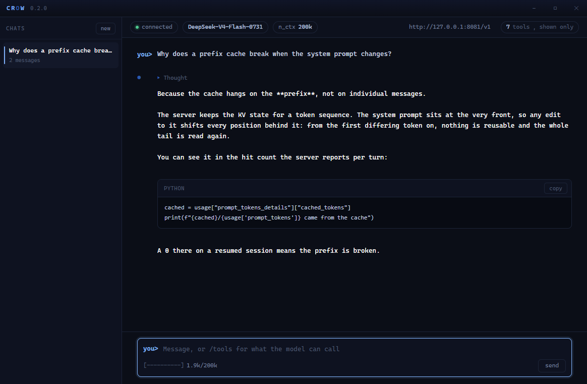

<div align="center">


<h1>CROW</h1>

<h3>Qwen3.8-27B at 200k context on one consumer graphics card.</h3>

<p>
<a href="LICENSE"></a>
<a href="cli/crow.py"></a>
<a href="#requirements"></a>
<a href="cli/crow.py"></a>
<a href="https://huggingface.co/unsloth/Qwen3.8-27B-GGUF"></a>
<a href="https://github.com/ggml-org/llama.cpp"></a>
</p>

<table>
<tr>
<td align="center"><b>27B</b><br><sub>dense</sub></td>
<td align="center"><b>200k</b><br><sub>context, one slot</sub></td>
<td align="center"><b>16.35 GiB</b><br><sub>model on disk</sub></td>
<td align="center"><b>25.5 GiB</b><br><sub>VRAM in use</sub></td>
<td align="center"><b>123.05</b><br><sub>tok/s decode, 11-round turn</sub></td>
<td align="center"><b>133.18</b><br><sub>tok/s decode, warm turn</sub></td>
<td align="center"><b>2,262.96</b><br><sub>tok/s prefill</sub></td>
</tr>
</table>

</div>

---

## Operating point

| | |
|---|---|
| Model | `Qwen3.8-27B-UD-Q4_K_XL.gguf`, 17,559,178,144 B |
| Architecture | dense, no `expert_count`; hybrid attention + SSM, `full_attention_interval 4` |
| Quant | `UD-Q4_K_XL`, Unsloth, imatrix 1,251 chunks |
| Context | `-c 200000`, one slot (`-np 1`) |
| KV | `q8_0` / `q8_0`, 6,647.00 MiB measured against 6,645.8 predicted |
| Speculation | `--spec-type draft-mtp`, head ships in the GGUF |
| GPU | RTX 5090, 32,607 MiB. 26,140 MiB in use |
| Build | llama.cpp server `1c3c967` |
| Source of truth | [`manifests/operating-point.json`](manifests/operating-point.json) |

Second model, unchanged: `DeepSeek-V4-Flash-0731` at `UD-IQ2_XXS`, 304B MoE, 13.3B active, experts
streamed off the SSD. Command line below.

---

## Requirements

| | |
|---|---|
| **GPU** | NVIDIA. 32 GB for this operating point. 16 GB is the installer's floor, unmeasured for Qwen |
| **System RAM** | 32 GB. The host tier is a 0731 flag and unused here |
| **Disk** | ~2 GB for Crow, **16.35 GiB for the model** — one file |
| **OS** | Windows x64 |
| **Python** | 3.8+. Terminal client uses the standard library only |
| **WebView2** | Window only. Ships with Windows 11 and with Edge |
| **pywebview** | Window only, ~2 MB. Installed by `install.ps1` |

---

## Install

```powershell
irm https://raw.githubusercontent.com/nibor1896/Crow/main/install.ps1 | iex
```

Preflight, download, extract, per-file sha256 against the release manifest, then the start lines
with paths resolved. No elevation. Everything under `%LOCALAPPDATA%\Crow`.

Model, separately:

```powershell
hf download unsloth/Qwen3.8-27B-GGUF --include "*UD-Q4_K_XL*" --local-dir $env:LOCALAPPDATA\Crow\models\qwen38-gguf
```

Check that one file of 17,559,178,144 B arrived. `hf` prints `✓ Downloaded` even when it could not
reach the repository.

---

## Start

### Server — Qwen3.8-27B

```powershell
$env:LOCALAPPDATA\Crow\bin\llama-server.exe `
  -m $env:LOCALAPPDATA\Crow\models\qwen38-gguf\Qwen3.8-27B-UD-Q4_K_XL.gguf `
  --port 8082 -c 200000 -ctk q8_0 -ctv q8_0 -ngl 99 -np 1 --jinja `
  --slot-save-path $env:LOCALAPPDATA\Crow\session `
  --spec-type draft-mtp
```

### Server — DeepSeek-V4-Flash-0731

```powershell
$env:LOCALAPPDATA\Crow\bin\llama-server.exe `
  -m $env:LOCALAPPDATA\Crow\models\0731-gguf\UD-IQ2_XXS\DeepSeek-V4-Flash-0731-UD-IQ2_XXS-00001-of-00003.gguf `
  --port 8081 -c 200000 -ngl 99 -np 1 --jinja `
  --slot-save-path $env:LOCALAPPDATA\Crow\session `
  --chat-template-file $env:LOCALAPPDATA\Crow\manifests\0731-chat-template.jinja `
  --moe-stream --moe-stream-cache 58s --moe-stream-io-threads 8 --moe-stream-direct `
  --moe-stream-l2 32
```

### Clients

```powershell
python $env:LOCALAPPDATA\Crow\cli\crow.py --base-url http://127.0.0.1:8082/v1
```

```powershell
python $env:LOCALAPPDATA\Crow\cli\crow_gui.py
```

The window attaches to whatever server is up: it reads the `--port` off the running process. The
terminal client defaults to 8081 and needs `--base-url` for Qwen.

---

## Config

### Server flags

| flag | value | why |
|---|---|---|
| `-c` | `200000` | a coding agent holds files and history. Rollover cuts at 0.9 of the window |
| `-np` | `1` | one user. `-np 4` splits the context four ways |
| `-ctk` / `-ctv` | `q8_0` | f16 left 332.8 MiB of headroom; q8_0 leaves 6,627 |
| `-ngl` | `99` | 16.35 GiB fits on the card whole |
| `--jinja` | on | without it llama.cpp uses its built-in template and the reasoning replay is dropped |
| `--slot-save-path` | `<install>\session` | the server refuses to start against a path that does not exist |
| `--spec-type` | `draft-mtp` | the model's own MTP head. 1.85x decode, measured |
| `--spec-draft-n-max` | `3` (default) | measured, see below |
| `--moe-stream*` | 0731 only | routes expert tensors through a slot cache. Qwen has no expert tensors |
| `--chat-template-file` | 0731 only | that GGUF's embedded template fails its own golden vector 4 |

### Client flags

| flag | default | |
|---|---|---|
| `--base-url` | `http://127.0.0.1:8081/v1` | Qwen needs `:8082` |
| `--reasoning-effort` | unset | per chat via `/reasoning`. Levels come from the manifest |
| `--rollover-at` | `0.9` | archive and start fresh at this share of the window. `0` disables |
| `--max-tool-rounds` | `24` | `0` answers without running any tool |
| `--mode` | `auto` | `manual` asks before writing and executing, `allowedit` before executing |
| `--rounds` | off | full timing line after every tool round |
| `--show-reasoning` | off | stream the reasoning. `/thoughts` toggles it |
| `--no-session` | off | do not resume the last session, do not save this one |
| temperature / top_p / min_p | `1.0` / `0.95` / `0.01` | written once, in `cli/crow_core.py` |

### Reasoning levels

Levels are per model, out of the manifest. Names that render the same prompt are one row in the
window.

| model | rows offered | collapses |
|---|---|---|
| Qwen3.8-27B | `high` (default), `low`, `medium` | `off` renders as `high` |
| DeepSeek-V4-Flash-0731 | `low` (default), `max` | `off`, `low`, `high` all render the same |

---

## Measurements

All rows below: one user, `-np 1`, identical prompt, server restarted cold per arm, numbers
cross-checked against the server's own `eval time` blocks.

### Speculation

| prompt | without MTP | with MTP | factor |
|---|---|---|---|
| tool-heavy, 11 rounds | 66.51 tok/s | **123.05 tok/s** | 1.85 |
| warm follow-up, 1 round | 64.50 tok/s | **133.18 tok/s** | 2.07 |
| wall clock, tool-heavy | 2m07s | **1m22s** | 1.55 |

| mechanism | without MTP | with MTP |
|---|---|---|
| main-model passes/s | 65 | 41 |
| accepted tokens per pass | 1.00 | 2.98 |
| draft acceptance | n/a | 4,379 / 6,630 = 66 % |
| per-round acceptance | n/a | 52 % to 100 % |

### `--spec-draft-n-max`

| n_max | tokens | tok/s | acceptance | mean len | passes/s |
|---|---|---|---|---|---|
| 1 | 3,425 | 96.71 | 77.1 % | 1.77 | 54.6 |
| 2 | 2,344 | 105.17 | 59.4 % | 2.19 | 48.0 |
| **3** (default) | 7,402 | **121.76** | 66.1 % | 2.98 | 40.9 |
| 4 | 4,341 | 115.73 | 53.0 % | 3.12 | 37.1 |
| 6 | 3,727 | 119.79 | 46.6 % | 3.80 | 31.5 |
| 8 | 2,976 | 111.68 | 33.7 % | 3.69 | 30.3 |

One run per value. Output length varied 2,344 to 7,402 tokens; the gap between 3, 4 and 6 is not
separable.

### Context

| context | decode, no MTP |
|---|---|
| 1,653 tokens | 74.09 tok/s |
| 35,984 tokens | 64.50 tok/s |

### Prefill

| block | tok/s |
|---|---|
| 34 tokens | 209.71 |
| 890 | 2,091.73 |
| 4,339 | 3,298.49 |

Prefill is a function of block size, not a constant.

### Verification

| check | result |
|---|---|
| tokens, client vs server | 6,591 = sum of 11 `eval time` blocks |
| decode, client vs server | 6,591 / 53.564 s = 123.05 tok/s |
| prefill, client vs server | 20,490 = sum of 11 `prompt eval` lines |
| suite | 702 of 702 |
| `check_shared_core` | 57 / 57 |
| `check_operating_point` | 6 / 6 |

### Not measured

| open | |
|---|---|
| VRAM floor for Qwen | 16 GB is the installer's floor, never run |
| contexts past 36k under MTP | without MTP that span costs 13 % |
| distribution fidelity at `temperature 1.0` | one graded answer is a sample |
| 0731 figures under MTP | its speculation path uses a separate draft model and costs 6.06 % |

---

## Window

<div align="center">

</div>

| | |
|---|---|
| Chips | connection, model, reasoning level, context window, endpoint, tool count |
| Model chip | picker. Switching restarts the server and says so before it does |
| Reasoning chip | one row per distinct rendering. A click selects and applies |
| Cost line | rounds, tokens, decode, prefill, cache hits, tool calls, wall clock |
| Thought blocks | folded, one per re-entry, each labelled with the turn's thinking share |
| Rail | chats, rollovers, archive |

---

## Repo

| path | |
|---|---|
| `cli/crow.py` | terminal client |
| `cli/crow_gui.py` | window |
| `cli/crow_core.py` | conversation, request, SSE, tool loop, cost line |
| `tools/start-server.py` | model picker, becomes `llama-server` |
| `manifests/operating-point.json` | source of truth for every command line above |
| `tools/check_operating_point.py` | holds this file against that manifest |
| `docs/README-v0.5.1-deepseek.md` | the previous README, DeepSeek-first |

---

## Licence

MIT. See [LICENSE](LICENSE).

Models are their authors': [Qwen](https://huggingface.co/Qwen/Qwen3.8-27B) (Apache-2.0),
[DeepSeek](https://huggingface.co/deepseek-ai/DeepSeek-V4-Flash-0731). Quantisations by
[Unsloth](https://huggingface.co/unsloth). Engine: [llama.cpp](https://github.com/ggml-org/llama.cpp).

<div align="center">
<a href="https://ko-fi.com/nibor1896"></a>
</div>
