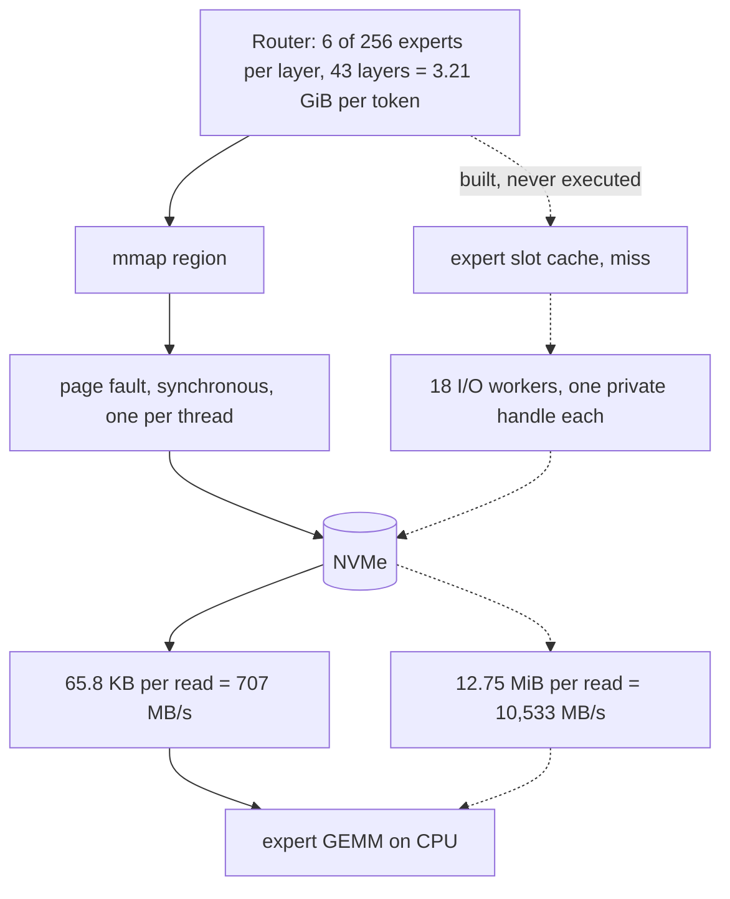

<p align="center">
  
</p>

<h1 align="center">Crow</h1>

<p align="center">
  A frontier coding LLM, made runnable by streaming its experts off the SSD.
</p>

---

## What this is

**The model is not trained. It is made runnable.**

A frontier-scale mixture-of-experts coding model, with its expert weights read from disk on demand
instead of held in memory. Plus an agent platform on top of it, in the spirit of
`NousResearch/hermes-agent` — that one is an example for scope, not a specification.

Target model: **`deepseek-ai/DeepSeek-V4-Flash`**, MIT licensed. Per its model card: 284 B total,
13 B active per token, LiveCodeBench 91.7. Those are the vendor's numbers about the vendor's
harness, kept here as such. Not the largest model wins, but the sparsest one that still scores at
frontier level on code.

The file in use is `ggml-org/DeepSeek-V4-Flash-GGUF` → `DeepSeek-V4-Flash-MXFP4.gguf`,
**154,991,536,896 bytes**, `sha256:78a9a077…`. Read from its header on 2026-08-02: 1328 tensors,
52 KV pairs, `block_count 43`, `expert_count 256`, `expert_used_count 6`, `hash_layer_count 3`.

## The card is not the problem. The disk is.

Measured on the development machine, 2026-08-02:

| Tier | Capacity | Bandwidth |
|---|---|---|
| VRAM | 32,607 MiB on the development card | ~1,800 GB/s |
| RAM | 63.4 GB DDR5-5600 | **~45 GB/s measured** |
| NVMe | 574 GB free, Phison 2 TB | **5.8 GB/s measured** sequential, single thread, 4 MB blocks |

**The binding constraint is RAM, not VRAM.** 63.4 GB is smaller than every usable quantisation of
this model — the smallest published one is `unsloth/UD-IQ1_S` at 82.5 GB, and the file in use is
155 GB. So the expert weights cannot live in RAM, and the NVMe is in the loop on every token.

And the card turned out to be the cheap part. **The fastest configuration measured here occupies
11.21 GiB, and spending the rest of a 32 GiB card made it 1.7× slower** — the numbers are in the
next section. That is a measurement about this model on this machine, not a system requirement:
**what the target profile may assume is still open** and is decided on
[#25](https://github.com/nibor1896/Crow/issues/25).

Read from the tensor table, then confirmed against llama.cpp's own load accounting:

| | measured |
|---|---:|
| expert tensors per layer | 3 × 1088 MiB = **3,264 MiB** (all 256 experts) |
| per expert, per layer | 12.75 MiB |
| **expert weights read per token** | 6 active × 43 layers ≈ **3.21 GiB** |
| non-expert weights, GPU-resident | 6,917.82 MiB |
| KV cache | 8.06 KiB per token — 32.25 MiB at `-c 4096` |
| KV + compute buffers + CUDA context | 1,295.15 MiB at `-c 4096` |

That per-token figure sets the ceiling: entirely out of RAM at 45 GB/s it would be ~13 tok/s;
entirely off the NVMe at 5.3 GB/s, ~1.5 tok/s.

## What it actually does today

Measured 2026-08-02, `--temp 0 --seed 1234 -n 32 -c 4096 -np 1 -ngl 99`, batch 1, single
unrepeated runs. `-ncmoe N` keeps the experts of the first N of 43 blocks on the CPU.

| `-ncmoe` | expert layers on GPU | VRAM | generation |
|---|---|---|---|
| 999 | 0 | 9.5 GiB | 4.57 tok/s |
| **42** | 1 | **11.21 GiB** | **4.78 tok/s** |
| 37 | 6 | ~27.8 GiB | 2.87 tok/s |
| 36 | 7 — the most this card holds | 30.33 GiB | 2.76 tok/s |

**Filling the card with experts made it slower, by a factor of 1.7.** `--n-cpu-moe` moves the
computation and not only the weights, so mixed placement pays PCIe round-trips per layer per token
that the all-CPU configuration never pays. That reading is unverified; the numbers are not.

Where VRAM could still pay is KV cache and batching across parallel agent runs — and batch scaling
has not been measured at all ([#38](https://github.com/nibor1896/Crow/issues/38)). Until it is, more
VRAM has no measured argument on this model. Which is why the work moved to the read path.

## The read path, and the 14.90× that is now on llama.cpp's own code

This is where the project spent 2026-08-02 and 2026-08-03, and it is the part with numbers.



Solid is what runs today. Dashed is what is in the tree and has no switch yet. Same drive both
times — the difference is how it is asked.

**The problem, measured.** Under mmap the expert weights arrive by page fault: **65.8 KB per read**,
**707.07 MB/s** over 539 samples with two counter paths 0.03 % apart. The same drive, asked properly
— large blocks, several requests in flight — delivers **10,523.9 MB/s at queue depth 8**
(`probe-queue-depth.py`, one file handle per thread, negative control held). The gap is not the
hardware.

**Why it could not simply be parallelised on Windows.** llama.cpp had no positional read on Windows:
one handle, one shared file pointer, `ReadFile` with `lpOverlapped == NULL`. Removing the race on
the file position is not enough either — measured here, a **shared** handle read through an
`OVERLAPPED` offset still reaches only **1.01×** at depth 8, while **one handle per thread** reaches
**2.22×**. Windows serialises on the file *object*, not on the file pointer.

**What was built into `llama_file`** (upstream code, not a private fork of the loader):

- unbuffered opening via `CreateFileW` + `FILE_FLAG_NO_BUFFERING`, with a loud fallback to buffered
- the sector size asked of the device at run time via `IOCTL_STORAGE_QUERY_PROPERTY` instead of a
  compile-time 4096 — measured **512 logical / 4096 physical** on this drive, which is 512e
- a positional `read_raw_at`, with the file position held in the class rather than in the kernel
- end-of-file handling, because **none of the four model files ends on a sector boundary**
- `has_direct_io()` answering from what the constructor achieved, instead of returning `true`
- a pool of **18 private handles**, one per reader, selected without a lock

**What that reaches, through llama.cpp's own file path** — same binary, one flag apart:

| arm | throughput | ratio |
|---|---:|---:|
| 1 thread, private handle | 5,009.2 MB/s | 1.000× |
| **8 threads, one handle each** | **10,533.4 MB/s** | **2.103×** |
| 8 threads, **shared** handle | 4,963.3 MB/s | **0.991×** |

The counter-arm sits in the *same* binary behind a single flag, not in a second build. Against the
mmap fault path that is **10,533.4 / 707.07 = 14.90×**, with both sides now measured through
llama.cpp code rather than one of them through a Python program.

**Still a synthetic access pattern through production code, not an inference run.** No tok/s follows
from this yet.

**Where the streaming itself stands.** PR
[ggml-org/llama.cpp#25294](https://github.com/ggml-org/llama.cpp/pull/25294) supplies the caller —
router top-k, slot cache, I/O worker pool. Its graph half and its loader half are both in the tree
(47 of its 53 hunks), and its Windows branch — a process-wide mutex that reported `O_DIRECT` while
reading buffered and serialised — has been replaced by the pooled positional read. **It has never
executed**: the enabling path is deliberately still out, so the switch does not exist, and every
regression probe stays character-identical. Decision and reasoning:
[#44](https://github.com/nibor1896/Crow/issues/44).

## The upstream blocker, and what measuring it actually settled

`ggml-org/llama.cpp` [#25582](https://github.com/ggml-org/llama.cpp/issues/25582): `deepseek4`
produces garbage when MoE experts run on CUDA, correct only at `--n-cpu-moe 999`. That is exactly
the configuration this project needs, so it was measured before anything was built
([#33](https://github.com/nibor1896/Crow/issues/33)).

Across four placements plus a targeted `-ot` run that put the experts of blocks 34–42 — the
reporter's own failure region — on CUDA, **every output was character-identical to the all-CPU
reference**, including a 146-character continuation. A negative control asking for a different
capital held every time.

That is a narrower result than it first looks, and the difference matters:

- **Three quantisations tested here now, all clean on CUDA.** Quant dependence is documented
  upstream on one machine and one build: `UD-IQ3_XXS` broken, `UD-Q2_K_XL` clean. MXFP4 is not one
  of the quants anyone has reported on, in either direction. Measured here 2026-08-04: **`UD-IQ1_S`
  and `UD-Q2_K_XL` both load on the streaming path with experts on CUDA0 and answer correctly.**
  Three data points on quant dependence, and they do not resolve it — see the ladder below.
- **283 builds separate us from the report.** It was filed against b9940, this was measured on
  b10223, and nine CUDA commits sit in between. "Fixed in the meantime" fits the evidence as well as
  "does not occur here".
- **Short prompts only exercise the smallest kernel tile.** `mul_mat_id` dispatches by token count;
  for MXFP4 on sm_120 the MMVQ ceiling is 7 tokens, above that it is MMQ.
- **Character equality is a coarse detector.** At `--temp 0` identical text only means no difference
  was large enough to flip an argmax.

Nothing has been closed on the strength of it.

## The quantisation ladder, and the operating point it moved

Measured 2026-08-04 on the coding prompt, `-c 4096 -n 256 --temp 0 --seed 1234`, direct I/O, 8 I/O
threads. Expert size is read from `alloc_bufs`, not from the file size.

| | MXFP4 | **UD-Q2_K_XL** | UD-IQ1_S |
|---|---:|---:|---:|
| file | 155.0 GB | **96.8 GB** | 82.5 GB |
| per expert per layer | 12.75 MiB | **7.78 MiB** | 6.55 MiB |
| slots in the same 21,930 MiB | 40 | **~64** | ~78 |
| coding check | RUNS AND CORRECT | **RUNS AND CORRECT** | **DOES NOT RUN** |

**IQ1_S is past the break point.** It is the fastest of the three — 8.01 t/s against 5.07 at equal
slot count — and it emits no function at all: it repeats the prompt, appends its own "Hints", and
drifts into reasoning until the token budget runs out. Speed without an answer.

**Q2_K_XL is the new operating point.** Half again the expert size means 64 slots fit on the card
instead of 40, and both effects compound:

| model / slots | remap calls | hit rate | **ms per token** | tok/s |
|---|---:|---:|---:|---:|
| MXFP4 / 40 | 11,008 | 68.04 % | 197.26 | 5.07 |
| Q2_K_XL / 56 | 11,008 | 73.97 % | 117.57 | 8.51 |
| **Q2_K_XL / 64** | 11,008 | **78.76 %** | **100.14** | **9.99** |

**A factor of 1.97 against the previous operating point, at an identical workload** — same remap
count, same prompt, and the coding check still green. Both repetitions per arm are character-identical
in every counter; the timings spread under 0.3 %.

Quality is measured against MXFP4 by KL divergence rather than perplexity — the project decided that
in #26, because a perplexity comparison carries two error bars and answers less. On the same token
sequence: **PPL ratio 1.0184 ± 0.0078**, mean KLD 0.0741 ± 0.0039 with a median of only 0.0025, and
**92.92 ± 0.40 % identical top tokens**. So the models agree most of the time and disagree sharply in
a narrow tail — under greedy decoding roughly every fourteenth token differs. Two chunks only, and
the corpus is llama.cpp source the model has likely seen.

### Bending the router toward the cache

Every miss begins as a selection, so the selection is a lever. `LLAMA_MOE_STREAM_ROUTE_BIAS` adds a
constant to the gate logits of every expert the layer already holds, before top-k. At 0 the graph
node is not built and a run is byte-identical to one from before the change.

| slots | bias | hit rate | ms/token | coding check |
|---:|---:|---:|---:|---|
| 40 | 0 | 67.30 % | 137.99 | RUNS AND CORRECT |
| 40 | **0.005** | **71.13 %** | **129.10** | **RUNS AND CORRECT** |
| 40 | 0.02 | 71.27 % | 129.19 | RUNS BUT WRONG — input modified |
| 40 | 0.1 | 75.13 % | 116.26 | DOES NOT RUN |
| **64** | **0** | **78.76 %** | **100.14** | **RUNS AND CORRECT** |
| 64 | 0.005 | 77.88 % | 107.64 | DOES NOT RUN |

**Where the cache is tight it buys 3.8 points and 6.4 % of time for free. Where slots are available
it does the opposite** — fewer hits, more time, broken code. The dosing band is narrow: 0.005 and
0.02 are indistinguishable in throughput and differ only in the verdict. The switch stays for the
case that returns: a bigger model, a smaller card, a context that eats the VRAM.

This is the first change here that touches the *compute* path rather than the load path. It couples
the graph to cache state and is deliberately **not** upstream material. The idea came from the dosing
method in arXiv 2607.28607, not from its subject.

## Where the novelty actually sits

Stated plainly, because the opposite would be a claim we cannot hold: **three-tier expert caching is
not unprecedented.** llama.cpp RFC #20757 specifies it point for point; MoE-Infinity, FlashMoE and
others have published on the family.

**And the field is crowded, not abandoned.** Checked on 2026-08-03: `#21067` (tensor-override
prefetch) has been open since 2026-03-27, `#25294` (stream MoE experts from disk) since 2026-07-04,
`#26414` (pin the hottest experts in RAM) since 2026-08-01. An earlier version of this README said
the work had been withdrawn; that was the state of one attempt, not of the area.

What remains genuinely open:

1. ~~**Expert locality for this model is unpublished.**~~ **Measured 2026-08-04, and it is the
   concentrated kind** — [#23](https://github.com/nibor1896/Crow/issues/23). A per-expert counter
   without decay, 43 layers, 256 experts each, 11 008 remap calls per run:

   | | 50 % of selections | 80 % | 95 % | Gini | hit rate |
   |---|---:|---:|---:|---:|---:|
   | **coding** | 8.9 % of experts | **25.7 %** | 47.3 % | **0.713** | 68.04 % |
   | prose | 6.8 % | 21.4 % | 41.8 % | 0.761 | 73.76 % |

   Against the two reference points: one coder model concentrates 80 % of hits in 28 % of its
   experts — this one does it in **25.7 %**. `gpt-oss-120B` routes so flatly that nearly doubling
   cache coverage bought 2.3 %; this model is nowhere near that. **So the caching lever holds.**

   Coding routes *wider* than prose, and those 4.3 points cost **5.7 points of hit rate** — which is
   why the ticket asks about a coding workload specifically. It also explains why 40 of 256 slots
   work at all: 15.6 % residency covering roughly two thirds of selections matches the measured
   67–72 %.

   **And the distribution holds at 64 slots too — measured 2026-08-04, after an earlier figure of
   69.14 % was found to belong to a different run.** On the coding workload, one value apart, both
   arms in host RAM, each run twice:

   | slots | placement | hit rate | misses | of which cold | waves | decode |
   |---:|---|---:|---:|---:|---:|---:|
   | 40 | CUDA_Host | 69.03 % | 21,854 | 8,279 | 688 | 4.33 t/s |
   | **64** | CUDA_Host | **77.35 %** | 15,984 | 8,279 | 387 | 5.04 t/s |
   | 40 | CUDA0 | 68.04 % | 22,545 | 8,274 | 688 | 5.07 t/s |

   **+8.32 points, against the ~80 % the distribution predicts.** The 69.14 % came from a 38-token
   `llama-batched-bench` run — 1,462 remap calls, cold first touches at **35.2 %** of accesses,
   where 80 % was unreachable by construction. Here the cold share is 11.7 %, so the arithmetic
   ceiling is 88.3 % and the remaining gap is 2.65 points, not eleven.

   **What does not follow is throughput.** 64 slots in RAM deliver 5.04 t/s against 5.07 for 40
   slots in VRAM — the better hit rate is consumed exactly by the slower memory it is bought with,
   and 64 slots do not fit on this card (35,088 MiB against 30,991 MiB free). So cache size is a
   lever for hit rate and not for tok/s on this machine. Details and controls:
   [#23](https://github.com/nibor1896/Crow/issues/23), [#30](https://github.com/nibor1896/Crow/issues/30).

   **And what host RAM costs is now measured too** — same six runs, three cache sizes on each
   placement, one value apart:

   | slots | decode CUDA0 → CUDA_Host | prefill CUDA0 → CUDA_Host |
   |---:|---:|---:|
   | 24 | 58,520 → 63,130 ms (**+7.9 %**) | 6,947 → 37,389 ms (**5.38×**) |
   | 32 | 53,773 → 59,219 ms (**+10.1 %**) | 8,644 → 26,591 ms (**3.08×**) |
   | 40 | 50,300 → 58,450 ms (**+16.2 %**) | 6,641 → 23,633 ms (**3.56×**) |

   **The surcharge is not in the loading.** Load stall is *lower* in the RAM arm at every cache size
   (44,988 against 52,726 · 40,603 against 47,733 · 39,048 against 44,533). The RAM arm waits less on
   the SSD and is slower anyway, so the time appears where compute reads the cache, not where it is
   filled. Prefill suffers most because an ubatch of 512 touches all 256 experts per layer against
   6 in decode.

   **On CUDA0 decode time is linear in the hit count, in host RAM it is not** — 1.291 and 1.227 ms
   saved per additional hit across three points (5.2 % apart), against 1.123 / 0.275 / 1.499 ms in
   RAM (a factor of 5.4). That is why no per-access cost figure is quoted here: the measurement does
   not carry one. Repetition spread: 1.5 % at 40 slots, 3.9 % at 64. The 24- and 32-slot points were
   run once each.
2. **Nobody has run this file.** The MXFP4 build has a few hundred downloads and no published
   correctness or throughput result in either direction. As of 2026-08-03 there is one, below: the
   streamed output is byte-identical to a non-streamed run over 512 tokens, and the generated code
   executes correctly.
3. **Windows had no positional unbuffered read in llama.cpp.** That gap is now closed here, with a
   test that covers the read path — upstream has none. It is the one piece of this work that is
   useful to llama.cpp whether or not #25294 is ever merged.

### How the hit rate compares, and why the second column decides it

Surveyed on 2026-08-03 across 22 systems that solve the same problem. **Twelve of them report no hit
rate at all** — KTransformers, ik_llama.cpp, MoE-Infinity, Fiddler, HOBBIT, AdapMoE, Klotski,
DeepSpeed, vLLM, SGLang, Ollama, LM Studio. Two more publish it only as a figure with no number in
the text. Where a number does exist:

| System | Hit rate | Cache share | Source |
|---|---:|---:|---|
| Gemma 4, 8 slots/layer, 100 tokens | 47 % | small | [#20757](https://github.com/ggml-org/llama.cpp/issues/20757), cited |
| the same, from 500 tokens on | 67 % | small | ditto, cited |
| **Crow, 40 slots / 256 experts** | **72.3 %** | **15.6 %** | **measured here**, 384 tokens, batch 2 |
| PR #25294, 64 slots / 256 | 73 % | 25.0 % | [#25294](https://github.com/ggml-org/llama.cpp/pull/25294) body, cited |
| PR #25294, 90 slots / 256 | 79 % | 35.2 % | ditto, cited |
| Metal slot pool, Qwen3-30B | 97–99 % | large | [#20757](https://github.com/ggml-org/llama.cpp/issues/20757), cited |
| offline simulation, 88 of 128 | 98.8 % | 68.8 % | ditto, cited — a simulation, not a running system |

**The right-hand column is the whole point.** A hit rate without the resident share is not a figure:
98.8 % is reached with 69 % of the expert set already in cache, which is the easier problem, not the
better method. Crow reaches 72.3 % holding 15.6 % — PR #25294, running the same mechanism, needs a
60 % larger cache share for 73 %.

**What this comparison does not establish.** The models differ (GLM-5.2 at ~754 B against
DeepSeek-V4-Flash), and "hit rate" is not one quantity: #25294 counts requested experts, one report
counts share of hit traffic, another counts bytes. Those three do not convert into each other. The
rows are a rough placement, not a ranking. Only the Crow row was measured on this machine.

### Prefill is the fastest part of the system, not the bottleneck

Measured 2026-08-04 on the streaming path, one model load for all three points:

| prompt tokens | T_PP | **S_PP** |
|---:|---:|---:|
| 6 | 0.995 s | 6.03 t/s |
| 512 | 8.856 s | **57.81 t/s** |
| 1024 | 17.790 s | **57.56 t/s** |

Scaling is linear — 0.4 % apart between 512 and 1024, so twice the length costs twice the time. The
6-token row measures warm-up, not rate.

This replaces the figure that made an agent look impossible. The previous prefill number on record
was **2.85 t/s**, which put 30 000 tokens of context at 2.9 hours just to read the prompt.

**Scaling does not hold beyond 1 024 tokens, and the 8.7-minute extrapolation that first stood here
is withdrawn.** Measured 2026-08-04 at `-c 32768`, one model load for all five points:

| prompt tokens | T_PP | S_PP |
|---:|---:|---:|
| 1,024 | 18.5 s | 55.48 t/s |
| 4,096 | 82.5 s | 49.64 t/s |
| 8,192 | 246.3 s | **33.27 t/s** |
| 16,384 | 453.7 s | 36.11 t/s |
| **30,000** | **785.0 s** | **38.22 t/s** |

**30 000 tokens cost 13.1 minutes, not 8.7** — the rate falls from 55 to 38 t/s. Against 2.9 hours
that is still an order of magnitude, but the figure is now measured rather than extended from two
points. The dip at 8 192 with a recovery after it is unexplained, and every row is a single point
without repetition.

**And for an agent it is paid once, not per round.** `--prompt-cache` was measured on the same day:
a 4 490-token prompt costs 125.6 s to prefill and write the cache; the identical prompt with
`--prompt-cache-ro` reports `prompt eval time = 0.00 ms / 1 tokens` and finishes in **8 seconds**.
The failing case holds — a prompt diverging 100 bytes in reuses nothing and pays the full 144 s. The
cache file is 271 MB for 4 490 tokens. **The condition is strict: append to the context, never
insert at the front.** Details: [#1](https://github.com/nibor1896/Crow/issues/1).

**Why it works although prefill takes the multi-wave path.** At an ubatch of 512 the graph computes
`n_touch_max = min(n_expert, n_tokens * n_expert_used)` = all 256 experts, and with
`stream_wave_cap` at 17 that is 16 waves per layer. The counters say why it is fast anyway: hit rate
**82.55 %** against 65–72 % in decode, with **19 381 preloads issued, 4 228 ready on arrival**.
Prefill routes a whole ubatch at once, so the expert ids for the next step exist before compute
starts — which is exactly what the preloader is for, and exactly what decode cannot offer, because
the router of layer N+1 reads the state layer N produces.

**So the bottleneck is generation, not reading:** 55.5 t/s in at 1 024 tokens and 38.2 at 30 000,
against 8.11 t/s out — a factor of 6.8 shrinking to 4.7. The suspicion that an agent would fail on
context length is refuted; if it fails, it fails on answer length.

The same run's `S_TG` column reads 4.2–4.9 t/s rather than 8.11 — eight generated tokens are almost
pure warm-up. Not a contradiction, measured too short. Lengths above 1024 were not run.

### Quality: the streamed output is byte-identical, and that is now measured

Of the 22 systems surveyed, **three** have ever measured output quality against a non-streamed
reference run. PR #25294 — the same mechanism Crow runs — claims bit-exactness in its body and
narrows it in the same sentence ("when both paths use the same kernels/ubatch"). It publishes no
figure.

Measured here on 2026-08-03, on a real coding task rather than a corpus
([#26](https://github.com/nibor1896/Crow/issues/26)):

```
31f4f91759174d553ce533f3e1d0fb69327f7252e6faae73e4de91d63cfa159d  reference arm
31f4f91759174d553ce533f3e1d0fb69327f7252e6faae73e4de91d63cfa159d  streamed arm
```

512 tokens, both arms run alternating in one session, identical but for the four streaming
switches. The `-n 16` preliminary pair matched as well.

| Check | Result |
|---|---|
| generated code executed | **runs and is correct**, 3 of 3 cases, first complete function block |
| raw output as written | **does not run** — the base model has no stop criterion and writes past its answer |
| `waves = …` in the streamed arm | absent, so `-ub 6` held and the comparison moves one variable |
| streaming counters | 22 661 remap calls, 65.00 % hit rate — the arm really streamed |
| check against a wrong implementation | red before the model ever started |

**The check is sensitive, and that is measured too.** The failing case originally written for this —
a run without `-nr` — did not hold: it produced the same hash, so `-nr` turned out not to be needed
here. The gap was closed with an arm that *must* differ, the same line with `--temp 0.8 --seed 7`
instead of `--temp 0`:

```
454da56ee344dd13ffb8...  reference, greedy
34d2ad4082b899133021...  identical but sampled
```

The outputs diverge after eight characters. So the equality over 512 tokens is a statement, not the
output of a check that checks nothing.

**What it still does not say.** Character equality under `--temp 0` means only that no difference was
large enough to flip an argmax — not that there is none. `tools/prompts/probe-f-coding.txt` and
`probe-f-check.py` carry the task and its assertions.

Measurement phase. No product code, deliberately. `tools/` holds measuring instruments, plus the two
scripts that make a measurement reproducible — one that builds an instrument, one that preserves the
build under test. The rule the project runs on:

> Every expense needs a zero-cost measurement first that shows what it buys.

Every instrument here carries a case that has to fail. A probe that has only ever seen good input
cannot be told apart from one that checks nothing.

| Tool | What it establishes | Its failing case |
|---|---|---|
| `probe-89.bat` | whether `quantize.cu` compiles for `compute_89` | `compute_50`, dropped in CUDA 13, must be rejected |
| `gguf_header.py` | the download is intact, from the header, without hashing 155 GB | its failing case lives in `test_gguf_header.py`, next row |
| `test_gguf_header.py` | that the header checker can fail | truncated file, broken magic, wrong expectation |
| `vram-calibrate.bat` | that VRAM is the binding constraint | 43 expert layers on a 31 GiB card must OOM |
| `measure-vram.ps1` | what llama.cpp actually places, two instruments on one load | a `-ot` rule matching nothing must void the run — checked by destination, since `--n-cpu-moe` emits override lines too |
| `measure-loadmode.ps1` | whether bypassing the page cache changes the thrashing regime | an invalid `--load-mode` must be rejected before anything is measured |
| `probe-queue-depth.py` | random read rate against queue depth, shared handle against handle-per-thread, and the read past end of file | a warm, RAM-resident file must NOT climb the same way; with `--direct`, it must not even read fast; a thread that dies must void the sweep instead of reporting a silent zero |
| `run-probes.ps1` | correctness against a self-made baseline | asks for a different capital, must not answer Paris |
| `sample-counters.ps1` | how much disk traffic a run causes through hard page faults — the denominator the 445 MB/s on [#30](https://github.com/nibor1896/Crow/issues/30) was borrowed for | three, and each covers a different silent failure: a threshold of `-1` must trip the idle gate, a dead PID must write no rows rather than zeros, and `-ExpectDisableValue 1` must trip the registry check that would otherwise be a green nobody tested |
| `wait_share.py` | what share of a run is spent on disk traffic and at what **queue depth** — throughput alone cannot tell a saturated drive from one that is merely asked for one block at a time ([#39](https://github.com/nibor1896/Crow/issues/39)) | pass the run's own CSV as the idle control: a baseline that does not separate from the run means the tool is reading noise, and every number above it is void |
| `preserve-build.ps1` | that the way back to b10223 is a fact and not a sentence — binary plus the commit that produced it | the manifest is written **last**: a crash mid-copy must leave a folder with no manifest rather than one that looks complete, and a directory missing a DLL must go red instead of green with zero probes |
| `build-bench.ps1` | builds `bench-loader.exe` against llama.cpp's internal `llama_file` | measured on the first build: without `ggml-base.lib` the link leaves 12 unresolved externals — the link step is the check, and it is not skippable |
| `bench-loader.cpp` | read throughput through llama.cpp's **own** file path, closing the "synthetic on the numerator side" gap on [#30](https://github.com/nibor1896/Crow/issues/30) | `--shared` in the same binary must NOT scale: 8 threads on one handle measured 0.991×, against 2.103× pooled. One value apart, or the figure is about the drive and not the code |
| `run-stage5-bench.ps1` | drives the whole stage-5 measurement in one deterministic pass, so the order is written down instead of remembered | arm 1 is the control on a 49.98 GB file, above the 46.5 GB the drive's own cache can serve: buffered must come out clearly faster, unbuffered must stay at disk speed. If they land close, `FILE_FLAG_NO_BUFFERING` never took hold and the run is VOID — two figures have already been withdrawn here for exactly that missing half |
| `run-token-series.ps1` | whether per-token decode time is a shape or a spread — the same positions slow in every run, or positions that move | `-SelfTest` feeds one real series and three broken forms; the discriminator is spread-within-a-run against spread-at-a-fixed-position, not a correlation coefficient |
| `run-cache-sweep.ps1` | hit rate and time against cache size at each placement, in one pass, so the order is written down instead of remembered | four, and each covers a different silent failure: a run without `print_stats` is invalid rather than empty, a run without `alloc_bufs` cannot say where the cache landed, a host request landing on `CUDA0` is rejected — that is what the buft-override bug did — and arms with differing remap counts void the sweep instead of averaging into a difference. Proven against a real failure too: 16 slots cannot satisfy the graph's `3*n_expert_used`, and the sweep reports VOID with exit 1 rather than green with zero arms |

### Open

| | Question |
|---|---|
| [#23](https://github.com/nibor1896/Crow/issues/23) | Does a coding workload keep hitting the same experts? |
| [#24](https://github.com/nibor1896/Crow/issues/24) | Baseline on this machine: what do existing tools reach? |
| [#25](https://github.com/nibor1896/Crow/issues/25) | What VRAM and RAM may the target profile assume? |
| [#26](https://github.com/nibor1896/Crow/issues/26) | One yardstick: tokens/s **and** a quality gate |
| [#28](https://github.com/nibor1896/Crow/issues/28) | The quantisation ladder: speed against quality |
| [#30](https://github.com/nibor1896/Crow/issues/30) | Three-tier expert cache — the parent of the read-path work |
| [#33](https://github.com/nibor1896/Crow/issues/33) | Does the upstream MoE fault affect us, on quants we have not tried? |
| [#38](https://github.com/nibor1896/Crow/issues/38) | Does throughput scale with batch size, and does VRAM then pay? |
| [#39](https://github.com/nibor1896/Crow/issues/39) | What share of a token's time is spent waiting on the SSD? |
| [#43](https://github.com/nibor1896/Crow/issues/43) | Windows positional unbuffered read in `llama_file` |
| [#44](https://github.com/nibor1896/Crow/issues/44) | Adopt #25294 on top of the Windows primitive, or build our own |

Closed on a measurement rather than on an opinion:
[#42](https://github.com/nibor1896/Crow/issues/42) — Windows read semantics, shared handle against
handle-per-thread. [#40](https://github.com/nibor1896/Crow/issues/40) (return path) and
[#41](https://github.com/nibor1896/Crow/issues/41) (the silent zero) carry work that has been driven
and are still open; the tickets lag the tree, which is recorded here rather than tidied away.

**Measured since 2026-08-02:** prefill throughput at **707.07 MB/s** over 539 samples, two counter
paths 0.03 % apart. Read throughput through `llama_file` at **10,533.4 MB/s** at depth 8. The
alignment requirement of this drive, 512 logical and 4096 physical. The behaviour of a read past end
of file under `FILE_FLAG_NO_BUFFERING`, on 4 of 4 model files.

**Decode is a shape, not noise — and it is still not explained.** A single run cannot measure it:
prefill reproduces within **2.0 %**, while total decode time varied by **91 %** between two
byte-identically configured runs. Warm and repeated it is far tighter — **1.098×** and **1.120×**
across two series of five runs — but *inside* one run the per-token step time spreads **3.15×**,
while the same position across runs holds to **1.12×**. So the step index carries information; the
cause does not follow from that. Five candidates have been refuted by measurement: platter volume,
cache hit rate, thermal throttling, power limit, and context size (**1.032×** at a 256× larger
context). One run of the same day took **2.89×** longer than the series and remains unexplained.

Consequence for every later comparison: **both arms of a before/after run in the same session, back
to back.** Compared across days or after a cold start, the 2.89× is back in play and the number is
unreadable.

Unmeasured and named as such, current to 2026-08-04: **quality beyond one coding task** — the check
runs one prompt with three cases, and the KL divergence against MXFP4 rests on two chunks of a corpus
the model has likely seen. **Several concurrent agent runs** — `--prompt-cache` holds exactly one
state per file, and `llama-server`'s slot caching has not been run here. **The dip at 8,192 prompt
tokens**, where the prefill rate falls to 33.27 t/s and recovers afterwards; every point in that
series is a single run. **Batch depth on Q2_K_XL** — the batch figures are MXFP4. No benchmark has
been run, and a model answering two capital-city questions is not a quality statement.

Spent so far: **0 €.**

Full plan: [project board](https://github.com/users/nibor1896/projects/7).

## Conventions

- Issues carry the knowledge. Each names its question, its first concrete move, the criterion that
  ends it, and the decision it gates.
- Every number carries its denominator. Anything unmeasured is marked as unmeasured, together with
  the one measurement that would settle it.
- A number from a vendor's own model card is a statement about that vendor's harness plus the model,
  not about the model. It is labelled as such.
- A cited number needs its suite in the same commit, and that suite needs a case that fails.
- A measurement is only a statement once a case was included that had to fail — at the same place
  the statement hangs on.
- No issue without a parent. The two roots are #1 (platform) and #2 (model).
- Closed issues are not deleted. Fourteen of them record a project that was planned against a
  handover document which had narrowed the brief — that failure is worth keeping.

## Credits

`Crow.jpg` is a generated render; the prompt that produced it sits beside it in
`CrowJPG-Prompt.txt`.
