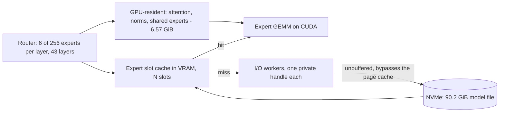

<p align="center">
  
</p>

<h1 align="center">Crow</h1>

<p align="center">
  A frontier coding LLM, made runnable by streaming its experts off the SSD.
</p>

---

## What this is

**The model is not trained. It is made runnable.**

A frontier-scale mixture-of-experts coding model whose expert weights are read from disk on demand
instead of held in memory. The host no longer needs to fit the model — a 90 GiB file runs in
1.3 GiB of process memory.

Target model: **`deepseek-ai/DeepSeek-V4-Flash`**, MIT licensed.

On top of it, an agent platform — in the spirit of **`NousResearch/hermes-agent`**, which serves as
an example for scope and not as a specification. That part has not been built; the model side is
what exists today.

This is a research repository. It carries the patch against `llama.cpp`, the measuring tools and
the record of what was measured — not a product.

## Status

Measured on 2026-08-06 on the development machine (RTX 5090, 32,607 MiB VRAM · 63.4 GB RAM ·
24 threads · NVMe). Quantisation `unsloth/UD-Q2_K_XL`, 90.2 GiB on disk.

| | **Crow, SSD streaming** | llama.cpp CPU offload |
|---|---:|---:|
| decode | **11.03 tok/s** | 8.18 tok/s |
| prefill | **9.47 tok/s** | 4.43 tok/s |
| peak VRAM | 29.06 GiB | 9.17 GiB |
| **peak host RAM** | **1.28 GiB** | 51.79 GiB |
| coding gate | 9–10 of 10 | 10 of 10 |

The right-hand column is the reference point, not a rival configuration: it is what the same
binary reaches with the experts left on the CPU. Both were measured back to back from one
executable, one quantisation and one prompt, with the placement as the only difference.

The gate resolves differences of two tasks or more, so the column difference of one is inside its
own movement and is not read as a quality difference.

Every figure here has its raw run on disk and its reasoning on the issue that asked for it.

**Spent so far: 0 €.** No rented compute, no API calls — everything measured on the machine above.

## Architecture



The host holds no model weights. Misses are read straight off the drive with unbuffered I/O, which
is why process memory stays flat regardless of model size.

## Build

The streaming path is a patch against `llama.cpp`. It is applied to a pinned upstream tag, never to
a moving branch.

```bash
git -C <llama.cpp-clone> worktree add --detach <tree> b10269
```

```bash
powershell -File tools/verify-patch-b10269.ps1 -WT <tree> -BuildDir build -UpTo build -NoNegative
```

That applies `patches/moe-stream-on-b10269.patch`, configures with CUDA, builds, and checks the
result — the flags reaching the binary, the symbols surviving the link, the patched paths matching
the expected count. Dropping `-UpTo build -NoNegative` runs the full verification including a
control build on the unpatched base; that leaves the tree pristine, so build again before measuring.

## Run

```bash
llama-server -m <model>/DeepSeek-V4-Flash-UD-Q2_K_XL-00001-of-00003.gguf \
  -c 4096 -ngl 99 -np 1 \
  --moe-stream --moe-stream-cache 64s --moe-stream-io-threads 8 --moe-stream-direct
```

| Flag | |
|---|---|
| `--moe-stream` | route expert tensors through the slot cache instead of placing them |
| `--moe-stream-cache 64s` | cache size, here in slots |
| `--moe-stream-io-threads 8` | I/O workers, each with its own file handle |
| `--moe-stream-direct` | unbuffered reads, bypassing the OS page cache |

## Repository layout

| | |
|---|---|
| `patches/` | the streaming patch against its pinned upstream tag |
| `tools/` | measuring and verification tools, each with its own selftest |
| `manifests/` | size and SHA-256 of every raw protocol, per day |
| `runs/` | raw protocols — **not** in git, recorded by the manifests |

Every tool answers `-Selftest` (PowerShell) or `selftest` (Python) and refuses to report a verdict
without passing it.

## How this project works

These rules are the actual product of the repository; the numbers follow from them.

- **Every number carries its denominator.** Anything unmeasured is marked as unmeasured, together
  with the one measurement that would settle it.
- **A cited number needs its suite in the same commit, and that suite needs a case that must fail.**
  A checker that cannot go red measures nothing.
- **A zero without a positive control is not a finding.** Every search includes a term that has to
  hit; otherwise "not present" cannot be told apart from "not looked for".
- **A vendor's own model-card number is a statement about that vendor's harness**, not about the
  model. It is labelled as such wherever it appears.
- **A criterion a correct implementation cannot meet manufactures faults instead of finding them.**
  Comparing answer hashes across two compute backends was such a criterion and was withdrawn.
- **Raw protocols stay out of git**, but their fingerprints do not. What a run produced is recorded
  even though the bytes are not versioned.
- **Closed work is not deleted.** Issues closed with a corrected goal say so on the ticket.

Knowledge lives on the issues and in a separate vault, not in this file. This README describes what
the repository is and how to run it — nothing else.

## Credits

`Crow.jpg` is a generated render; the prompt that produced it sits beside it in
`CrowJPG-Prompt.txt`.
