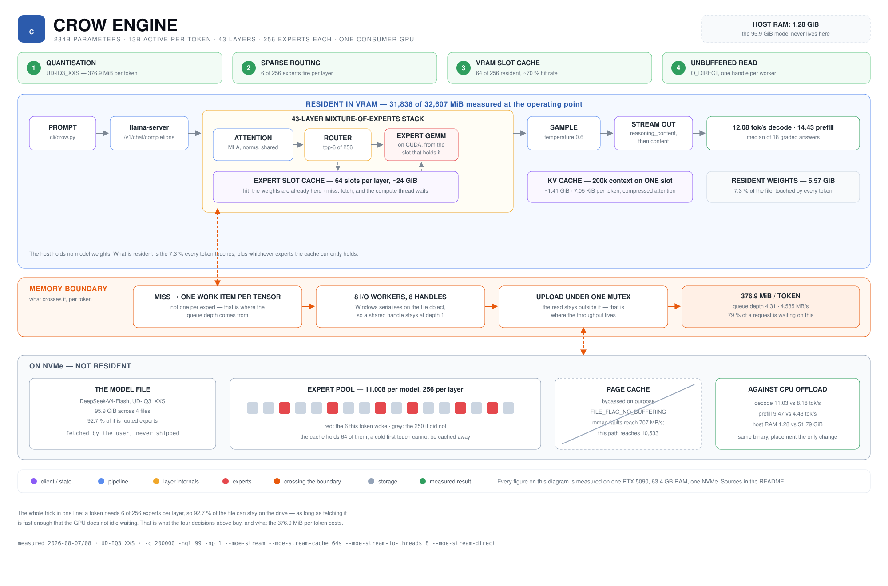
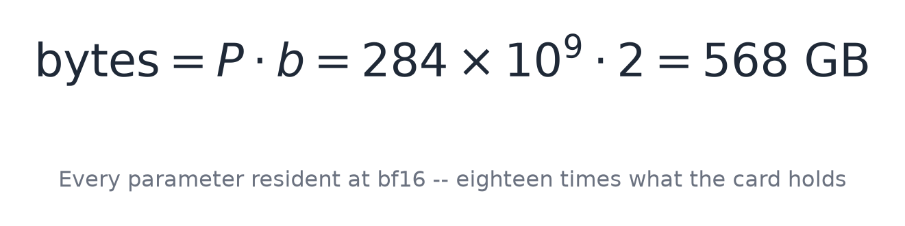
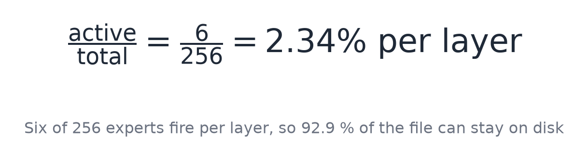
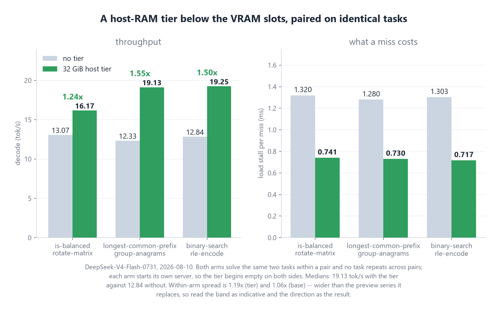
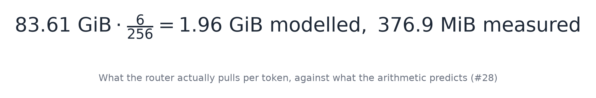
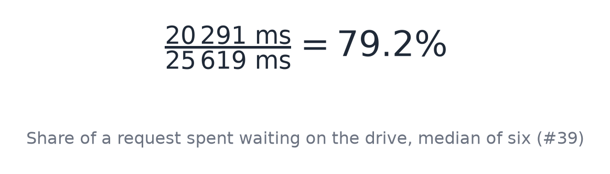
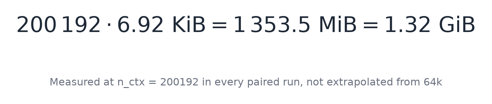

<div align="center">

<h1>CROW</h1>

<h3>A 304-billion-parameter coding model at a 200k context, on one consumer graphics card.</h3>

<p>Mixture-of-experts inference with the routed experts streamed off the SSD.</p>

<p>
<a href="LICENSE"></a>
<a href="cli/crow.py"></a>
<a href="#requirements"></a>
<a href="cli/crow.py"></a>
<a href="https://huggingface.co/deepseek-ai/DeepSeek-V4-Flash-0731"></a>
</p>

<table>
<tr>
<td align="center"><b>304B</b><br><sub>parameters</sub></td>
<td align="center"><b>13.3B</b><br><sub>active per token</sub></td>
<td align="center"><b>200k</b><br><sub>context, one slot</sub></td>
<td align="center"><b>84.6 GiB</b><br><sub>model on disk</sub></td>
<td align="center"><b>17.70 GiB</b><br><sub>expert cache in VRAM</sub></td>
<td align="center"><b>19.53</b><br><sub>tok/s decode, gate median of 3 runs</sub></td>
<td align="center"><b>133.10</b><br><sub>tok/s cold prefill, 1,884-token prompt</sub></td>
</tr>
</table>

<br>

</div>

<br>

> **Operating point:** `DeepSeek-V4-Flash-0731` at `UD-IQ2_XXS`, `--moe-stream-cache 58s`, RTX 5090
> (32,607 MiB), 63.4 GB DDR5. Throughput and quality measured 2026-08-12 (#89): three graded runs of
> the ten-task gate per rung, fresh server per run, one variable changed. Raw protocols under
> `runs/2026-08-12/` and `runs/2026-08-11/`.
>
> **Two figure sets were measured on the previous rung `UD-IQ3_XXS` and are marked where they
> appear:** the slot ladder (56–64) and the 1.63x host-tier pairing. The mechanism is unchanged, the
> numbers would not be. 16 GB VRAM is the installer's floor, not a measured point; nothing below
> 63.4 GB system RAM has been run.

## What this is

A mixture-of-experts model activates 6 of 256 experts per layer per token. The routed experts are
78.11 of the file's 84.62 GiB (92.3 %) and can be absent. Crow keeps the always-active set in VRAM —
attention, norms, shared experts: **6,378.40 MiB on CUDA0 + 284.06 MiB host buffers = 6.51 GiB,
7.69 % of the file** — holds the 58 most useful experts per layer in a slot cache of
**18,121.38 MiB = 17.70 GiB**, and reads misses off the drive during compute.

The 200,000-token context costs **1,353.50 MiB = 1.32 GiB** of KV at `n_ctx = 200192`, 6.92 KiB per
token. `--moe-stream-l2 32` adds a page-locked host-RAM tier between the slots and the drive: cost
per miss falls from 1.331–1.383 ms to 0.713–0.722 ms, decode from 11.04 to 18.03 tok/s — a factor of
**1.63** *(measured on `UD-IQ3_XXS`, not repeated)*. On the shipped rung a miss costs **0.6470 ms**.



---

# Part I: Getting started

## Requirements

| | |
|---|---|
| **GPU** | NVIDIA, **16 GB VRAM minimum**, 32 GB for the operating point. Below 16 GB unsupported |
| **System RAM** | **64 GB for the operating point**, of which 32 GiB go to the [host tier](#4-host-ram-tier-optional). 32 GB runs without it, at 1.63x less throughput *(`UD-IQ3_XXS`)* |
| **Disk** | ~2 GB for Crow, **84.6 GiB for the model** — 90,860,736,928 B across three files |
| **OS** | Windows x64. The streaming path uses `FILE_FLAG_NO_BUFFERING` and a handle pool |
| **Python** | 3.8+. The terminal client needs the standard library and nothing else |
| **WebView2** | Window only. Ships with Windows 11 and with Edge; measured as `151.0.4129.78` |
| **pywebview** | Window only, ~2 MB. The installer runs `pip install pywebview` |

The preflight checks all of this before downloading. Only two rows stop the install: under 16,000 MB
VRAM, and under 2 GB free on the install drive. The rest are warnings.

## Quick start

```powershell
irm https://raw.githubusercontent.com/nibor1896/Crow/main/install.ps1 | iex
```

Five steps, no elevation, everything under `%LOCALAPPDATA%\Crow`: preflight, download, extract,
per-file sha256 against the release manifest, then the start lines for server and clients with the
paths resolved for your machine.

The model is not in that package. The last step prints the command that fetches it:

```powershell
hf download unsloth/DeepSeek-V4-Flash-0731-GGUF --include "UD-IQ2_XXS/*" --local-dir $env:LOCALAPPDATA\Crow\models
```

> When `hf` cannot reach the repository it prints `✓ Downloaded` and returns the local directory.
> Check that three files totalling 84.6 GiB (90,860,736,928 B) arrived.

> Every block on this page is PowerShell, so it writes `$env:LOCALAPPDATA`, not the `cmd.exe` form
> `%LOCALAPPDATA%`. The installer prints these commands with paths resolved — `install.ps1:1474` for
> the server, `:1505` and `:1526` for the clients.

## Full setup

### Step 1 — start the server

```powershell
$env:LOCALAPPDATA\Crow\bin\llama-server.exe `
  -m $env:LOCALAPPDATA\Crow\models\UD-IQ2_XXS\DeepSeek-V4-Flash-0731-UD-IQ2_XXS-00001-of-00003.gguf `
  --port 8081 -c 200000 -ngl 99 -np 1 --jinja `
  --slot-save-path $env:LOCALAPPDATA\Crow\session `
  --chat-template-file $env:LOCALAPPDATA\Crow\templates\0731-chat-template.jinja `
  --moe-stream --moe-stream-cache 58s --moe-stream-io-threads 8 --moe-stream-direct `
  --moe-stream-l2 32
```

The installer leaves `--moe-stream-l2` out below 60 GB of detected RAM (Windows reports 63.4 on a
64 GB machine).

| Flag | Why |
|---|---|
| `-c 200000` | Fits on one slot: **30,548 MiB of 32,607 after load**, three runs reading the same value |
| `--port 8081` | `llama-server` defaults to 8080, the client to 8081; on Windows 8080 is often taken |
| `-np 1` | One user, one stream. `-np 4` splits the context into 4 × 50k |
| `--jinja` | Use the model's chat template. Without it the replayed reasoning is dropped and the prompt cache breaks every turn |
| `--moe-stream` | Route expert tensors through the slot cache instead of placing them |
| `--moe-stream-cache 58s` | 58 of 256 experts per layer, **18,121.38 MiB = 17.70 GiB**. Not 64 — see [the ceiling](#the-cache-has-a-ceiling) |
| `--moe-stream-io-threads 8` | I/O workers. With `--moe-stream-direct` each reads through its own handle; without it all share one, which Windows serialises (`src/llama-mmap.cpp:266-277`, fallback `:457`) |
| `--moe-stream-direct` | Unbuffered reads, and what opens the handle pool at all |
| `--slot-save-path` | Where the server writes KV state so a session survives a restart. Must be an existing directory |
| `--chat-template-file` | 0731 ships no Jinja template, and the GGUF-embedded one fails the model's golden vector 4. The shipped file renders all four byte-identically |
| `--moe-stream-l2 32` | Optional [host-RAM tier](#4-host-ram-tier-optional), in GiB. **1.63x median** (18.03 against 11.04 tok/s). Costs 32 GiB of page-locked memory |

**Do not run with `-lv 5` on a console.** The debug log is ~40 lines per token and every CUDA graph
launch waits for them. Redirect it — `2> server.err` — or the number you measure is the console's.
*(Single observation, no run under `runs/`; direction only, no factor claimed.)*

#### Second model — Qwen3.8-27B

Not part of the install: a separate 16.4 GiB download (`unsloth/Qwen3.8-27B-GGUF`, `UD-Q4_K_XL`,
17,559,178,144 B). Alternative to the line above, not an addition — one model at a time.

```powershell
$env:LOCALAPPDATA\Crow\bin\llama-server.exe `
  -m $env:LOCALAPPDATA\Crow\models\qwen38-gguf\Qwen3.8-27B-UD-Q4_K_XL.gguf `
  --port 8082 -c 200000 -ctk q8_0 -ctv q8_0 -ngl 99 -np 1 --jinja `
  --slot-save-path $env:LOCALAPPDATA\Crow\session `
  --spec-type draft-mtp
```

```powershell
python $env:LOCALAPPDATA\Crow\cli\crow.py --base-url http://127.0.0.1:8082/v1
```

| Flag | Why |
|---|---|
| `--port 8082` | 8081 is 0731's, and every raw run under `runs/2026-08-20/` carries 8082. The client needs `--base-url` |
| `-ctk q8_0 -ctv q8_0` | f16 KV leaves **332.8 MiB** free — a third of the 924 MiB at which [the ceiling](#the-cache-has-a-ceiling) starts costing. q8_0 leaves **6,627**. KV is 6,647.00 MiB against 6,645.8 predicted |
| no `--moe-stream` | 16.4 GB dense, fits on the card whole. There are no expert tensors to route |
| no `--chat-template-file` | Unlike 0731, the embedded template is the one to use — unsloth's. `reasoning_effort` takes `low`, `medium`, `high`; `max` and `none` throw, and `high`, `xhigh` and unset render byte-identically |

Loads in **7.9 s**, **25,253–25,561 of 32,607 MiB** after load. Decode **71.05 tok/s at an empty
context** — not an operating figure. Prefill **3,164 / 3,236 / 3,021 tok/s** at 4,028 / 16,006 /
32,012 tokens, so 32k costs 10.6 s; the three points are already not linear and do not extrapolate.

### Step 2 — check the server

```powershell
(Invoke-RestMethod -Uri 'http://127.0.0.1:8081/props').default_generation_settings.n_ctx
nvidia-smi --query-gpu=memory.used,memory.total --format=csv,noheader
```

Expect `n_ctx = 200192` (llama.cpp rounds up) and about **30,548 of 32,607 MiB**. A reading well
above that means something else holds VRAM; when the headroom goes to nothing the driver moves the
expert cache into host memory and single requests halve at random — see
[the ceiling](#the-cache-has-a-ceiling). `n_ctx` of 65536 or 16384 means a measurement server is
running, not the operating point.

Every figure on this page comes from a fresh server. One long-running server fell from ~15 to
~1 tok/s after 121 minutes and recovered only on restart; it was not the context — a fresh server at
a resumed 63.9k window ran at 14.97. Never re-run at 58 slots. Open as
[#71](https://github.com/nibor1896/Crow/issues/71); the remedy is a restart.

### Step 3 — start a client

Both ship in every package and the installer starts neither.

```powershell
python $env:LOCALAPPDATA\Crow\cli\crow.py       # terminal, stdlib only
python $env:LOCALAPPDATA\Crow\cli\crow_gui.py   # window, needs pywebview
```

The client prints the endpoint and the model read back from `/props`, so an endpoint serving
something else says so under its own address.

At `-np 1` there is one slot. Two clients against one server share the session file, but a turn
started in one holds slot 0 until it finishes and the other queues behind it. Closing the window
mid-turn does not release it — the server keeps computing.

## Using the CLI

| Command | |
|---|---|
| `/help` | the commands |
| `/tools` | the tools the model can call, read out of the schema it is sent |
| `/thoughts` | show or hide the reasoning as it arrives — the `--show-reasoning` switch, mid-session |
| `/mode` | the release level, `/mode manual\|allowedit\|auto` to switch. Switching drops standing approvals |
| `/reset` | drop the conversation and start a new one |
| `/context` | how much of the window is used |
| `/exit`, `/quit` | leave |

A line starting with `/` turns yellow as you type it. That needs raw mode; piped input falls back to
a plain read.

| Option | |
|---|---|
| `--base-url` | default `http://127.0.0.1:8081/v1` |
| `-m` | model name sent to the endpoint (default `crow`) |
| `--api-key` | placeholder, default `local-no-provider`; the local server does not check it |
| `--system` | replace the system prompt, `--no-system` removes it |
| `--temperature` | default **1.0** — what the model card specifies. `0` risks a repetition attractor inside the reasoning block; it stays available for byte-identical measurement runs |
| `--top-p` | default **0.95**, the model card's agentic figure. Its `generation_config.json` says 1.0; the disagreement is recorded at `cli/crow.py:2733` |
| `--min-p` | default **0.01**, unsloth's recommendation for this quantisation. Sent explicitly because llama.cpp's server default is 0.05 |
| `--reasoning-effort` | `low`, `high` or `max`. Rides in `chat_template_kwargs` only when set |
| `--show-reasoning` | print the reasoning in its own dim block. Off by default: it is 88.2 % of every generated character over the 2026-08-07 reference run. The block reopens if the model thinks again mid-answer |
| `--timeout` | socket timeout in seconds (default **1800**) |
| `--rollover-at` | archive and start fresh at this share of the window, `0` switches it off (default **0.9**) |
| `--max-tool-rounds` | tool rounds per turn before it answers from what it has (default **24**) |
| `--no-run-tools` | report tool calls instead of running them; the turn ends after one round. The declarations stay in the request either way |
| `--mode` | release level: **`manual`** asks before writing and executing, **`allowedit`** asks before executing, **`auto`** asks for nothing (default). Reading never asks at any level |
| `--resume FILE` | resume a named session file |
| `--no-session` | do not resume the last session, and do not save this one |
| `--no-update-check` | do not ask GitHub for a newer release |
| `--no-font`, `--no-background` | leave the terminal profile alone |

There is no `--max-tokens`, and one error message says there is: a turn stopped by the server's
budget prints `CUT OFF at the token budget -- raise --max-tokens` (`cli/crow.py:1563`) while the
parser accepts no such option (`:2708-2777`). Tracked as
[#63](https://github.com/nibor1896/Crow/issues/63).

**How the working directory is chosen, and how long it lasts.** The two clients answer this
differently, and the difference is one of expectation rather than mechanism:

| | how it picks a working directory at start | why |
|---|---|---|
| terminal | `--root`, otherwise the nearest ancestor holding a `.crow/root.json` — where you stand | you just typed the directory you meant |
| window | **the folder that chat chose**, restored silently | its cwd comes from a shortcut and means nothing; you expect the project to reopen where you left it |

**Each chat in the window carries its own working directory.** Switching chats moves the boundary
with them, so two chats can work in two projects. A chat that never chose one — a new chat, or any
chat from before this existed — starts from `active` in `%LOCALAPPDATA%\Crow\roots.json`, which is
the template written whenever a person picks a folder or picks **no folder**. `recent` in the same
file is only the picker's menu: both clients write it, so it never decides where anything opens.

Choosing **no folder** is itself a choice and belongs to that chat, so it survives a switch and a
restart instead of coming back as a folder. Cancelling the picker changes nothing. If a remembered
folder is gone at start, Crow says so and runs without one — not decoration: with no root, nothing
bounds the paths Crow picks for itself.

**The release level stays with the folder, not with the chat** — it is a statement about the
project, so two chats in one folder share it. Otherwise the same directory would carry different
rights depending on which conversation happened to be open.

A launch binds twice: `ready()` takes the template immediately so the window is never unbounded, and
the restored chat replaces it once it arrives. The button may correct itself once; a visible
correction is cheaper than an invisible gap.

Until 2026-08-15 the window bound nothing at start and the folder had to be picked again after every
single one ([#92](https://github.com/nibor1896/Crow/issues/92)).

**The working area bounds what Crow chooses, never what you ask for.** Two rules, and the second is
what makes the first usable:

| | |
|---|---|
| Crow picks a path outside the root by itself | **refused**, at every level |
| You named the path — or a directory above it — anywhere in the conversation | **written**, at every level |

The level (`manual`/`allowedit`/`auto`) decides who gets *asked*; it never decides what you are
allowed to order. An assistant that argues with the address its user typed is not careful, it is
broken — and until 2026-08-15 this one did exactly that:
[#98](https://github.com/nibor1896/Crow/issues/98) opens with `Erstell mir bitte die Datei
"C:\Users\robin\Desktop\x.txt"` being refused, the model reaching the path through the shell to
carry out the instruction, and the ticket filing that as a bypass. It was not a bypass. It was
obedience against a rule that could not tell an instruction from an invention.

A location counts as named when it carries a separator — `C:\...`, `D:/...`, `\\share\...`. A bare
word does not: **"leg das auf den Desktop" names no path**, and guessing a directory out of a noun
is how a release rule starts releasing places nobody named. Naming the path lifts it, and the
refusal says so.

**What the root still bounds** — two of the nine tools:

| Tool | Bounded by the root | Where |
|---|---|---|
| `write_file` | yes — for paths you did not name | `cli/crow_core.py:2457` |
| `edit_file` | yes — for paths you did not name | `cli/crow_core.py:2480` |
| `run_command` | **no, at every level** | `cli/crow_core.py:2603` |
| the other six | no — reads are never bounded | — |

`run_command` runs with `shell=True`, so a shell line naming an absolute path outside the root
reaches it. This is [#92](https://github.com/nibor1896/Crow/issues/92) decision 3 and it stands:
a `cwd` check is protection nobody has, and refusing shell lines by their text is string analysis
against a shell. What is left of that gap after the release rule above is narrow but real — a path
**you never named**, reached through the shell rather than through `write_file`. Two things cover
it, neither of them a mechanism:

1. The refusal tells the model not to reach the path by other means. Instruction, not mechanism,
   and listed here as instruction.
2. A shell command that runs in a turn where the boundary already refused a write is **marked on
   screen**, in `auto`'s own colour, naming the refused path (`cli/crow.py:936`,
   `cli/crow_gui.py:1246`). Since only unnamed paths are refused, the marker fires only when Crow
   went somewhere on its own — the case worth a line. A turn where you named the path never
   reaches it.

What this does **not** give you: protection against a hostile prompt, or against a model that
reaches for the shell first. `manual` and `allowedit` ask before executing — at those levels the
gate is a person. Cases: `TheWorkingAreaIsNotASandboxTests` in `cli/test_crow.py`, whose negative
half is the half that matters: naming one location must not release a second one, and the
assistant's own text must never count as a mandate.

**Rollover.** A request at or past `n_ctx` is refused outright and the turn is lost. At 90 % of the
window Crow writes the conversation to `rollover-<stamp>.json` **and `rollover-<stamp>.md`**, empties
it, and opens the next one with a note naming the transcript, its line count and the paths the work
had reached. The check also runs inside the tool loop — one tool round has been measured adding
5,253 tokens, and up to 24 run without user input. The archive is written without the KV cache: the
slot file has one fixed name, and a save is ~1.3 GiB at a full window. If the server does not report
the window size, `n_ctx` is 0 and rollover stays off.

**Resumed caches are checked.** `POST /slots/0?action=restore` returning 200 means the file was
read, not that the slot holds the prefix about to be sent. Measured 2026-08-10: a start printing
`cache warm` was followed by `cached 0/21004` and **469.51 s to the first token**. The save records
`n_saved`, the restore compares it against `n_restored`, and if the first turn comes back with
`cached 0` after a `cache warm`, Crow says so.

**The context is append-only and every assistant turn carries its reasoning.** The template renders a
kept turn as `<think>…</think>`; an omitted `reasoning_content` leaves an empty think block, the
prefix diverges where the thoughts began, and everything behind it is re-read. For the same reason
the client sends its `tools` array with every request — with an empty array both variants render byte
for byte the same. Measured 2026-08-10 through `/apply-template` and `/tokenize`: a first turn with a
five-token message sends **953 tokens**, of which **909 (95.4 %) are the seven tool declarations**.
Re-measured the same way on 2026-08-14 with `web_search` and `fetch_url` added: **1,269 tokens**, of
which **1,222 (96.3 %) are the nine declarations**. The two web tools cost **313 tokens of prefix in
every request**, cached after the first.

On first start the client installs its bundled typeface and writes `profiles.defaults.font.face` and
`background` into Windows Terminal's `settings.json`, with a `.bak` beside it. It never overwrites a
value it did not write itself.

## Web research

`web_search` and `fetch_url` need no key, no account and no service. Six official, keyless APIs are
queried in parallel; results merge round-robin by authority and every snippet is capped at 240 bytes.

| Source | Fires on |
|---|---|
| PyPI, crates.io | a query naming a version, release, install, package, crate or changelog |
| HuggingFace | a query naming a model, gguf, quant, weights, checkpoint, or a known model family |
| DuckDuckGo instant answers | every query — the *documented* API, not the html endpoint |
| Stack Overflow | every query, accepted answers only |
| GitHub repositories and issues | every query |
| Wikipedia | every query |

| Variable | |
|---|---|
| `CROW_TAVILY_KEY` | optional. Switches to Tavily for a general web index. Free tier is 1,000 searches a month and takes no credit card |
| `CROW_SEARXNG_URL` | optional, wins over the key. Needs `json` under `search.formats` in the instance's `settings.yml` — only `html` is enabled by default |

`fetch_url` takes http and https only; `file:` and `data:` are refused, so it cannot become a disk
read around the #92 boundary. Extraction runs before the 16 KB clip — clipping first keeps the
markup and drops the answer. Every failure returns as a tool result, never an exception.

**Why no general web index by default.** Measured 2026-08-14: `duckduckgo.com/html/?q=` answers
**HTTP 202 with zero results** to both a browser user-agent and Crow's own — the snippet every model
writes for this is dead, and it fails silently because 202 does not raise. `lite.duckduckgo.com`
still answers 200 with 10 results to `Mozilla/5.0` and **202 to `Crow/0.3.3`**, so the only working
scrape requires misrepresenting the client. Six public SearXNG instances were probed the same day;
none served `format=json`.

**Cost.** Each fetched page is up to 16 KB ≈ 4,000 tokens ≈ two minutes of prefill at ~38 tok/s, and
`MAX_TOOL_ROUNDS` is 24 for the whole turn. The tool caps fetches at 4 per question and tells the
model so. The declarations themselves cost 313 tokens of prefix per request (measured above).

`web_search` and `fetch_url` are class `network` in `TOOL_CLASS`. **They ask at no release level,
including `manual`**: the search happens because a task was given, and giving the task is the
release.

## Using the window

Logic lives in `cli/crow_core.py`, rendering in the window: thought-block boundaries, code-fence
detection, turn cost and session format are shared. `tools/check_shared_core.py` verifies this
against `manifests/shared-core.json` (44 rules).

| | |
|---|---|
| **status bar** | connection, the model read from `/props`, context used. The model chip starts empty and stays empty until `/props` answers |
| **transcript** | reasoning in a dim block that closes when the answer starts and reopens if the model thinks again, then the answer, then the cost line |
| **code blocks** | framed with a copy button. An unclosed block is still framed and copyable |
| **composer** | ENTER sends, SHIFT+ENTER newline. The read timeout is printed beside the send button, read off the running configuration |
| **sessions rail** | one entry, because there is one `session.json` — the same file `cli/crow.py` writes |
| **release level** | a dropdown beside `send`, coloured by level: **manual** white, **allowedit** green, **auto** yellow. The same three levels `/mode` switches in the terminal, decided by the same table in `cli/crow_core.py` |

**Held-back calls.** A call the level holds back is drawn as a card with the tool name and the
arguments as sent. Three answers: run, decline, or allow from now on for that directory or program.
The card stays with the answer on it. A declined call returns `error: declined by the user` as a tool
result and the turn continues.

**Abort.** ESCAPE or the send button stops the turn: interrupt flag polled every 50 ms, socket closed
in `finally`, socket timeout.

The timeout is **600 s** in the window against 1800 in the terminal. Measured 2026-08-13: nothing in
this process wakes an already-blocked `recv` — `settimeout`, `shutdown` and close each returned only
when the server hung up — so the bound is the timeout as it stood when the read started. 600 s clears
the worst prefill on record (469.51 s). If the reader is still alive two seconds after an abort, the
window writes that into the transcript.

**Drawing is batched per frame.** One `after()` tick at 30 fps takes up to 512 events off the queue,
one insert per tag run. Over 4,000 deltas: per event 4,000 ticks and 332.9 ms of inserts; per tick
1 tick and 4.8 ms.

Flags are the terminal client's where they mean the same thing (`--base-url`, `-m`, `--system`,
`--temperature`, `--top-p`, `--min-p`, `--reasoning-effort`, `--rollover-at`, `--max-tool-rounds`,
`--no-run-tools`, `--mode`, `--no-session`); `--timeout` differs. The window has no `/` commands — buttons
instead — and does not write the terminal profile.

## Updating

On start the client asks GitHub for a newer release and prints it with the install command. The check
runs in the background, is given at most 1.5 s, never blocks a turn and stays silent without network.
`--no-update-check` switches it off; `crow --version` prints what you have.

The 84.6 GiB under `%LOCALAPPDATA%\Crow\models` is not part of any package and is never deleted. A
running `llama-server` is not a blocker: the installer renames `bin\*` to `.old` first, the process
keeps its handle, and the new binary takes over at the next server start. Files that cannot be moved
are named and the install stops there.

The installer will not overwrite a directory it cannot identify as a Crow install, and will not put
an older version over a newer one. Both refuse and print the forcing invocation, because
`irm … | iex` cannot take a `-Force` switch:

```
&([scriptblock]::Create((irm https://raw.githubusercontent.com/nibor1896/Crow/main/install.ps1))) -Force
```

## Common questions

**Does it need the model in RAM?** No. The 84.6 GiB file is never held in host memory. The host holds
the optional tier — 32 GiB when `--moe-stream-l2 32` is on, nothing when it is off.

**Does the host tier change the answers?** Not at this resolution: 6 of 6 graded tasks correct with
and without, across three pairs. Six tasks resolve a difference of about two, so this is *no
difference found*, not equivalence.

**Why Windows only?** The streaming path rests on `FILE_FLAG_NO_BUFFERING`, positional `OVERLAPPED`
reads and a per-worker handle pool. The POSIX side compiles but has never been run.

**Why not more VRAM?** No consumer card holds 84.6 GiB. Above the card's limit the allocation no
longer fits beside the display and per-slot cost stops being constant.

---

# Part II: How it works

## The problem

DeepSeek-V4-Flash-0731 is **304,180,418,494 parameters**, counted from the safetensors headers of all
48 shards. Resident at bf16 that is 608 GB, against 34.2 GB of VRAM and 63.4 GB of system RAM.



## 1. Sparsity

43 layers, 256 experts each, 6 selected per token.



The always-active set — attention, norms, embeddings, shared expert — is **6,378.40 MiB on CUDA0 plus
284.06 MiB of CUDA_Host buffers = 6.51 GiB, 7.69 % of the 84.62 GiB file**, GPU-resident by
construction at `-ngl 99`. The routed experts are the other **90.17 GiB**: 378,208,256 B per expert
across 43 layers, times 256.

Routing concentration, three cumulative blocks of the `r1-l2` arm — share of experts covering:

| coverage | block 1 | block 2 | block 3 |
|---|---:|---:|---:|
| 50 % of selections | 7.7 % | 8.5 % | 8.7 % |
| 80 % | 23.0 % | 24.6 % | 25.7 % |
| 95 % | 43.0 % | 45.4 % | 48.4 % |
| Gini | 0.744 | 0.725 | 0.711 |

Every figure widens with run length as more experts are touched at all.

## 2. The slot cache

A hit means the weights are in VRAM; a miss fetches them while the compute thread waits. At 58 slots
the cache is **20,919.88 MiB = 20.43 GiB** and the server's hit rate over a graded arm is
**80.10–81.81 %**.

<a id="the-cache-has-a-ceiling"></a>
**Ceiling: VRAM.** A slot costs **312.44 MiB**, constant to five digits across every step. Above the
card's limit the driver silently moves the excess into host memory and per-slot cost stops being
constant.

> **Measured on `UD-IQ3_XXS`, not repeated on `UD-IQ2_XXS`.** On the shipped rung a slot costs
> 312.44 MiB rather than 360.69, so every cache size below is ~13.4 % smaller (#89).

| cache | cache size | prefill, 1,374 tok | decode, 200 tok | VRAM used | **free** |
|---|---:|---:|---:|---:|---:|
| 64 slots | 23,084.00 MiB | **15.28** median of 8, spread **8.69x** | not measured | 32,014 | 593 |
| 62 slots | 22,362.62 MiB | 114.92 median of 5 | 14.62 median of 4, **one at 7.07** | 31,683 | 924 |
| 60 slots | 21,641.25 MiB | 113.53 median of 5 | 17.43 median of 8 | 30,954 | 1,653 |
| **58 slots** | **20,919.88 MiB** | **112.69 median of 3** | **17.32 median of 8** | **30,548** | **2,059** |
| 56 slots | 20,198.50 MiB | 110.30 median of 3 | 17.09 median of 8 | 29,842 | 2,765 |

2026-08-11, fresh server per run, `runs/2026-08-11/`. The VRAM column closes arithmetically: 62 slots
read 31,683 MiB and 60 read 30,954 — **729 MiB for two slots** against the 721 the printed slot size
predicts. **64 must therefore read ~32,404 and reads 32,014; the 390 missing MiB are what the driver
moved out.** At 64 slots the same prompt ran between 3.83 and 33.29 tok/s across eight runs; at 58 the
three runs span 111.38 to 112.82.

Prefill and decode are not one series: 58/56 in one session, 62/60 in another, and a VRAM reading
includes whatever else was on the card.

58 against 60 is within noise — 112.69 vs 113.53, 17.32 vs 17.43, against a 1.09x spread over eight
repeats of one configuration. The difference is free VRAM: 2,059 MiB vs 1,653.

**58 applies to 32,607 MiB.** Deriving it per machine is
[#87](https://github.com/nibor1896/Crow/issues/87).

An over-allocated cache is invisible to every counter: same graphs, same misses, and possibly the
lowest load stall of the run.

**Cold misses cannot be cached away.** On the `r1-l2` arm's warm-up task against an empty cache they
are **7,988 of 25,678 misses (31.1 %)**; the first graded task takes **487 of 7,517 (6.5 %)**, and by
the end of the arm the running figure is **9,435 of 98,769 (9.6 %)**. Growing the cache removes
evictions, never first touches.

The cache has a hard floor the graph imposes:


Multi-pass expert GEMMs need at least `3 × n_expert_used` slots. Upstream's default computed
`2 × n_expert_used` clamped to 16, below the required 18, and did not fail at load — the `GGML_ABORT`
sits in `build_moe_ffn` and fires on the first batch touching more experts than the cache holds
(`src/llama-model.cpp:1338-1343`). Crow rejects the option at load time.

**Waves.** One token touches at most 6 experts per layer. A ubatch of 512 can select more in one
layer than 58 slots hold, so the graph splits them into passes of at most `plan_capacity` experts
with the non-running wave masked out (`src/llama-moe-stream.h:102-111`). Prefill only — decode at
`-np 1` is one wave. Wave *w+1* is fetched while wave *w* computes (`stage_wave_locked`,
`:420-422`):

```
moe stream: waves = 430 (228 non-empty), preloads issued = 4303 (ready on arrival = 474), wave stall = 4032.35 ms
```

474 of 4,303 preloads arrived in time, 4.03 s spent waiting. Cumulative, like every counter here —
see [below](#cumulative-counters).

## 3. Reading the drive without the page cache

**Not page faults.** A fault is synchronous and per-thread, leaving the drive at queue depth ~1.

**Windows serialises on the file object.** One handle across threads keeps depth at 1 regardless of
worker count. The read mechanism (`SetFilePointerEx` vs positional `OVERLAPPED`) makes no measurable
difference; sharing the handle does. `llama_file` opens **18 private handles**; at the operating
point 8 are used (`--moe-stream-io-threads 8`, where the drive saturates). A worker past the pool
falls back to the shared handle (`src/llama-mmap.cpp:95-107`).

**One work item per weight tensor, not per expert.** An expert carries 2–3 weight tensors — a
**slab**, the unit counted throughout: 43 × 256 × 3 = 33,024 in the file. Looping over an expert's
slabs keeps one request in flight; issuing them independently keeps the drive busy.

Side effect: concurrent `ggml_backend_tensor_set` calls broke reproducibility. A mutex around the
upload restores it, with the disk read outside the lock.

Upstream fix from this work: `llama_file` on Windows had no positional unbuffered read, and
`has_direct_io()` returned a hard `true` on a path that had never opened anything unbuffered —
[ggml-org/llama.cpp#26541](https://github.com/ggml-org/llama.cpp/issues/26541) and
[#26542](https://github.com/ggml-org/llama.cpp/pull/26542).

## 4. Host-RAM tier (optional)

`--moe-stream-l2 32` puts a second cache level in page-locked host memory, between the VRAM slots and
the drive.

> **Measured on `UD-IQ3_XXS`, not repeated.** On the shipped rung a miss with the tier on costs
> 0.6470 ms (#89); the pairing there is unrun.

Three pairs on 2026-08-11, `runs/2026-08-11/slot58-pairs`. Fresh server per arm at
`--moe-stream-cache 58s`; both arms of a pair solve the same tasks, the pairs solve different ones.

| | with `--moe-stream-l2 32` | without |
|---|---:|---:|
| decode, three arms | 18.93 / 17.33 / **18.03** tok/s | 11.44 / 10.63 / **11.04** |
| median against median | **18.03** | **11.04** — factor **1.63** |
| per pair | 1.65x / 1.63x / 1.63x | |
| stall per miss | 0.713 / 0.722 / 0.713 ms | 1.363 / 1.383 / 1.331 |
| decode spent waiting on a miss | 65.2 / 67.4 / 70.0 % | 78.6 / 79.3 / 81.0 % |
| expert cache hit rate | 81.81 / 80.10 / 80.33 % | 80.99 / 80.06 / 79.73 % |
| tier hit rate, in slabs | 39.96 / 36.14 / 33.33 % | — |
| graded tasks correct | 6 of 6 | 6 of 6 |

**Denominators.** The median tier arm `r3-l2` is 3 answers, 837 decoded tokens, 46,434.23 ms; the
median base arm `r3-base` is 3 answers, 1,139 tokens, 103,196.15 ms. Eighteen answers in the series,
each arm's three including its ungraded warm-up task. Within-arm spread is 1.09x with the tier and
1.08x without, against an effect of 1.63x.

**Cold prefill** on `UD-IQ3_XXS` at 58 slots: **112.69 tok/s**, three runs at 1,374 tokens, spread
1.013x, fresh server each (`runs/2026-08-11/slot58-prefill/`). On `UD-IQ2_XXS` the same cold start
measures **133.10 tok/s** on a 1,884-token prompt, so the two are not one series (#89). Both are
harness prompts — a repeated word list routes to fewer distinct experts than real text, so this is
the upper end of a cold start.

**Arrangement.** Same tasks within a pair, different tasks across pairs, fresh server per arm, one
ungraded warm-up task before each graded pass.

At 32 GiB the tier holds **7,695 slots of 4,464,640 B** — one slot takes the largest slab plus its
direct-I/O alignment slack, so any slab fits any slot and the allocator cannot fragment
(`src/llama-moe-stream.cpp:263`). Two numbers follow, and they differ:

- **7,695 of 33,024 slabs = 23.3 %** — a share of the slab *count*, and the tier's capacity, not its
  fill. At a 33–40 % hit rate most of what a token wants is elsewhere.
- **~21.0 GiB of payload in a 32.00 GiB allocation.** The average slab is 327,614,463 / 129 =
  2,539,647 B against a 4,464,640 B slot. 7,695 × 2,931,847 B = 22,560,562,665 B against
  7,695 × 4,464,640 B = 32.00 GiB; the remaining **~11.0 GiB is stride slack**.

**No extra read to fill it.** The worker already read every missing slab into a staging buffer; the
read now lands in a tier slot and the upload sources from there.



**Cost:** 32 GiB of page-locked memory for the life of the process. Off by default; the installer
prints it above 60 GB of detected RAM, because 32 GiB on ~64 GB is the only ratio run.

**What it cannot do:** catch a cold first touch — 9,435 of the `r1-l2` arm's 98,769 misses.

**Fixed during this work:** the first version released a resident slot's lock before the upload, so
another worker could evict and overwrite it mid-read. Symptom: 8,191 characters of `<<<<<<<<`, with
normal throughput counters. A slot is now pinned while read and committed only after upload.

Tier mutex cost, measured: **0.539 µs per operation, 457.20 ms over 848,297 operations**.

## What it costs per token





Decode time spent waiting on a miss: **65.2 / 67.4 / 70.0 %** with the tier, **78.6 / 79.3 / 81.0 %**
without, same tasks (`runs/2026-08-11/slot58-pairs/l2-pairs.csv`, `load stall` over summed
`eval time`). Per-miss stall: 0.713 ms vs 1.363 ms.

<a id="cumulative-counters"></a>
**Server statistics are cumulative — nothing resets them.** `load stall`, `slot wait`, `wave stall`,
`L2 lock wait` and the hit / miss / cold-miss counts run over the life of the model instance
(`src/llama-moe-stream.cpp:746-751`, `tools/server/server-context.cpp:686-690`).

A per-request figure is the difference between two consecutive blocks. Example, cold misses in the
`r1-l2` arm across one run: 7,988 → 8,475 → 9,435.

Every stall and hit-rate figure on this page that names an arm is that arm's last block, warm-up
included.

Context is nearly free by comparison — 1,353.50 MiB of KV at `n_ctx = 200192`, 6.92 KiB per token:



---

## Licence

MIT, see [`LICENSE`](LICENSE). Four components carry terms this project cannot grant, listed in
[`NOTICE`](NOTICE): `ggml-org/llama.cpp` (MIT, other copyright holders), `deepseek-ai/DeepSeek-V4-Flash`
(MIT, fetched rather than shipped), the NVIDIA CUDA Toolkit the CUDA backend is built against, and
Google Sans Code under the SIL Open Font License 1.1.

## Credits

Measured on one machine: RTX 5090 (32,607 MiB), 63.4 GB DDR5, 24 threads, one Phison NVMe.
**Spent so far: 0 EUR** — no rented compute, no API calls.

<div align="center">
<br>
<a href="https://ko-fi.com/nibor1896"></a>
</div>
