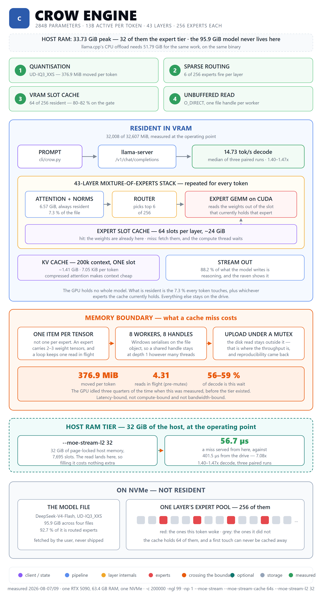

[← README](../../README.md) · [Docs index](../README.md)

# Architecture

Six modules under `cli/`. Line counts (`wc -l`) measured 2026-09-24 on local main (b9cac62).

| | lines | holds |
|---|---|---|
| `crow_core.py` | 25886 | every rule both surfaces obey: tools, the turn loop, memory, skills, MCP, remote providers, sessions |
| `crow_gui.py` | 17192 | the window. Page, pywebview API, the browser pane, and nothing a rule depends on |
| `crow.py` | 2623 | the terminal client. Screen, slash commands, `VERSION` |
| `crow_platform.py` | 1435 | the platform seam: where things live, how a process is found and killed, per OS |
| `crow_voice.py` | 293 | dictation: microphone and recogniser, and the phone's recorded clip (#290) |
| `crow_remote.py` | 1477 | the phone mirror (#249): LAN HTTP + SSE server, pairing, devices, stdlib QR, the loopback listener for `tailscale serve` and the read-only Tailscale state (stage 5), the phone's audio upload (#290) |

## The split

A rule lives in `crow_core.py` and is called from a surface. A surface owns its
screen and nothing else.

| in the core | in a surface |
|---|---|
| what a tool does, what a level asks before, what a turn costs | how a row is drawn, which key closes a menu |
| the sentences a user reads | where on screen they appear |

**The window is the client.** `crow.py` is still shipped, still tested and still
the one that runs with the standard library alone, but nothing in the product
assumes it: the window boots the server, holds the goal, draws the panels and is
what every user-facing page describes first.

Two surfaces that write the same sentence agree with each other right up to the
day one is edited. `manifests/shared-core.json` names what may exist only once,
and `tools/check_shared_core.py` enforces it — see [Testing](testing.md).

## The platform seam (2.2.0)

`crow_platform.py` is the one module that answers "where" and "how" per operating
system: XDG directories, install and models roots, the server binary name and
search order, `/proc`-based server discovery without `psutil`, spawn flags, kill
by process group, the shell, the browser candidates, the font store, the updater
argv. Standard library only, and **one-way** — it never imports the core.
`crow_core.py` calls it at 69 sites (counted 2026-09-23). Two direct OS tests have come back
since 2.2.0 and are the exceptions, not the rule: `sys.platform == "darwin"` for the deno cache
in `build_bundle`'s esbuild search (#212) and `os.name == "nt"` for a `file:///C:/…` console
source path in `render_page`'s API hints (#253). Where the paths it resolves land:
[Install](../user-guide/install.md) and [Linux](../user-guide/linux.md).

## One bounded runner

Every child a tool starts goes through `_bounded_run` in `crow_core.py` (#207, #212, #218):
`run_command`'s shell, every esbuild call of `build_bundle` including its `--version` probes,
and the `node --check` of `write_file`/`append_file` (#251). It owns the one deadline, the
capture cap in the reader threads and the kill of the child's whole process group; on Linux
`run_command` adds its own systemd user scope around it. A goal's acceptance check (#250) runs
through `run_command`, so it gets the same clock, cap and scope. `render_page` is the one
exception: it drives its browser over its own DevTools pipe under its own scope (#213).

## The browser panel (Linux, #201)

On Linux the browser panel is a second `WebKit2.WebView` inside the window's own GTK window,
built in `crow_gui.py` with its own `WebsiteDataManager` (a lasting profile), a
`MemoryPressureSettings` kill, a `bwrap` sandbox for its web process when `bwrap` is installed
(`CROW_PANE_SANDBOX=0` switches it off; no `bwrap` means no sandbox, not no panel) and no
pywebview bridge. `CROW_PANE_WINDOW=1` falls back to the
separate pane window, which is still what Windows uses. See [the browser](../user-guide/browser.md).

## Registries

Rebuilt in place by `mcp_apply()`, never rebound: `crow.py` does
`from crow_core import TOOLS`, which binds the value.

| | |
|---|---|
| `TOOLS` | the declarations sent in each request. Built-ins first, MCP above |
| `TOOL_IMPL` | name → callable. A name here that is not in `TOOLS` is unreachable |
| `TOOL_CLASS` | name → `reading` \| `writing` \| `executing`. Absent means `executing` |

---

