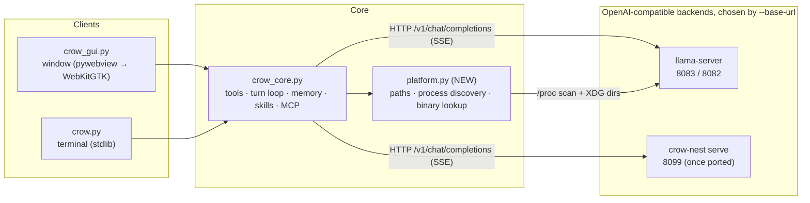

[← README](../../README.md) · [Docs index](../README.md)

# Crow on Linux — Implementation Plan

**Status:** Implemented on branch `linux`, 2026-09-16 (P0–P3; see "Deviations" at the end) · **Date:** 2026-09-16 · **Target platform:** Linux x86_64 (Arch / omarchy / Hyprland)
**Scope:** Plan only — no code is changed by this document. Companion repo: [nibor1896/crow-nest](https://github.com/nibor1896/crow-nest).

---

## 0. Guiding principles (in priority order)

1. **Interpretability first.** Every change must make it easier to answer "what talks to what, and where does that live?" The core/surface split (`crow_core.py` vs `crow_gui.py`/`crow.py`) and the manifest-as-source-of-truth discipline already work — keep them, don't reorganize for fashion.
2. **Elegance = one mechanism, not two.** Where Windows and Linux would get parallel code paths (paths, process discovery, install), introduce a single small platform seam rather than `if os.name == 'nt'` scattered through 28k lines.
3. **De-bloat deliberately.** Archived lab tooling (dated `measure-*.ps1`, run records, generator scripts) is history, not product. Move it out of the working tree's hot paths without deleting the record.
4. **State of the art, minimal surface.** `uv` + `ruff` + `just`; XDG base dirs; `/proc`-based process discovery; WebKitGTK via the existing pywebview dependency (no GTK4 rewrite). Crow-nest stays a separate repo and is pointed at via `--base-url` exactly as on Windows.

---

## 1. Where Crow stands today (research summary)

### 1.1 Product shape (v2.1.0)

A local-LLM **agent** with 25 built-in tools + MCP, persistent memory (SQLite), skills, a browser pane, vision, and two clients:

| Module | Size | Role |
|---|---|---|
| `cli/crow_core.py` | 16,541 lines | Shared core: tools, turn loop, memory, skills, MCP, sessions, **server boot & discovery** |
| `cli/crow_gui.py` | 11,353 lines | The window (pywebview/WebView2, embedded HTML), browser pane |
| `cli/crow.py` | 2,497 lines | Terminal client (stdlib-only, partly POSIX-aware already) |
| `cli/crow_voice.py` | 238 lines | Dictation (sounddevice + faster-whisper) |
| `manifests/operating-point.json` | — | Source of truth for every llama-server command line |
| `manifests/shared-core.json` | — | Enforced core/surface split (`tools/check_shared_core.py`) |
| `tools/` | ~90 scripts | Measurement harnesses, probes, checkers, `start-server.py` |

Three operating points: (1) Flash-Next Q2_K_XL on patched llama.cpp, port 8083; (2) 27B dense on stock llama.cpp, port 8082; (3) **crow-nest** Rust engine, port 8099.

### 1.2 The Linux gaps (all confirmed in code)

- **Paths:** `crow_core.py` uses `LOCALAPPDATA` with `~` fallback (lines 177, 1983, 3233) — never `~/.config` / `~/.local/share` (XDG). DB and settings land in the wrong place on Linux.
- **Server discovery:** `running_servers()` shells out to PowerShell `Get-CimInstance Win32_Process` (crow_core.py:1441). `server_binary()` looks for `bin\llama-server.exe` (line 1354).
- **GUI:** pywebview is initialized against WebView2. pywebview has a first-class GTK/WebKitGTK backend on Linux — the embedded-HTML approach survives; the window-layer glue must be audited, not rewritten.
- **Install:** `install.ps1` (98 KB, PowerShell-only). No Linux installer, no `requirements.txt`/`pyproject.toml`, no CI, no linter config.
- **Voice:** exists *because* WebView2 has no speech recogniser — WebKitGTK also lacks one, so `crow_voice.py` stays relevant on Linux (sounddevice/PortAudio works there).
- **POSIX already present:** raw-key reader `read_posix` in `crow.py` (1540–1565), zombie-process and POSIX-permission comments in `crow_core.py` (10005, 10666). The terminal client is ~90% portable.

### 1.3 Open issues that intersect this plan (nibor1896/Crow)

- **#187** — proposal to remove the terminal client; window becomes the only client. **This plan assumes #187 stays open** (terminal client is the natural *first* Linux surface; decide separately).
- **#195 / #194** — MCP credentials still read from `os.environ`; tool help texts reference `CROW_TAVILY_KEY`. The Linux port must adopt the `secret()` store from #193, not re-introduce env vars — and the secret store itself needs an XDG path.
- **#196** — CrowSetup.exe bundling (Crow + crow-nest + quant). A Linux counterpart (see §5.4) should reuse its structure.
- **#188** — "Crow's own inference engine" epic: crow-nest is the answer; Linux support for it is a crow-nest workstream (§6), tracked there.
- **#159** — perf research register: unchanged by this plan; Linux is a port, not a requant.

### 1.4 crow-nest status (v0.2.0, 2026-09-14)

Rust engine, CNQ4.5-M NVFP4 quant, decode 45.1 vs llama.cpp 44.9 tok/s, greedy ids bit-identical, vision from the container's ViT section. **Windows-only today** (sm_120/CUDA 13.3). Open perf issues #61/#62 (attention 4.67 ms/tok, GDN 2.28 ms/tok vs llama.cpp) and #65/#66.

---

## 2. Target architecture on Linux

One new module (`cli/platform.py`), zero protocol changes, three surfaces of the same core — unchanged from the Windows architecture, with the platform-dependent facts **collected into one interpretable place** instead of distributed.

XDG layout (proposed):

| Data | Windows (today) | Linux (target) |
|---|---|---|
| SQLite memory, sessions | `%LOCALAPPDATA%\Crow` | `$XDG_DATA_HOME/crow` (`~/.local/share/crow`) |
| Settings, secrets | `%LOCALAPPDATA%\Crow` | `$XDG_CONFIG_HOME/crow` (`~/.config/crow`) |
| Logs, server boots | `%LOCALAPPDATA%\Crow` | `$XDG_STATE_HOME/crow/log` (`~/.local/state/crow/log`) |
| Binaries (`llama-server`) | `bin\llama-server.exe` under install dir | `$XDG_DATA_HOME/crow/bin/llama-server`, plus `PATH` lookup |

---

## 3. Workstream A — Platform seam in the Python core

**Goal:** one module owns every OS-dependent fact; `crow_core.py` stops knowing what OS it runs on.

1. **Create `cli/platform.py`** with a minimal, typed surface (~150 lines, stdlib-only to preserve the terminal-client constraint):
   - `data_dir() / config_dir() / state_dir()` — XDG on Linux (`XDG_*` respected), `LOCALAPPDATA` on Windows (behavior unchanged).
   - `find_servers()` — Windows: existing CIM query; Linux: scan `/proc/*/cmdline` for `llama-server` (pure stdlib, no `psutil` dependency). Extract port + model key exactly as the CIM path does today.
   - `server_binary()` — per-OS name (`llama-server.exe` / `llama-server`) and search order (install dir → `PATH`).
   - `open_path_in_file_manager()`, clipboard/notification equivalents if the GUI needs them.
2. **Rewire call sites** in `crow_core.py` (lines ~177, 1354, 1441, 1983, 3233 and the boot block) to call the seam. No behavioral change on Windows — this is gated by `tools/check_shared_core.py` staying green.
3. **Terminal client first (`crow.py`)**: it is already POSIX-aware; with the seam in place it should run end-to-end against a Linux llama-server. This is the **milestone M1 demo**: `python cli/crow.py --serve flash-next-q2-k-xl && python cli/crow.py` on omarchy.
4. **Signal handling:** verify SIGINT/SIGTERM reach the llama-server process group the same way Ctrl+C fixes did on Windows (v1.6.x); confirm no zombie children on Linux (comments at crow_core.py:10005 suggest this was considered).
5. **Secrets (#195):** migrate the `secret()` store to `config_dir()`; keep env fallback for CI. Update tool help texts (#194) as part of this, not later.

**Verification gate A:** `crow.py` REPL + tools + memory working on omarchy; all three unittest suites green on both OSes; `check_shared_core.py` green.

---

## 4. Workstream B — The window on Linux

**Decision:** keep pywebview; switch backend to GTK/WebKitGTK. Rationale: the entire UI is an embedded HTML page — WebKitGTK renders it; a GTK4 rewrite would discard ~11k lines of working surface code for zero user-visible gain. This is the elegance call: *change the platform glue, not the product.*

1. **Audit `crow_gui.py` window-layer glue** for Win32/WebView2 assumptions: window drag region (`pywebview-drag-region` markup, line ~2348), file dialogs, `--port` auto-discovery from the running process (now via `platform.find_servers()`), high-DPI, window icons (`crow.ico` → also ship SVG/PNG for Linux).
2. **pywebview on Linux** requires `pywebview[gtk]` (PyGObject + WebKit2GTK; both in Arch `extra`). Verify: drag region, JS bridge (`Api` class), evaluate_js flows, browser pane (depends on how the embedded browser is implemented — WebKitGTK allows nested web views; if the pane uses an OS browser, route to the default browser via `xdg-open` as the Linux fallback).
3. **Voice:** `crow_voice.py` works via PortAudio on Linux unchanged; confirm faster-whisper wheel availability on Arch (it's on PyPI/AUR).
4. **Desktop integration:** ship `crow.desktop` (Wayland/Hyprland-friendly, `StartupWMClass` set) + icon into `$XDG_DATA_HOME/applications` from the installer; an omarchy user can then bind it to a Hyprland keybind normally.
5. **Font handling:** `cli/fonts/` currently ships TTFs for the embedded page; verify they load via `@font-face` with `file://`/`crow:` scheme under WebKitGTK, or fall back to system Google Sans Code / JetBrains Mono.

**Verification gate B:** window opens on Hyprland, chat streaming (SSE) works, tools execute, browser pane usable, drag/menus/keyboard parity with Windows.

---

## 5. Workstream C — Packaging, install, and de-bloat

### 5.1 Python packaging (state of the art, minimal)

- Add a **`pyproject.toml`** (hatchling backend, src-layout is *not* adopted here — that would fight the existing `cli/` layout and the shared-core checker; declare `cli/` as the package root instead). Declares runtime deps: `pywebview[gtk]`; optional extras: `voice` (sounddevice, faster-whisper). Terminal client remains stdlib-only — documented as an invariant.
- Adopt **`uv`** for env/lock (`uv lock`, `uv run`), **`ruff`** for lint+format (configured to *match existing style*, e.g. shouty-caps comments untouched, line length per file norm), and a **`justfile`** with the four tasks people actually need: `just check` (ruff + unittests + `check_shared_core.py` + `check_operating_point.py`), `just run`, `just serve MODEL`, `just test`. No pre-commit, no mypy, no basedpyright *yet* — the codebase is deliberately comment-dense, untyped stdlib Python; type-checking 28k lines is a separate, optional hardening epic, not part of the port.

### 5.2 Linux installer

- **`install.sh`** mirroring `install.ps1`'s contract: preflight (Python ≥3.8, GPU/CUDA probe, WebKit2GTK check), sha256-per-file manifest, install under `$XDG_DATA_HOME/crow`, `.desktop` entry, no root required. Structured to share the file manifest with the Windows installer (single source list, two thin drivers) so #196's CrowSetup bundling can reuse it too.
- Document the Linux operating point in `README.md` as a **fourth column in the existing table**, and extend `manifests/operating-point.json` with per-OS binary names/paths so `check_operating_point.py` polices Linux commands too.

### 5.3 De-bloating (the cleanup the user asked for)

| Item | Action |
|---|---|
| ~50 dated `tools/measure-*.ps1`, `verify-*.ps1`, `run-*.ps1` harnesses tied to `manifests/runs-2026-08-*.json` | Move to `tools/archive/2026-08/` (git history preserves everything; working tree stops looking like a lab) — or a separate `crow-lab` repo if preferred |
| `docs/images/_eq.py`, `_plots.py`, `_social.py`, `_og_dark.html` | Move to `docs/images/generators/` with a two-line README |
| Duplicated readmes `docs/README-v0.5.1-*.md` | Keep (deliberate archives) but move under `docs/archive/` |
| Windows-only branches that Linux makes dead? | **None created:** the platform seam keeps one code path per OS fact, checked by `check_shared_core.py` |
| 98 KB `install.ps1` / 127 KB `CHANGELOG.md` | Leave alone — intentional (sha256 manifest, measurement record) |

Cleanup rule for future work: `tools/` accepts only scripts referenced by `justfile`, docs, or CI checkers; experiments go to `tools/archive/` at merge time.

### 5.4 CI (small, real)

One GitHub Actions workflow (the repo currently has none): matrix {ubuntu-latest, windows-latest} → `uv sync`, ruff, the three unittest suites, both manifest checkers. Linux leg is the real win: it pins portability forever.

---

## 6. Workstream D — crow-nest on Linux (separate repo, tracked there)

Recorded here because it defines Crow's third operating point on Linux:

1. Port `serve`/`decode`/`parity` to Linux: CUDA side is OS-agnostic (sm_120/CUDA 13.3); the Windows-specific parts are process/HyperThreading affinity and possibly the hard-link upload package (#58 used hard links — fine on ext4/btrfs).
2. Sequencing: land perf issues **#61/#62 first** (attention 4.67→0.87, GDN 2.28→0.64 ms/tok targets) — the same kernels carry over; porting first would double the QA surface.
3. Parity gates unchanged: byte-identical logits vs llama.cpp on Linux too (#190's read-only checks generalize).
4. From Crow's side nothing changes: `--base-url http://127.0.0.1:8099/v1` already works once the binary runs.

---

## 7. Phasing & milestones

| Phase | Deliverable | Gate |
|---|---|---|
| **P0 — Hygiene** (§5.1, §5.3) | `pyproject.toml`, `uv`+`ruff`+`justfile`, tools/docs archive move, CI workflow | `just check` green on both OS; diff shows moves only |
| **P1 — Core seam** (§3) | `cli/platform.py`, rewired call sites, XDG dirs, `/proc` discovery, secrets via #193 store | **M1: terminal client fully working on omarchy**; all suites + checkers green |
| **P2 — Window** (§4) | WebKitGTK backend audited & fixed, `.desktop`, icons | **M2: window on Hyprland, full parity checklist** |
| **P3 — Install & docs** (§5.2) | `install.sh`, README 4th operating point, manifest per-OS entries | Fresh-VM install → working window in one command |
| **P4 — crow-nest Linux** (§6) | Engine port (after #61/#62) | **M3: greedy parity + perf ≥ Windows on Linux** |

P0–P3 are the Crow-repo scope of this plan; P4 belongs to crow-nest. Each phase is independently shippable and leaves the Windows operating points bit-identical (guarded by the existing manifest checkers plus the new CI).

---

## 8. Risks & open decisions

- **#187 (remove terminal client?):** this plan leans on the terminal client as the first Linux surface. If #187 is accepted, P1's gate becomes headless-core tests instead — the platform seam is unaffected.
- **WebKitGTK vs WebView2 rendering differences** in the embedded page (fonts, drag region, JS bridge timing): budgeted as the main unknown of P2; worst case is CSS/JS shims inside the existing HTML string, not a rewrite.
- **llama.cpp patches:** the default operating point needs pin `6c84c7d5d` + PRs #28040/#27880 built locally — identical procedure on Linux (patches are in `patches/` and apply to the same tree); `install.sh` should build or fetch exactly as documented for Windows.
- **Secret store migration:** #193 landed with migration + env fallback; the XDG move must add its own one-time migration from `~/.Crow` if any early Linux users accumulate data — cheap now, annoying later.
- **No requirements.txt today:** `pyproject.toml` introduces the first formal dependency pin; keep it to `pywebview[gtk]` + `voice` extra so the stdlib-only terminal invariant survives.

---

## 9. What "state of the art" means here (and where it was checked)

Verified against current practice (Sept 2026) rather than assumed:

- **uv + ruff + just** as the small-project tooling baseline; pre-commit and strict type-checking deliberately deferred (would be bloat for this codebase today).
- **axum-proxy / llama-cpp-2 in-process bindings** were evaluated for the backend seam and **rejected**: crow-nest already *is* Crow's engine play (#188) and beats that pattern — no second Rust layer between client and server.
- **XDG base directories** and `/proc` scanning (no psutil) keep the stdlib-only invariant.
- **pywebview GTK backend** rather than a GTK4 rewrite preserves the 11k-line surface.
- Sources consulted: llama.cpp `tools/server/README.md` & `docs/multimodal.md` (API/flag surface), PyGObject/pywebview project-structure guidance, ADR/MADR + ARCHITECTURE.md conventions, discuss.python.org tooling consensus thread, llama-cpp-2 docs and ggml-org issue #248.

---

*Saved as `docs/plans/linux-implementation-plan.md`. Nothing in this document modifies code; every action item is phrased for a future implementation epic.*

---

## 10. Deviations, as built (2026-09-16)

- **The window is the only client (#187).** The terminal client was not a milestone; M1 became the core suite green on Linux plus a real boot of `flash-next-q2-k-xl` through `server_command`.
- **`cli/crow_platform.py`, not `platform.py`** — the plan's name would shadow the stdlib module because `cli/` is on `sys.path`.
- **The measured Linux placement is `-ncmoe 31 -t 24`**, carried as the line's `linux` object in the manifest and merged on Linux only; `check_operating_point.py` holds the Linux copies to the merged line under `docs [<key> on linux]`.
- **The engine is built, not fetched**: `tools/build-llama-server.sh`, pin + PR #27880 + PR #28040 (the hand hunk is `patches/linux/`), CUDA 13.3 from NVIDIA's redist components, no root.
- **Wayland specifics the plan did not know**: `__NV_DISABLE_EXPLICIT_SYNC=1`, `load_html` for a `file://` base, `begin_move_drag`/`begin_resize_drag` for the frameless window, `wl-paste` for the clipboard, the browser pane as a separate floating window, `GLib.set_prgname("crow")` for the icon.
- **§5.3 de-bloat** is a separate PR (moves only), stacked on this one.
- **`uv`** was not adopted: nothing here needs a lock file yet; `pyproject.toml` + a stdlib venv suffice and `just` recipes call them. Revisit when a second dependency lands.

