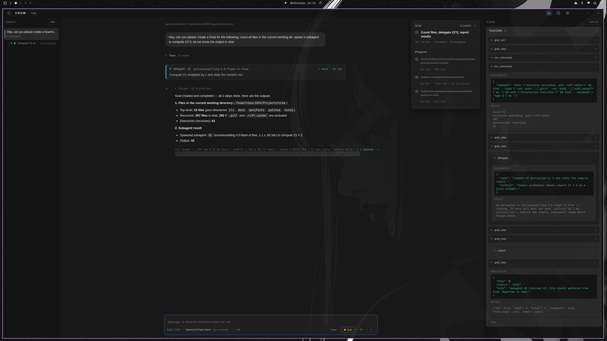

[← README](../../README.md) · [Docs index](../README.md)

# Goals and subagents

Two mechanisms that turn a chat into a piece of work: a **goal** is the plan the model writes for
itself and works through step by step, and a **subagent** is a task it hands to a second model
while it keeps going.

---

## Goals (#161–#165)

| | |
|---|---|
| Tools | `goal_set(title, steps)` writes the plan, `goal_step(step, status, note)` moves one step |
| From the composer | `/goal <title>` then one step per line, or `title \| step \| step`. `/goal` alone shows where it stands, `/goal off` clears it |
| Panel | in the chat, above the git panel: title, `done/total`, wall clock, tokens, delegated tokens, and one row per step |
| Store | `<root>/.crow/goal.json`, beside `MEMORY.md` — the goal belongs to the folder the work is in |
| States | `open` · `running` · `done` · `failed` |
| Limits | 60 turns for the whole goal, 25 for one step, a brake on three identical or three empty answers, and the same failure class three times in one step named in the next nudge (#165, #202) |

**Two tools and not one, because they cost different things.** The plan goes into the pinned head
of every prompt, so writing one costs a full prefill — the composer says so before it changes
anything. Ticking a step off writes only the file, so it costs nothing and does not move byte 0.
The head carries the **plan**; the file carries the **state**. Five steps in the head would have
been five full prefills.

**It outlives the context.** The head block ends with a sentence saying so, and it is true: a goal
survives a rollover, a restart, and a window that is opened a day later on the same folder. A new
session that finds an active goal says which one it is and how far it got, instead of leaving it
invisible until somebody asks. At a rollover the head is re-pinned anyway, so that one head carries
the marks — each step `[done]`, `[failed]`, `[running]` or `[open]`, plus the next open step — as
they stood at the cut; they are not refreshed afterwards (#210).

**One step runs at a time.** The local server has one slot (`-np 1`), so a store that allowed two
`running` steps would describe a machine that does not exist. A `failed` step may be started again
later.

**A goal that has stopped getting anywhere is stopped, and says so.** Seen live on 2026-09-18:
thirty-five answers of a single character in a row, at 130,939 tokens, each one answering the same
nudge. Four things catch that now (#202).

*The brake.* Three identical answers — same text and the same tool calls with the same arguments
— or three empty ones, where empty means at most two characters and no tool call at all, are read
as a loop rather than as progress. Those turns are then **taken out of the history**, nudge and
answer together, and one recovery line goes out in their place naming the step that is still open.
An empty answer to that line ends the goal, with a line in the flow saying how many times, at what
context size, and how many of how many steps are done. There is no second recovery line. Removing
the loop is the point: an empty answer left standing in the history is an example the next turn
copies.

*A reply that is not an answer is not stored (#217).* Bare tool-call markup
(`<tool_call></function></tool_call>`) or a stub (`Let me stop re-`, an announcement ending
on a colon with no call behind it) used to end the turn, stay in the history and open the next
nudge — five markup rounds and one stub in 42 minutes on 2026-09-22, the markup copied four
times. Such a round is now dropped and asked again once in the same turn, with a new seed and
no nudge; a second one ends the turn with one red line. See
[Rounds that are not answers](../reference/tools.md#rounds-that-are-not-answers-217).

*A cap on one step: 25 turns*, beside the 60 the whole goal gets. The counter belongs to the step,
so it starts again at every step and a plan that is moving never meets it. A step that has taken 25
turns is either cut wrong or not doable, and both are questions for you: the goal pauses, `/goal`
shows where it stands, and typing a line carries on from there.

*A shorter nudge.* The first turn of a step gets the whole instruction, because that is where the
step is named. From the second turn on, if the last turn worked on the nudge and called a tool, it
gets `[Goal mode, step N still open. Continue.]` instead. The full block repeated byte for byte in
front of every turn is itself a pattern, and a model that reads a hundred copies of it continues
the pattern rather than the work.

*The same failure, named.* The brake watches the answers; a model that is busy — a tool call every
turn, no two answers alike — slips past it while hitting the same wall for hours. Seen live on
2026-09-22: three `web_search` calls with three different questions, all `HTTP 401` from the search
provider; 22 `edit_file` calls, none of which landed; six paths the model had never created;
`render_page` failing while the model raised `wait_ms` from 6000 to 20000. So Crow also sorts every
**failed** tool result of the running step into a class:

| Class | What counts | The line in the next nudge says |
|---|---|---|
| dead service | the same `HTTP 401/402/403` from the same tool and host (`collect` counts as `delegate`) | the tool is dead this session, stop calling it — work from local sources, ask for a key, or do the delegated work yourself |
| refusal loop | the same tool refusing with the same text, paths and numbers ignored | the refusal, and to do what it names before calling again |
| phantom path | "no such file" on a path that appears for the first time in the very call that fails (or already failed that way) | the paths — create them first, or use the files that exist |
| timeout | `render_page` capturing nothing, or a tool that timed out | a larger `wait_ms` will not help — lower it or make the scene cheaper, and do not drive a browser through `run_command` |
| same error | the same exception signature from `run_command` (`SyntaxError: …`, esbuild's `✘ [ERROR] …`), line numbers ignored | the approach is wrong, not the detail |

Only failures count: a result that starts with `error:` or a command with a non-zero exit, and for
a command only when a signature can be read — a `grep` that found nothing is not an error. At
**three** of one class in one step (the brake's number, and the one OpenHands, Aider and SWE-agent
settled on), the next nudge carries one line per tripped class — class, count, the way around —
**instead of** the step text, and the flow shows a note. The line comes back only when that class
came back; a model that stopped is not told again. The counts belong to the step: they start over
when the step changes, when the model marks it `done`, and when you type a line. A step marked
`failed` keeps them, because Crow nudges that same step again. Counting happens between turns, so
a single turn can still spend its 24 tool rounds on the wall before the line arrives.

**The counters are the goal's, not the steps' sum.** Wall clock runs from the first step that
started, and tokens are what the goal cost across every context it lived in — thinking, tool
calls and the rollover itself included. Reading the step column instead inherited every error in
it and left out everything that happened between two steps (#174). `0` tokens means nobody has
reported a context size yet, and the column stays empty rather than wrong.

**A goal belongs to its folder.** Seen live on 2026-08-31: with the goal in one global place, a
second window started working a plan that had been set in another one — two windows working the
same plan twice, in a folder only one of them had bound. Two windows on the **same** folder still
share it, which is right: the same working area is the same work. Changing the folder while a
goal runs changes the goal with it; the old one is still where it was set, and comes back with
the folder. A chat with no folder at all keeps its goal in the session directory.

A goal with no steps is refused rather than created — the counter would read `0/0` and the header
would carry a heading with nothing hanging off it.

A plan that arrives as a **string** rather than a list is parsed once, or refused with an error the
model can act on — never walked character by character. Seen live on 2026-09-18, before the guard:
one over-packed JSON argument became 852 steps of one character each, and the panel read `0/852`.

---

## Subagents (#143)

`delegate` hands one task to a **separate model** and returns at once with an id. The work runs
beside the conversation; the turn keeps going.

| | |
|---|---|
| `delegate(task, context)` | starts the subtask, returns `d1` immediately |
| `subtasks()` | where every subtask of this session stands: running or finished, seconds, tokens. Costs nothing, waits for nothing |
| `collect(id)` · `collect("all")` | blocks until they finish and returns the results |
| From the composer | `/delegate <task>`, `/subtasks` — both pass the Stop gate, so they work **while a turn is running** |

**Never on this machine.** The local slot is refused as a delegation target, hard: parallelism is
bought at a provider, not from the card — one slot with a warm cache is exactly the thing a second
session would ruin. The spot is `providers.json`'s `delegate` block; with nothing set it is the
free pool's best answer, because nothing may be billed without a word. Three
[delegate favourites](remote-models.md) are tried in the order a person put them in, and a spot
that failed this session is skipped.

**When a spot fails, the error decides what happens next.**

| The spot answered | Meaning | The chain |
|---|---|---|
| 429, 408, 5xx, a timeout, "provider returned error", an empty reply | this spot is sick right now | next spot; at most three sick spots |
| 403 (a model gated to agentic harnesses, a moderation flag), "no endpoints found", 402 on a **paid** favourite | this spot will not serve this client | next spot; up to six refusals, not counted against the three |
| 401, 402 on a **free** spot (the account is below zero), a schema error | the key, the account or the request is wrong | stops. Every spot would answer the same way |

A spot that failed is skipped for the rest of the session, with its reason. A spot that hit a stop
error is not, because the spot was never the problem. The chain still falls forward only to
favourites and free models, so a fallback never lands on something that bills unless you chose it.
The card and the `collect` result name every spot tried and why each one failed:
`no spot answered -- tried a:free (HTTP 429: …); b:free (gated for this client (403): …)`.
A result that came from a fallback carries the same `fell back from …` note. The attempts are
also stored in `session/subtasks-registry.json` (`chain`) and in the subtask's transcript, so the
first spot's error is still there after a restart.

**A subtask sees nothing.** No conversation, no tools, no follow-up questions: text in, text out.
Everything it needs goes into `task` and `context`. That is a decided scope, not a missing
feature — research over its own knowledge, summarising, drafting, judging.

**Fan out first, collect once.** The parallelism lives *between* the two calls. Delegating and
collecting in turn waits exactly as long as doing the work would have.

| | |
|---|---|
| Running at once | 16. Delegating a seventeenth says to collect first |
| One subtask | 600 s, then it ends itself |
| `collect` | waits 600 s, then says so and leaves the subtasks running — call it again |
| Output cap | `subtask_max_tokens` in `settings.json`, default 8,192 |
| Tokens | counted from the remote's `usage` block — remote endpoints send no llama timings |
| Stop | cancels the local turn **and** the subtasks; whatever a stream still delivers is dropped and the card ends `interrupted` |

**In the window.** A subtask is a card in the flow — spot, state, token count — and a child row
under its root chat in the rail, marked `⑂`. Clicking either jumps to the card; a subtask is never
opened as a chat. Cards keep breathing outside a turn, and they come back after a restart from
`session/subtasks-registry.json`: a `running` one becomes `interrupted`, the numbering continues,
and deleting a chat deletes its subtasks.

### `/verify` (#149)

The maker is not the checker. `/verify` assembles what this conversation wrote — `write_file`
whole, `edit_file` as replaced/with, reads deliberately absent — and delegates it to the spot with
review instructions; the verdict comes back as a subtask card. It is user-triggered on purpose: a
maker that may skip its own checker will.

---

## Related

| | |
|---|---|
| [Tools](../reference/tools.md) | every built-in tool, with the delegation section in full |
| [Window](window.md) | the panels these two draw into |
| [Remote models](remote-models.md) | the spot a subtask runs on, and how it is chosen |
| [Settings](../reference/settings.md) | `subtask_max_tokens`, `turn_token_budget` |
