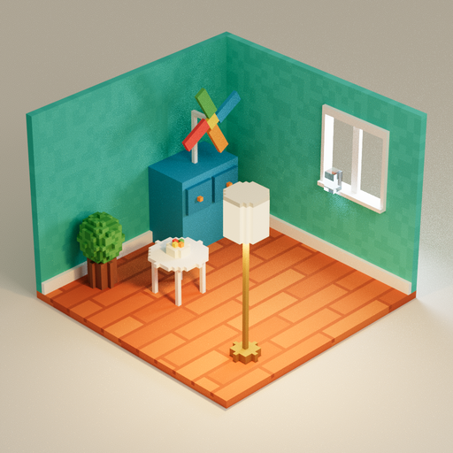
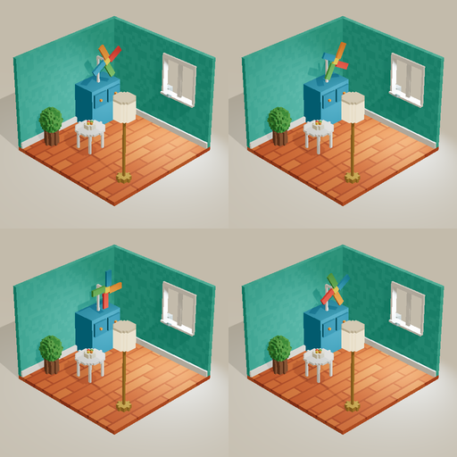

[← README](../../README.md) · [Docs index](../README.md)

# Voxel kit (path tracing)

Path-traced voxel scenes (the MagicaVoxel look) as one offline HTML page (#298), animated and
orbitable (#299). The model writes only the content: voxels, a palette, props, lamps, moving parts.
Global illumination, soft and contact shadows, colour bleeding and the lamp glow come from a
vendored path tracer. The model never writes a ray tracer or a shader.

## Switch it on

| | |
|---|---|
| Linux | `bash install.sh --pathtracer` |
| Windows | `&([scriptblock]::Create((irm https://raw.githubusercontent.com/nibor1896/Crow/main/install.ps1))) -PathTracer` |
| By hand | Settings → Skills → `voxel-diorama` on |

| | |
|---|---|
| What ships | `kits/pathtracer/` in every install, ~1 MB. The flag installs nothing more |
| What the flag does | checks the bundle against `kit.json`, switches the `voxel-diorama` skill on, and reports whether `build_bundle` has an esbuild |
| Already on | `the voxel-diorama skill was already on` |
| Off | the skill is seeded **off** at Crow's next start: 0 prompt tokens until it is switched on |
| Needs | an esbuild for `build_bundle` ([install](install.md), row *esbuild*). Crow never downloads one |

## What the model does

| step | |
|---|---|
| 1 | reads the skill `voxel-diorama` |
| 2 | copies `kits/pathtracer/scaffold/{index.html,scene.js}` to `src/` in the working area |
| 3 | plans the grid, palette and props (density rule below) |
| 4 | writes `src/scene.js` with `crow-voxel-kit` |
| 5 | `build_bundle` entry `src/index.html`, out `index.html`: one offline file |
| 6 | `render_page index.html?mode=live&ui=0` with `frames` 4 (motion), `render_page index.html?mode=photo&t=2&ui=0` with `wait_ms` 20000 (the photo), reads the `[crow-pt]` / `[crow-scene]` console lines, then `read_image` against the reference |
| 7 | or all of it at once: `check_diorama.py index.html` (below) |

`import … from 'crow-voxel-kit'` and `'crow-pathtracer'` are resolved by `build_bundle` to the
installed kit. The library never has to be in the working area. An import map in the page for
the same name wins.

## Rules (measured 2026-09-25, pt-proof, RTX 5090, 1024×1024)

| rule | why |
|---|---|
| room ≥ 64 voxels wide, every prop ≥ 8–16 voxels per dimension | coarse voxels make objects unreadable (robin: HD scene at 2.5× density "far more legible") |
| one `MeshStandardMaterial` per palette colour, never `vertexColors` | with vertex colours the room rendered black in 1 of 3 starts; palette materials 5 of 5 normal |
| lamps through `addLamp`: the spot light sits **below a solid** shade | a spot inside a hollow shade: 30.6 dB PSNR (fireflies); below a solid shade: 38.6 dB |
| emission ≤ 1 (the kit caps it) | emissive surfaces are not importance-sampled; bright small emitters are fireflies |
| culled faces, no instancing | the library does not support instanced geometry |
| despeckle pass | removes the isolated fireflies left after 2,700 samples (HD4 → HD5) |
| context lost → restored → scene set again | headless ANGLE/Vulkan lost the context once at start in 3 of 3 runs |

`start()` refuses a scene with `vertexColors`, a non-Standard material, an `InstancedMesh` or
`emissiveIntensity` > 1, and names the mesh.

## Modes (#299)

| | |
|---|---|
| LIVE (default) | rasterised preview of the same scene and materials: real lights, soft shadow maps (`PCFShadowMap` + `shadow.radius`), the dome as environment, no bloom. Runs `d.animate` every frame. Area and key lights get raster stand-ins (a wide spot, a directional light) |
| PHOTO | the animation paused at t, the scene posed once, the path tracer converging (the rules above: despeckle, context-loss restore) |
| switch | key **P**, or the small **Foto** / **Live** button bottom right (shows only while the pointer is over the page) |
| `?mode=photo&t=2` | opens as the photo of t = 2 s (for a judge) |
| `?mode=live` | the preview |
| `&ui=0` | no button at all |
| camera | drag orbits around the target, wheel or pinch zooms (0.5×–3×); in photo mode a camera change restarts the accumulation (`updateCamera()`) |
| time | only the page clock (the rAF timestamp): under render_page's frozen clock (#293) 4 frames differ and a second capture repeats them byte for byte |

## Not empty (#299)

Every object on the terrain goes in `g.prop('name', () => { … })`. Everything built outside a prop
is terrain. The page reports:

| | |
|---|---|
| `props` | named props that still hold voxels, each with `voxels` and `bbox` |
| `propKinds` | distinct names without a trailing number (`rock 3`, `rock#12` → `rock`) |
| `coverage` | terrain columns with a prop cell above the column's top terrain cell ÷ all terrain columns; `null` without terrain |

The skill's targets: ≥ 40 props of ≥ 12 kinds, ≥ 60,000 voxels, coverage ≥ 0.5.

## API

| | |
|---|---|
| `new VoxelGrid()` | integer cells, y up |
| `.put(x,y,z, colour, kind)` | `colour` `'#rrggbb'` or `(x,y,z) => colour \| null`; `kind` `matte` (default) · `metal` · `glass` · `emit` |
| `.box(x0,y0,z0, x1,y1,z1, …)` · `.clear(…)` | corners inclusive |
| `.cyl(cx,cz, r, y0,y1, …)` · `.blob(cx,cy,cz, rx,ry,rz, …)` | vertical cylinder · ellipsoid |
| `hash(x,y,z)` | stable value in [0,1) for colour variation |
| `createDiorama(grid, opts)` | `width` `height` (1024), `voxelSize` (0.4), `background` (`#ddd6c8`), `fov` (14), `direction` ([1, 0.82, 1]), `zoom`, `fStop` (3.2), `bounces` (6), `despeckle` (true), `shadows` (true), `shadowRadius` (4), `orbit` (true), `minZoom` (0.5), `maxZoom` (3), `liveLight` (1, live light scale) |
| `.addLamp({x, z, bottom, top})` | solid glowing shade from `bottom` to `top`, closed top, spot light below it; returns the light rig |
| `.addAreaLight({at, lookAt, intensity, width, height})` | soft rectangle light, voxel coordinates, e.g. daylight outside a window; returns the light rig |
| `.addSpot({at, lookAt, colour, intensity, angle, penumbra, shadow})` | spot light, `angle` = half-angle in degrees; returns the light rig (`rig.rotation.y = t` sweeps a beam) |
| `g.prop(name, build)` | records what `build` adds: `{name, voxels, bbox}`; props nest |
| `.part(name, grid, {pivot})` | an animated part from its own grid → `THREE.Group` turning around `pivot`; `userData.home` = start position |
| `.animate((t, dt, scene) => …)` | every live frame, and once at the photo's t; `t` in seconds of page time |
| `.start()` | meshes, lights, camera, the chosen mode; returns `{scene, camera, renderer, pathTracer, probe, setMode, mode, time}` |
| `.setMode('live' \| 'photo')` | what P does |
| `window.__SCENE__` | `voxels` `staticVoxels` `faces` `triangles` `materials` `lights` `size` `props` `propCount` `propKinds` `propVoxels` `coverage` `terrainColumns` `parts` `animated` `mode` `t` `errors` |
| `window.__PT__` | `renderer` `mode` `samples` `samplesPerSecond` `fps` `lost` `restored` `despeckled` `error` |
| console | `[crow-scene] {json}` at start, first live frame, every mode switch and every 5 s; `[crow-pt] samples=…` (photo) / `[crow-live] fps=…` (live) every 5 s |

## Checker

`kits/pathtracer/check_diorama.py <built index.html>`: renders through Crow's own `render_page`
(4 live frames twice, one photo at `wait_ms` 20000), prints PASS/FAIL per check, exit 0 only when
all pass, 2 on a setup error.

| check | passes when |
|---|---|
| gpu | both captures `render_mode` gpu, renderer not SwiftShader/llvmpipe |
| probe | the `[crow-scene]` line came back from both, in the asked mode |
| samples | photo ≥ `--min-samples` (200) |
| props · kinds · voxels | ≥ `--min-props` (40) · `--min-kinds` (12) · `--min-voxels` (60000) |
| coverage | ≥ `--min-coverage` (0.5) |
| motion | animated, and all 6 pairs of the 4 live frames differ in > 0.5 % of pixels (channel delta > 25) |
| repeat | the second live capture is byte-identical (`--no-repeat` skips) |
| photo | not near-uniform, < 90 % near-black |
| errors | no `Uncaught` / `[crow-error]` console line, `errors` 0, no setScene failure |

Options: `--photo-t` (2), `--wait-ms` (20000), `--frame-ms` (500), `--size` (1024),
`--reference DIR` (writes `<photo>-vs-reference.png` and prints mean luma/saturation per image),
`--crow-cli DIR` (default: the `cli/` beside the kit, then `~/.local/share/crow/cli`),
`--serve URL` (the local crow-nest serve render_page borrows VRAM from, as inside a Crow turn (#297, #304);
default `$CROW_SERVE_URL`, else `http://127.0.0.1:8099/v1`; `none` = never borrow).

## Numbers

| | |
|---|---|
| samples/s | 13.0 at 10 s, 14.3 at 40 s, scaffold room (26,627 voxels, 46,168 triangles, 23 materials), headless Chromium 152, ANGLE/Vulkan, RTX 5090, 2026-09-25 |
| proof scene | ~15 samples/s at 9,124 and at 59,964 triangles; PSNR 60 s vs 180 s = 39.79 dB (HD5) |
| page size | 970,310 bytes (scaffold, built with esbuild 0.28.2); 981,292 bytes with the #299 kit (esbuild 0.25.5) |
| live preview | 60 fps (vsync cap) on the scaffold, headless Chromium, ANGLE/Vulkan, RTX 5090, 1024×1024, 2026-09-25 |
| photo after 20 s | 289 samples (14.5 samples/s), scaffold with the pinwheel part, same machine |
| bundle | `crow-pathtracer.js` 958,266 bytes, sha256 in `kits/pathtracer/kit.json` |

## Third party

three 0.186.1, three-mesh-bvh 0.9.15, three-gpu-pathtracer 0.0.24, all MIT. Licence texts beside
the bundle, entry in [NOTICE](../../NOTICE). Rebuild: `bash tools/build-pathtracer-kit.sh`
(exact npm pins). Check: `python tools/check_pathtracer_kit.py`.
